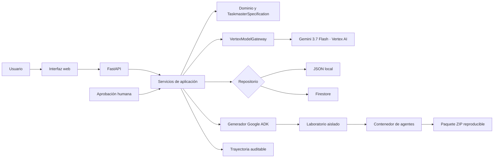

# Collaborative Taskmaster Studio

**Un Collaborative Partner que convierte una tarea ambigua en un Taskmaster ejecutable, revisable
y verificable.** Entrevista al usuario, estructura requisitos, incorpora feedback, exige aprobación
humana, selecciona automáticamente el framework adecuado, genera un proyecto reproducible y
demuestra su comportamiento en un laboratorio aislado.

La experiencia se está reconstruyendo desde su fundamento: la entrada principal es ahora una
**conversación continua y real con Gemini 3.7 Flash en Vertex AI**. Gemini
explora el problema, hace preguntas adaptativas y mantiene el contexto. Cuando el borrador está
completo, una confirmación humana entrega la especificación a un **Ingeniero de agentes** distinto:
este genera el proyecto, muestra actividad observable, solicita permiso antes de probar y entrega
un ZIP verificado sin abandonar el chat.

La interfaz de esta conversación sigue patrones de un producto LLM: compositor persistente,
`Enter` para enviar, `Shift+Enter` para una nueva línea, indicador de respuesta, historial local,
copia de mensajes y representación segura de listas y bloques de código. La actividad del
constructor describe acciones y resultados verificables; nunca presenta razonamiento privado del
modelo como si fuera telemetría.

## Demo pública

<https://collaborative-taskmaster-studio-760216344589.us-central1.run.app>

La versión pública ejecuta **Gemini 3.7 Flash en Vertex AI**, persiste el estado en Firestore y está
desplegada en Cloud Run. Está destinada a evaluación y demostración: no introduzca secretos, datos
personales ni información confidencial.

## Estado

- H0–H10 completados: producto vertical, Gemini, Google ADK, Firestore y Cloud Run.
- H11 en curso: pulido, reproducibilidad final, accesibilidad, seguridad, video y entrega Devpost.
- Última revisión validada: `collaborative-taskmaster-studio-00004-fqp`.
- Recorrido desplegado: 13 pasos HTTP, revisión humana 2, artefacto ADK válido y laboratorio `ready`.
- Calidad local: 481 pruebas automatizadas aprobadas con todos los extras.

## Qué problema resuelve

Crear un agente útil exige mucho más que pedirle a un modelo que escriba código. Hay que aclarar el
objetivo, separar requisitos de suposiciones, definir herramientas y políticas, incorporar feedback,
aprobar riesgos y demostrar que el resultado funciona.

Collaborative Taskmaster Studio guía ese trabajo como un socio:

1. formula preguntas aclaratorias relevantes;
2. convierte respuestas en un briefing editable y confirmable;
3. diseña una `TaskmasterSpecification` estructurada;
4. aplica feedback como una nueva revisión y muestra el diff;
5. impide cambios silenciosos sobre políticas protegidas;
6. exige aprobación humana explícita;
7. recomienda y genera un proyecto reproducible para Google ADK, Google Gen AI SDK,
   Antigravity SDK o Genkit;
8. ejecuta pruebas y escenarios normal, incompleto y adversarial;
9. incorpora el agente validado a una biblioteca visual;
10. permite usarlo en una conversación integrada, revisar el entregable y aprobarlo, solicitar
    cambios o rechazarlo sin abandonar el estudio; también permite descargar su ZIP;
11. conserva una trayectoria auditable de decisiones y resultados.

El producto no es un chatbot que termina al producir texto: crea archivos, manifiestos, checksums,
pruebas y evidencia ejecutable.

## Recorrido de la demostración

```text
Idea ambigua en el chat
  → conversación de diseño con Gemini 3.7 Flash
  → borrador incremental listo
  → confirmación humana de construcción
  → selección automática de framework
  → selección automática de plugins mínimos
  → proyecto ADK / Gen AI SDK / Antigravity / Genkit
  → progreso observable del Ingeniero de agentes
  → aprobación humana antes de 3 verificaciones aisladas
  → catálogo persistente y ZIP descargable en la misma conversación
```

El recorrido automático falla de forma cerrada ante preguntas fuera de alcance, contratos JSON
inválidos, ausencia de aprobación, artefactos inconsistentes o pruebas fallidas. Gemini participa
cuando respeta el contrato; de lo contrario, el flujo conserva el estado y utiliza un fallback local
seguro y visible.

### Datos oficiales de la demo

El caso oficial reproducible es un coordinador académico ficticio: tres respuestas, cuatro
requisitos que suman seis horas, feedback que prohíbe calendario y envío, aprobación humana de la
revisión 2 y tres escenarios obligatorios. El estudio también acepta otros dominios: el fallback
local deriva un flujo general del briefing y no introduce estudiantes, calendarios ni paquetes
semanales cuando no corresponden. Para validar los textos, privacidad, resultado y hashes sin usar
cloud:

```powershell
python scripts\prepare_demo_data.py
```

### Reinicio seguro de la demo

Dentro de un proyecto, **Reiniciar demo** restaura exclusivamente esa instancia con el fixture
oficial. La operación exige escribir `REINICIAR_DEMO`, comprueba la sesión propietaria, limpia sus
revisiones, eventos y artefactos y no modifica otros proyectos. Consulte
[`docs/15_HITO_H11_REINICIO_SEGURO_DEMO.md`](docs/15_HITO_H11_REINICIO_SEGURO_DEMO.md).

La ficha para copiar durante el video está en
[`docs/14_HITO_H11_DATOS_OFICIALES_DEMO.md`](docs/14_HITO_H11_DATOS_OFICIALES_DEMO.md).

## Capacidades principales

### Collaborative Partner

- una pregunta por turno y notas estructuradas;
- briefing editable antes de confirmarlo;
- feedback humano conservado por hash y longitud, no por contenido en la auditoría;
- revisiones inmutables, comparación estructurada y aprobación explícita;
- interfaz web en español con estados de carga, vacío, error y éxito.
- conversación continua: las preguntas, respuestas y etapas completadas permanecen en un único
  hilo y la etapa siguiente se añade sin cambiar de pantalla.
- indicador visible del modelo activo: `Gemini 3.7 Flash · Vertex AI` cuando la integración está
  habilitada o `Fallback local · Sin llamadas cloud` cuando se trabaja sin modelo remoto.
- catálogo local con preguntas neutrales y diseñador adaptable al dominio descrito.

### Inteligencia con límites

- Gemini 3.7 Flash mediante Google Gen AI SDK y Vertex AI;
- salidas JSON restringidas por esquema para preguntas, briefing, diseño y revisión;
- `VertexModelGateway` como única frontera del modelo;
- máximo configurable de tokens y preguntas por proyecto;
- una sola llamada por operación, sin reintentos ocultos;
- fallback determinista y auditable para cada operación asistida;
- agentes Google ADK de coordinación, entrevista y diseño sin herramientas de negocio.

### Acción verificable

- selector automático y generadores versionados para Google ADK, Google Gen AI SDK, Genkit y
  Antigravity;
- constructor asíncrono dentro del chat, aislado por sesión y detenido ante cualquier fallo;
- aprobación humana separada antes de ejecutar las verificaciones locales;
- manifiesto `taskmaster.manifest.json` con versión, revisión y checksums SHA-256;
- herramientas simuladas protegidas por políticas de aprobación;
- laboratorio temporal sin credenciales y con red bloqueada;
- tres escenarios obligatorios y puerta de exportación basada en `ready`.
- biblioteca de agentes aprobados, identidad visual editable y descarga ZIP reconstruible incluso
  cuando el almacenamiento efímero de Cloud Run ya no conserva la generación original.
- registro cerrado de plugins, selección por mínimo privilegio y gateway generado que bloquea por
  defecto plugins desconocidos, conexiones ausentes y escrituras sin aprobación.

El nombre del constructor siempre declara su ejecución real. Si el SDK de Antigravity no está
instalado y habilitado, la interfaz muestra `Constructor local seguro · respaldo de Antigravity`;
no atribuye esa generación al SDK. En ambos casos, Gemini conserva exclusivamente el papel de socio
de diseño y no recibe herramientas de escritura ni autoridad para aprobar pruebas.

El selector de framework permanece en **Pendiente** mientras el borrador tenga menos de 60 % de
preparación o todavía no defina misión, entradas, resultados y flujo. Su confianza describe la
adecuación técnica entre frameworks, no la calidad del borrador. Las capacidades que necesiten
correo, tickets, Internet, repositorios o documentación privada se muestran como integraciones
pendientes; diseñarlas no significa que esos accesos ya estén conectados.

### Capacidad `workspace.read`

Cuando el diseño aprobado solicita explícitamente leer o inspeccionar fuentes dentro del directorio
del agente, el constructor incorpora una herramienta real `workspace_read` al paquete Google ADK.
La raíz se declara con `TASKMASTER_WORKSPACE_ROOT`; no se concede acceso al resto del equipo.

El lector:

- permite listar directorios y leer texto UTF-8 en formatos expresamente admitidos;
- rechaza rutas absolutas, `..`, escapes de la raíz y enlaces simbólicos;
- oculta `.env`, credenciales, claves, directorios internos y nombres que comiencen por `secret`;
- limita cada archivo a 256 KiB por defecto y nunca supera el límite duro de 1 MiB;
- no escribe, elimina, ejecuta ni registra el contenido leído en la auditoría.

La capacidad no se añade a agentes que no la soliciten. Antes de entregar el ZIP, el laboratorio
ejecuta una verificación adicional que comprueba una lectura válida y el bloqueo del escape de ruta.

### Investigación y contexto del socio colaborativo

El chat de diseño puede utilizar cinco capacidades de solo lectura cuando Gemini determina que
son necesarias y el usuario proporciona el contexto correspondiente:

- **Google Drive por usuario:** tras iniciar sesión y completar OAuth, Gemini puede buscar archivos
  por nombre o contenido indexado, enumerar carpetas y leer Google Docs, Sheets, Slides, PDF,
  DOCX, XLSX, PPTX y contenido textual con el scope `drive.readonly`. Los resultados incluyen
  accesos para abrir o leer el elemento desde el chat. Los grants se cifran antes de
  persistirse en Firestore y nunca llegan al navegador ni al historial. Un Taskmaster aprobado solo
  puede usar esa evidencia cuando su especificación declara Drive como herramienta `read_only` y el
  usuario lo solicita explícitamente. La conexión puede revocarse desde el panel izquierdo.

- **Investigación en Internet:** Google Search grounding y lectura directa de URLs públicas mediante
  el mismo cliente autenticado de Vertex AI. Si una página impide la lectura directa, el Studio
  realiza una búsqueda verificable por su dominio y registra el cambio de método. Las consultas
  recientes incluyen la fecha y el año actuales; una respuesta sin fuentes verificables se
  descarta. No inicia sesión, completa formularios ni ejecuta acciones en sitios externos.
- **Lectura de documentos:** carga explícita de TXT, Markdown, CSV, JSON, YAML, XML, PDF, DOCX,
  XLSX o PPTX.
  Se extrae únicamente texto, el original nunca se ejecuta, cada archivo se limita a 8 MiB y solo
  queda disponible en la sesión que lo adjuntó.
- **Memoria avanzada:** recupera fragmentos visibles y relevantes de conversaciones anteriores de
  la misma sesión. No mezcla usuarios ni expone cargas internas de herramientas.
- **Navegación profunda del proyecto:** además de leer y buscar, crea un mapa estructural acotado,
  cuenta líneas de archivos legibles e identifica imports y referencias inversas. Permanece
  confinada al directorio autorizado, sin escritura ni ejecución de comandos.

Cada uso aparece como actividad verificable en la respuesta. Las páginas, documentos, recuerdos y
archivos inspeccionados se consideran datos no confiables y no pueden modificar las políticas del
sistema. En desarrollo local, los documentos extraídos se guardan bajo `.studio-data`; en una
instancia efímera de Cloud Run deben tratarse como datos temporales hasta conectar almacenamiento
duradero específico para adjuntos.

### Persistencia y operación

- repositorio local JSON para desarrollo sin nube;
- Firestore con revisiones, aprobaciones, eventos y artefactos en subcolecciones;
- transacciones críticas con reintentos acotados y concurrencia optimista;
- retención demo de siete días declarada para raíz y subcolecciones;
- Cloud Run con mínimo cero, máximo una instancia y concurrencia uno;
- imagen fijada por digest, identidad administrada y rollback entre revisiones;
- presupuesto mensual de 20.000 COP con alertas al 50 %, 80 % y 100 %.

## Arquitectura



La lógica de negocio no depende de FastAPI, Firestore ni Vertex AI. Los puertos y adaptadores
permiten ejecutar el mismo flujo con implementaciones locales, dobles de prueba o servicios reales.
La vista final desplegada, el recorrido y las fronteras de confianza están en
[`docs/12_DIAGRAMA_ARQUITECTURA_FINAL.md`](docs/12_DIAGRAMA_ARQUITECTURA_FINAL.md). Las decisiones
técnicas detalladas permanecen en
[`docs/03_ARQUITECTURA_IMPLEMENTACION.md`](docs/03_ARQUITECTURA_IMPLEMENTACION.md).

## Inicio rápido local

### Requisitos

- Python `3.13.x`;
- PowerShell 7 o Windows PowerShell;
- Git, únicamente para clonar y versionar.

No necesita cuenta de Google Cloud para el modo local determinista.

### Instalar y ejecutar

```powershell
cd "C:\ruta\a\collaborative-taskmaster-studio"
py -3.13 -m venv .venv
.\.venv\Scripts\Activate.ps1
python -m pip install --upgrade pip
python -m pip install -e ".[dev]"
python -m app.main
```

Abrir:

- interfaz: <http://127.0.0.1:8080/>;
- OpenAPI: <http://127.0.0.1:8080/docs>;
- disponibilidad: <http://127.0.0.1:8080/health/ready>.

El modo predeterminado usa repositorio local y componentes deterministas. No descubre credenciales,
no invoca Gemini y no consume Google Cloud.

### Verificar una instalación limpia

El siguiente comando crea otra copia y otro entorno virtual temporales, instala `.[dev]`, ejecuta
la suite y el recorrido integral, inicia un servidor local y comprueba sus endpoints:

```powershell
py -3.13 scripts\verify_clean_install.py
```

La verificación fuerza Gemini y Firestore a apagado, no copia credenciales y elimina el entorno
temporal al finalizar. Puede descargar dependencias desde PyPI. Consulte
[`docs/13_HITO_H11_INSTALACION_LIMPIA.md`](docs/13_HITO_H11_INSTALACION_LIMPIA.md) para conocer los
controles y la evidencia.

## Ejecutar con Gemini 3.7 Flash

La forma recomendada en Windows valida la configuración y las credenciales **antes del primer
prompt** y conserva las variables correctas durante toda la vida del servidor:

```powershell
.\scripts\start_local.ps1
```

Para comprobar Vertex AI sin iniciar el servidor:

```powershell
.\scripts\start_local.ps1 -CheckOnly
```

Las variables establecidas manualmente con `$env:` pertenecen únicamente a la terminal actual. Si
el servidor se inicia desde otra consola, la interfaz permanece bloqueada en `Fallback local` en
lugar de aceptar mensajes que no podrá procesar.

Instalar los adaptadores opcionales:

```powershell
python -m pip install -e ".[dev,vertex]"
gcloud auth application-default login
```

Configurar la terminal de desarrollo:

```powershell
$env:GOOGLE_CLOUD_PROJECT = "TU_PROJECT_ID"
$env:GOOGLE_CLOUD_LOCATION = "global"
$env:GOOGLE_GENAI_USE_VERTEXAI = "true"
$env:STUDIO_ENABLE_VERTEX = "true"
$env:STUDIO_ENABLE_MODEL_QUESTIONS = "true"
$env:STUDIO_ENABLE_MODEL_BRIEFING = "true"
$env:STUDIO_ENABLE_MODEL_SPECIFICATION = "true"
$env:STUDIO_ENABLE_MODEL_REVISION = "true"
$env:STUDIO_GEMINI_MODEL = "gemini-3.7-flash"
$env:STUDIO_VERTEX_API_VERSION = "v1"

python -m infrastructure.vertex.check
python -m app.main
```

El diagnóstico valida la configuración y la presencia de ADC sin invocar el modelo. Ejecutar el
flujo con las cuatro puertas activas sí puede enviar contexto delimitado a Vertex AI y consumir
créditos. Para volver al modo local, cierre esa terminal o asigne `false` a las cinco variables
`STUDIO_ENABLE_*`.

## Persistencia Firestore

Instalar el adaptador:

```powershell
python -m pip install -e ".[dev,firestore]"
```

La infraestructura declarada usa la base nombrada `collaborative-taskmaster` en `us-central1`,
protección contra borrado, transacciones pesimistas y TTL de siete días para datos de demostración.
Planificar el aprovisionamiento no modifica Google Cloud:

```powershell
python -m infrastructure.firestore.provisioning --project TU_PROJECT_ID
```

La opción `--apply` crea o verifica recursos reales y debe utilizarse únicamente con autorización.
Consulte [`docs/08_HITO_H9_FIRESTORE.md`](docs/08_HITO_H9_FIRESTORE.md) antes de habilitarla.

## Configuración

`.env.example` documenta todos los valores admitidos, pero la aplicación no carga ese archivo
automáticamente. Defina variables en el proceso o mediante la configuración declarativa de Cloud
Run.

| Variable | Valor local | Propósito |
| --- | --- | --- |
| `STUDIO_ENABLE_VERTEX` | `false` | Activa la frontera de Vertex AI. |
| `STUDIO_ENABLE_MODEL_*` | `false` | Autoriza cada operación asistida por separado. |
| `STUDIO_GEMINI_MODEL` | `gemini-3.7-flash` | Fija el modelo estable usado por el socio y los agentes. |
| `STUDIO_MAX_MODEL_OUTPUT_TOKENS` | `8192` | Limita la salida estructurada. |
| `STUDIO_MAX_MODEL_QUESTIONS_PER_PROJECT` | `3` | Limita preguntas generadas por proyecto. |
| `STUDIO_ENABLE_FIRESTORE` | `false` | Activa persistencia Firestore. |
| `STUDIO_FIRESTORE_DATABASE` | `collaborative-taskmaster` | Selecciona la base nombrada. |
| `STUDIO_FIRESTORE_DEMO_RETENTION_DAYS` | `7` | Limita retención de sesiones demo. |
| `STUDIO_GENERATED_ROOT` | `generated` | Ubica proyectos generados. |
| `STUDIO_SANDBOX_TIMEOUT` | `8` | Limita cada ejecución del laboratorio. |

`PORT`, `K_SERVICE`, `K_REVISION` y `K_CONFIGURATION` están reservadas para Cloud Run. API keys y
archivos JSON de credenciales están prohibidos en producción; la aplicación utiliza la cuenta de
servicio y Application Default Credentials.

## Selección y generación multi-framework

Después de aprobar una revisión, Studio crea:

```text
generated/{project_id}/revision-{n}/
```

El selector determinista evalúa el propósito, el flujo, las acciones, las entradas, los resultados
y las restricciones. Gemini ayuda a definir el agente, pero no tiene autoridad para imponer el
framework. Los destinos instalados son:

| Framework | Uso preferente | Lenguaje |
| --- | --- | --- |
| Google ADK | agentes de varios pasos, herramientas, estado y aprobaciones | Python |
| Google Gen AI SDK | extracción, clasificación o transformación ligera | Python |
| Antigravity SDK | trabajo sobre repositorios, archivos, terminal, navegador o MCP | Python |
| Genkit | aplicaciones web/API, Firebase, RAG, streaming y flujos full-stack | TypeScript |

Cada adaptador produce código, configuración, Dockerfile, README, manifiesto y checksums dentro de
`generated/`. Una generación existente se verifica y reutiliza; nunca se sobrescribe
silenciosamente. Las plantillas iniciales no ejecutan herramientas ni incorporan secretos.

El playground de ADK es solo para desarrollo local:

```powershell
python -m pip install -e ".[dev,vertex]"
.\.venv\Scripts\adk.exe web --host 127.0.0.1 --port 8002 agents
```

No exponga ese servidor a una red pública. Abrirlo no invoca Gemini; enviar un mensaje sí puede
consumir Vertex AI.

## Pruebas y calidad

```powershell
python -m pytest
python -m ruff check .
python -m mypy app studio sandbox adapters infrastructure agents
```

El recorrido integral local utiliza la composición real sin credenciales ni llamadas cloud:

```powershell
python -m pytest tests\integration\test_h10_journey_local.py
```

MyPy valida los 84 módulos de producción; `tests/` se valida mediante su ejecución con Pytest y no
forma parte de esa puerta de tipos. La suite cubre dominio, contratos JSON, API, entrevista,
feedback, aprobación, generación,
laboratorio, prompt injection, repositorios local/Firestore, IAM, contenedor, despliegue, rollback,
presupuesto y recorrido de extremo a extremo.

## Despliegue verificado

| Elemento | Evidencia |
| --- | --- |
| Servicio | `collaborative-taskmaster-studio` |
| Región | `us-central1` |
| URL | <https://collaborative-taskmaster-studio-760216344589.us-central1.run.app> |
| Revisión | `collaborative-taskmaster-studio-00004-fqp` |
| Tráfico | 100 % |
| Escalado | mínimo 0, máximo 1, concurrencia 1 |
| Modelo | Gemini 3.7 Flash mediante Vertex AI |
| Persistencia | Firestore, base `collaborative-taskmaster` |
| Identidad | cuenta de servicio administrada, sin claves de usuario |
| Imagen | Artifact Registry, digest SHA-256 inmutable |

Humo público de solo lectura:

```powershell
$url = "https://collaborative-taskmaster-studio-760216344589.us-central1.run.app"
python -m infrastructure.cloud_run.smoke_check --url $url
```

El recorrido desplegado crea datos, invoca Gemini y puede consumir créditos; debe ejecutarse una
sola vez por revisión candidata:

```powershell
python -m infrastructure.cloud_run.journey_check --url $url --timeout 90
```

La evidencia versionada está en `infrastructure/cloud_run/deployment-evidence.json`. El despliegue,
la reversión y la validación están documentados en
[`docs/09_HITO_H10_CLOUD_RUN.md`](docs/09_HITO_H10_CLOUD_RUN.md) y
[`docs/10_HITO_H10_RECORRIDO_INTEGRAL.md`](docs/10_HITO_H10_RECORRIDO_INTEGRAL.md).

## Seguridad y gobernanza

- aprobación humana obligatoria antes de generar;
- políticas `deny`, `data` y `require_approval` no reducibles silenciosamente;
- entradas del usuario delimitadas como datos no confiables;
- respuestas del modelo validadas estructural y semánticamente;
- modelo sin herramientas de negocio ni autoridad para persistir, aprobar o desplegar;
- fallback seguro con causa estable y preservación de estado;
- sandbox sin credenciales, sin red y con timeout;
- eventos auditables sin prompts completos, feedback, secretos ni razonamiento interno;
- Firestore con aislamiento lógico, concurrencia, transacciones y retención limitada;
- cuentas de servicio separadas para build y runtime, sin claves descargadas;
- permisos mínimos para Vertex AI, Firestore, Artifact Registry y logs;
- rollback de aplicación separado de los datos versionados.

## Costos

La configuración reduce el consumo, pero no promete costo cero:

- Cloud Run escala a cero y se limita a una instancia;
- las llamadas al modelo tienen tokens y preguntas acotados;
- no existen trabajos periódicos ni reintentos ocultos;
- el presupuesto mensual es 20.000 COP, con alertas 50/80/100;
- no hay apagado automático ni automatización Pub/Sub.

Los presupuestos de Google Cloud generan alertas; no constituyen un límite duro y los costos pueden
aparecer con retraso. Consulte
[`docs/11_HITO_H10_PRESUPUESTO_ALERTAS.md`](docs/11_HITO_H10_PRESUPUESTO_ALERTAS.md).

## Limitaciones conocidas

- El selector cubre cuatro frameworks, pero sus plantillas iniciales son deliberadamente mínimas y
  deben ampliarse después de validar el agente en el laboratorio.
- Las herramientas de los Taskmasters generados son simuladas y no modifican sistemas productivos.
- La demo pública no implementa gestión empresarial de usuarios ni debe recibir datos sensibles.
- Los artefactos generados en Cloud Run usan almacenamiento efímero; Firestore conserva sus
  metadatos, no un repositorio permanente de código.
- El presupuesto alerta, pero no bloquea cargos.
- En el equipo Windows usado para la entrega, el almacén local de certificados impide algunas
  consultas `gcloud`; Cloud Shell fue la superficie de verificación sin desactivar TLS.

## Estructura del repositorio

```text
app/                 API FastAPI e interfaz web
studio/              dominio, casos de uso y puertos
agents/              agentes Google ADK
adapters/google_adk/ generador y plantillas ADK
infrastructure/      adaptadores local, Firestore, Vertex AI y Cloud Run
sandbox/             laboratorio y políticas de ejecución
schemas/             contrato JSON canónico
tests/               unitarias, contrato, integración y API
docs/                decisiones, hitos y evidencia
generated/           salida local ignorada por Git
```

## Documentación

- [Identidad multiusuario y conexiones externas](docs/18_IDENTIDAD_MULTIUSUARIO_Y_CONEXIONES.md)

| Documento | Contenido |
| --- | --- |
| [`01_PLAN_MAESTRO.md`](docs/01_PLAN_MAESTRO.md) | Visión, alcance y etapas. |
| [`02_CONTRATO_TASKMASTER_SPECIFICATION.md`](docs/02_CONTRATO_TASKMASTER_SPECIFICATION.md) | Contrato canónico. |
| [`03_ARQUITECTURA_IMPLEMENTACION.md`](docs/03_ARQUITECTURA_IMPLEMENTACION.md) | Arquitectura y seguridad. |
| [`04_EXPERIENCIA_USUARIO_Y_DEMO.md`](docs/04_EXPERIENCIA_USUARIO_Y_DEMO.md) | UX y guion de demo. |
| [`05_PLAN_IMPLEMENTACION_MVP.md`](docs/05_PLAN_IMPLEMENTACION_MVP.md) | Backlog, hitos y puertas de calidad. |
| [`06_CASO_DEMO_Y_FIXTURES.md`](docs/06_CASO_DEMO_Y_FIXTURES.md) | Caso oficial y resultados esperados. |
| [`08_HITO_H9_FIRESTORE.md`](docs/08_HITO_H9_FIRESTORE.md) | Persistencia Firestore. |
| [`09_HITO_H10_CLOUD_RUN.md`](docs/09_HITO_H10_CLOUD_RUN.md) | Despliegue y rollback. |
| [`10_HITO_H10_RECORRIDO_INTEGRAL.md`](docs/10_HITO_H10_RECORRIDO_INTEGRAL.md) | Recorrido integral y evidencia. |
| [`11_HITO_H10_PRESUPUESTO_ALERTAS.md`](docs/11_HITO_H10_PRESUPUESTO_ALERTAS.md) | Presupuesto y alertas. |
| [`12_DIAGRAMA_ARQUITECTURA_FINAL.md`](docs/12_DIAGRAMA_ARQUITECTURA_FINAL.md) | Sistema desplegado, recorrido y fronteras de confianza. |
| [`13_HITO_H11_INSTALACION_LIMPIA.md`](docs/13_HITO_H11_INSTALACION_LIMPIA.md) | Instalación aislada, recorrido local y evidencia. |
| [`14_HITO_H11_DATOS_OFICIALES_DEMO.md`](docs/14_HITO_H11_DATOS_OFICIALES_DEMO.md) | Textos, requisitos y resultados oficiales de la demo. |
| [`15_HITO_H11_REINICIO_SEGURO_DEMO.md`](docs/15_HITO_H11_REINICIO_SEGURO_DEMO.md) | Reinicio aislado, confirmado e idempotente de la demo. |
| [`16_HITO_H11_CONTENEDOR_AGENTES.md`](docs/16_HITO_H11_CONTENEDOR_AGENTES.md) | Recorrido vertical, biblioteca visual y exportación ZIP reconstruible. |
| [`17_ARQUITECTURA_INGENIERO_PLUGINS.md`](docs/17_ARQUITECTURA_INGENIERO_PLUGINS.md) | Relevo Gemini/Ingeniero, selector, plugins, catálogo y límites externos. |

## Licencia

El paquete declara licencia Apache-2.0 en `pyproject.toml`.
