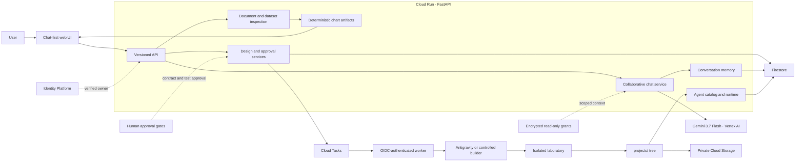

# Collaborative Taskmaster Studio

> A Collaborative Partner that turns an ambiguous job into a scoped, approved, tested, and
> reusable AI Taskmaster.

[](https://www.python.org/)
[](https://fastapi.tiangolo.com/)
[](https://cloud.google.com/run)
[](https://cloud.google.com/vertex-ai/generative-ai)
[](https://www.apache.org/licenses/LICENSE-2.0)

**Live application:**
[collaborative-taskmaster-studio-760216344589.us-central1.run.app](https://collaborative-taskmaster-studio-760216344589.us-central1.run.app/)

- **Hackathon:** [All Things Agentic](https://allthingsagentichackathon.devpost.com/)
- **Category:** Collaborative Partner
- **Primary model:** Gemini 3.7 Flash through Vertex AI
- **Agent frameworks:** Google ADK, Google Gen AI SDK, Antigravity SDK, and Genkit generators
- **Google Cloud:** Cloud Run, Firestore, Cloud Storage, Cloud Tasks, Vertex AI, Cloud Build, and
  Artifact Registry

---

## Why this exists

Most agent builders begin after the hardest decisions have already been made. They assume the user
knows the exact objective, inputs, tools, permissions, failure policy, memory model, and framework.
Real work rarely arrives that cleanly.

Collaborative Taskmaster Studio starts with the messy version:

> “I need an agent that reviews research papers.”

The Studio leads a conversation, asks only the missing questions, records decisions, challenges
unsafe assumptions, and turns the result into a versioned agent contract. It then hands that
approved contract to a separate builder, creates a real project, waits for explicit permission
before testing it, and publishes the Taskmaster only after the isolated laboratory passes.

The output is not another answer in a chat window. It is a navigable project with code, a manifest,
checksums, tests, policy boundaries, a conversational profile, and a durable catalog entry.

## The twist

The product is both:

1. a **Collaborative Partner** that guides a person from uncertainty to a precise design; and
2. a **Taskmaster factory** that converts that design into an executable, controlled agent.

Every published Taskmaster also receives a domain-specific conversational layer. Before executing
anything, it can explain what it does, what it cannot do, what information it needs, and which
actions require approval. That makes the generated agent useful as a guide and as an operator.

## What the Studio does

```text
Messy request
  → adaptive conversation with Gemini
  → structured notes and visible design
  → human approval of the contract
  → automatic framework and capability selection
  → asynchronous construction
  → human approval before tests
  → isolated laboratory
  → durable project and catalog entry
  → specialized conversation and controlled execution
```

### 1. Leads the discovery process

- asks focused clarifying questions instead of returning a generic checklist;
- maintains a continuous conversation and structured design state;
- identifies mission, users, inputs, outputs, workflow, tools, constraints, and approvals;
- captures feedback as a new revision instead of silently changing an approved design;
- shows completion, missing decisions, recommended framework, and required connections;
- preserves a deterministic fallback when the model response violates the contract.

### 2. Builds a real Taskmaster

- freezes the human-approved contract with a SHA-256 digest;
- selects the smallest suitable framework and plugin set;
- dispatches construction outside the web request through Cloud Tasks;
- runs Antigravity in an isolated Python environment when the SDK is available;
- clearly labels the safe controlled builder when Antigravity is unavailable;
- writes the result to the mandatory `projects/<agent-name>/` tree;
- stores files individually—never as ZIP or RAR archives;
- produces a manifest with paths, sizes, versions, and checksums.

### 3. Tests before publishing

- asks for a second human decision before running the laboratory;
- launches the generated project without Google, OAuth, or model credentials;
- blocks network access and applies a strict timeout;
- validates normal, incomplete-input, and adversarial scenarios;
- verifies workspace path confinement and plugin policies;
- publishes only a build that reaches `ready`.

### 4. Turns published agents into useful partners

The generated Taskmaster classifies each request as:

| Intent | Behavior |
| --- | --- |
| Conversation | Explains its specialty, capabilities, limitations, and examples. |
| Clarification | Requests the smallest missing input needed to continue. |
| Execution | Starts the workflow defined in its approved specification. |
| Approval | Pauses a protected action until the person explicitly decides. |

The runtime stays tied to the approved mission. A research agent behaves like a research guide; a
dataset agent behaves like a data analyst. The universal conversational layer does not erase the
agent's specialized task.

### 5. Works with documents and datasets

The chat accepts multiple files and immediately displays upload progress, inspection, attachment,
and deletion controls.

Supported inputs:

- text and structured data: TXT, Markdown, CSV, JSON, YAML, and XML;
- office documents: PDF, DOCX, XLSX, and PPTX;
- images: PNG, JPG, JPEG, and WEBP.

Small files use a direct upload. CSV and XLSX files up to **600 MiB** use validated 8 MiB chunks.
Large inputs are never copied wholesale into a prompt: extraction is bounded by rows, columns,
characters, expanded archive size, and multimodal bytes.

### 6. Draws charts instead of returning chart code

When a user asks for analysis or a visualization, the backend creates deterministic chart
artifacts. The browser renders them with Google Charts. The model is prevented from substituting a
Matplotlib, Seaborn, Plotly, or Chart.js snippet when a chart artifact is available.

Available visualizations include:

- vertical and horizontal bars;
- line and area charts;
- pie and donut charts;
- scatter plots with a linear trend and R² where supported;
- metric strips, calculated insights, source attribution, and expandable data tables.

A deep-analysis request can inspect several attached datasets and return a colorful dashboard of up
to eight complementary views. Explicit demo requests can also produce reproducible simulated data,
clearly labeled as synthetic.

### 7. Uses external context with least privilege

Personal connections are isolated by verified user identity:

- Google Drive: search, list, and read with `drive.readonly`;
- Gmail: search and read with `gmail.readonly`;
- Google Calendar: list and read with `calendar.readonly`;
- GitHub and public web research through bounded read-only adapters when configured;
- local project inspection confined to an explicitly authorized workspace.

Connecting a service does not grant write access. A capability shown in a design is not presented as
connected until OAuth and the required adapter are actually available.

---

## Architecture



### Architectural boundaries

| Boundary | Responsibility | What it cannot do |
| --- | --- | --- |
| Browser | Interaction, rendering, local cache, upload progress | Choose a production owner or approve on behalf of the user |
| API | Authentication, request limits, use-case orchestration | Bypass domain transitions |
| Gemini gateway | Questions, synthesis, structured proposals | Write projects, approve tests, or receive cloud credentials |
| Domain | Contracts, states, risk, validation, idempotency | Call Google Cloud directly |
| Builder | Render an approved specification into an allowed tree | Accept arbitrary shell commands or escape `projects/` |
| Laboratory | Verify the generated package | Use network or inherited credentials |
| Repository adapters | Persist state and artifacts | Decide what the agent should do |
| Human gates | Confirm design and authorize tests/actions | Mutate an already approved revision in place |

The application is a modular monolith at the web layer, but the long-running build path is
asynchronous and durable. Domain code depends on ports; local JSON, Firestore, local project
storage, and Cloud Storage are adapters behind those ports.

## Google technology used

| Technology | Role in the product |
| --- | --- |
| Gemini 3.7 Flash | Collaborative conversation, synthesis, structured agent proposals, and runtime responses |
| Vertex AI | Managed model access through Application Default Credentials |
| Google ADK | Agent topology and one supported generated-project target |
| Google Gen AI SDK | Typed model gateway and generated-project target |
| Antigravity SDK | Isolated refinement of approved generated projects |
| Genkit | Additional generated-project target |
| Cloud Run | Public web application and authenticated worker endpoint |
| Firestore | Projects, revisions, decisions, conversations, catalog, events, and durable build state |
| Cloud Tasks | Background construction and test delivery with bounded retries |
| Cloud Storage | Private, file-by-file persistence of completed Taskmaster projects |
| Identity Platform | Verified multi-user isolation and Google sign-in |
| Cloud Build | Test, container build, and image publication pipeline |
| Artifact Registry | Immutable container images |
| Google Charts | In-chat interactive rendering of validated chart artifacts |

## How this goes beyond a chatbot

| Simple chat loop | Collaborative Taskmaster Studio |
| --- | --- |
| Returns text | Produces code, manifests, checksums, tests, state, and visual artifacts |
| Treats the first prompt as complete | Leads discovery and records unresolved decisions |
| Changes output silently | Creates immutable revisions and visible diffs |
| Runs immediately | Requires separate approval for the contract and the laboratory |
| Loses work with the request | Uses Firestore and Cloud Tasks for durable asynchronous work |
| Claims capabilities | Verifies connections, runtimes, generated files, and tests |
| Offers chart code | Renders traceable charts directly in the conversation |
| One generic assistant | Publishes domain-specific Taskmasters with their own conversational profile |

---

## Safety model

The system treats user text, uploaded files, web pages, repository contents, and connector results
as untrusted data.

Core guarantees:

- production identity is derived from a verified token, not a client-provided session ID;
- OAuth grants are encrypted at rest and never written to chat history or browser storage;
- Gemini receives bounded context and no builder, Firestore, Cloud Storage, or OAuth credentials;
- generated paths are selected by controlled adapters;
- the isolated builder receives a frozen contract digest and a confined destination;
- the laboratory runs without network access or inherited cloud credentials;
- unknown plugins, missing connections, and unapproved writes fail closed;
- events contain identifiers, hashes, sizes, and outcomes—not private chain-of-thought;
- a failed cloud dispatch is shown as a failure, never as a simulated success.

### Human authority

There are three distinct decisions:

1. **Approve the design** — authorizes construction from the frozen contract.
2. **Approve laboratory execution** — authorizes isolated tests of the generated project.
3. **Approve a protected external effect** — required later if a Taskmaster gains a write-capable
   plugin.

Gemini, ADK agents, the builder, and the laboratory cannot grant these approvals.

## Data and upload limits

| Limit | Value |
| --- | ---: |
| Message length | 6,000 characters |
| Documents per session/conversation | 12 |
| Direct upload | 25 MiB per file |
| Large CSV or XLSX | 600 MiB per file |
| Upload chunk | 8 MiB |
| Simultaneous reserved large-upload bytes | 1,200 MiB per session |
| Extracted text retained | 100,000 characters per document |
| Dataset sample | 2,500 rows × 40 columns per sheet |
| XLSX sheets inspected | 24 |
| Chart points | 24 per artifact |
| Chart artifacts | 8 per request |
| Generated project | 500 files / 50,000,000 bytes |

The 600 MiB transport limit is not an instruction to load 600 MiB into model context. XLSX archive
members, expansion size, shared strings, sheets, rows, and columns remain independently bounded.

## Persistence and lifecycle

| Resource | Local development | Hosted production |
| --- | --- | --- |
| Conversations | Browser cache and local JSON | Browser cache plus Firestore authority |
| Design revisions and events | Local repository | Firestore |
| Build queue | Atomic local JSON | Firestore plus Cloud Tasks delivery |
| Agent catalog | Local catalog | Firestore per verified owner |
| Completed Taskmaster project | `projects/` | Private Cloud Storage with hash validation |
| Taskmaster runtime state | Separate local state file | Separate mutable Cloud Storage object |
| Uploaded chat files | `.studio-data` | Instance-temporary storage in the current release |

Completed projects are durable. Chat attachments on Cloud Run are intentionally described as
temporary until a dedicated private attachment store is connected. Closing a session is different
from deleting a chat, an uploaded file, an agent catalog entry, or a durable project.

---

## Repository layout

```text
app/                    FastAPI composition and browser application
studio/                 Domain-facing application services and capabilities
agents/                 Google ADK agent definitions
adapters/               Framework generators and construction orchestrators
infrastructure/         Vertex AI, Firestore, Cloud Run, Cloud Tasks, Storage, and local adapters
sandbox/                Isolated evaluation and safety gates
schemas/                Canonical Taskmaster specification schema
scripts/                Local startup and reproducibility helpers
tests/                  Unit, contract, integration, and API coverage
projects/               Generated Taskmasters; local content is ignored by Git
generated/              Legacy export output; local content is ignored by Git
```

## Local quick start

### Requirements

- Python 3.13.x
- Git
- PowerShell on Windows for the assisted Vertex AI startup script

Cloud credentials are not required for deterministic local mode.

### 1. Clone and create an environment

```powershell
git clone https://github.com/JavierMurcia/collaborative-taskmaster-studio.git
cd collaborative-taskmaster-studio
py -3.13 -m venv .venv
.\.venv\Scripts\Activate.ps1
python -m pip install --upgrade pip
python -m pip install -e ".[dev]"
```

On macOS or Linux, activate with `source .venv/bin/activate` and use `python3.13` when creating the
environment.

### 2. Run deterministic local mode

```powershell
python -m app.main
```

Open:

- application: <http://127.0.0.1:8080/>
- OpenAPI: <http://127.0.0.1:8080/docs>
- readiness: <http://127.0.0.1:8080/health/ready>

Local mode does not discover Google credentials, invoke Gemini, connect personal accounts, or
consume cloud resources. It uses the deterministic fallback and local adapters.

## Run locally with Gemini on Vertex AI

### 1. Install cloud extras

```powershell
python -m pip install -e ".[dev,vertex,firestore,storage,tasks]"
gcloud auth application-default login
gcloud config set project YOUR_PROJECT_ID
```

The Vertex integration uses Application Default Credentials. Remove `GOOGLE_API_KEY` and
`GEMINI_API_KEY` from the terminal before starting; API keys are deliberately rejected in this
mode.

### 2. Verify configuration before the first prompt

```powershell
.\scripts\start_local.ps1 -ProjectId YOUR_PROJECT_ID -CheckOnly
```

### 3. Start the application

```powershell
.\scripts\start_local.ps1 -ProjectId YOUR_PROJECT_ID
```

The script checks credentials, project, model, API version, and the effective builder. If a valid
Antigravity environment is absent, it reports and uses the controlled ADK builder.

## Optional isolated Antigravity runtime

Antigravity is installed separately because its dependency set should not control the web
application environment.

```powershell
py -3.13 -m venv .antigravity-venv
.\.antigravity-venv\Scripts\python.exe -m pip install --upgrade pip
.\.antigravity-venv\Scripts\python.exe -m pip install "google-antigravity==0.1.15"
.\scripts\start_local.ps1 -ProjectId YOUR_PROJECT_ID -CheckOnly
```

When the readiness check succeeds, the startup script sets the builder to `antigravity` and passes
the absolute interpreter path to the isolated orchestrator.

## Configuration reference

The application reads environment variables; it does not automatically load `.env.example`.

### Runtime and model

| Variable | Default | Purpose |
| --- | --- | --- |
| `STUDIO_ENV` | `development` | Selects development or production validation. |
| `STUDIO_HOST` | `127.0.0.1` | Local bind address; Cloud Run uses `0.0.0.0`. |
| `STUDIO_PORT` | `8080` | Local port; Cloud Run injects `PORT`. |
| `STUDIO_DATA_DIRECTORY` | `.studio-data` | Local state root. |
| `STUDIO_ENABLE_VERTEX` | `false` | Enables the Vertex AI gateway. |
| `GOOGLE_CLOUD_PROJECT` | empty | Exact Google Cloud project ID. |
| `GOOGLE_CLOUD_LOCATION` | `global` | Vertex AI location for Gemini. |
| `STUDIO_GEMINI_MODEL` | `gemini-3.7-flash` | Primary collaborative model. |
| `STUDIO_VERTEX_API_VERSION` | `v1` | Stable Vertex API version. |
| `STUDIO_MAX_MODEL_OUTPUT_TOKENS` | `8192` | Structured-output ceiling. |
| `STUDIO_MAX_MODEL_QUESTIONS_PER_PROJECT` | `3` | Generated interview-question ceiling. |

Model-assisted operations have independent feature gates:

- `STUDIO_ENABLE_MODEL_QUESTIONS`
- `STUDIO_ENABLE_MODEL_BRIEFING`
- `STUDIO_ENABLE_MODEL_SPECIFICATION`
- `STUDIO_ENABLE_MODEL_REVISION`

### Persistence and construction

| Variable | Default | Purpose |
| --- | --- | --- |
| `STUDIO_PERSISTENCE` | `local` | Selects the repository adapter. |
| `STUDIO_ENABLE_FIRESTORE` | `false` | Enables Firestore persistence. |
| `STUDIO_FIRESTORE_DATABASE` | `collaborative-taskmaster` | Named database. |
| `STUDIO_FIRESTORE_DEMO_RETENTION_DAYS` | `7` | Demo retention contract. |
| `STUDIO_PROJECTS_ROOT` | `projects` | Mandatory generated-project root. |
| `STUDIO_ENABLE_CLOUD_STORAGE` | `false` | Enables durable project replication. |
| `STUDIO_PROJECTS_BUCKET` | empty | Private project bucket. |
| `STUDIO_PROJECTS_BUCKET_PREFIX` | `taskmaster-projects` | Isolated object prefix. |
| `STUDIO_PROJECTS_MAX_FILES` | `500` | Project file-count limit. |
| `STUDIO_PROJECTS_MAX_TOTAL_BYTES` | `50000000` | Project byte limit. |
| `STUDIO_AGENT_BUILDER` | `controlled_adk` | Effective builder request. |
| `STUDIO_ANTIGRAVITY_PYTHON` | empty | Absolute isolated Antigravity interpreter. |
| `STUDIO_ANTIGRAVITY_MODEL` | `gemini-2.5-flash` | Explicit model used by the builder SDK. |
| `STUDIO_SANDBOX_TIMEOUT` | `8` | Seconds allowed for each laboratory process. |

### Asynchronous work and identity

| Variable | Default | Purpose |
| --- | --- | --- |
| `STUDIO_ENABLE_CLOUD_TASKS` | `false` | Enables external build delivery. |
| `STUDIO_CLOUD_TASKS_LOCATION` | `us-central1` | Queue region. |
| `STUDIO_CLOUD_TASKS_QUEUE` | `taskmaster-builds` | Queue name. |
| `STUDIO_BUILD_WORKER_SERVICE_ACCOUNT` | empty | Exact OIDC worker identity. |
| `STUDIO_BUILD_WORKER_URL` | empty | Private worker URL. |
| `STUDIO_BUILD_WORKER_AUDIENCE` | empty | Expected OIDC audience. |
| `STUDIO_AUTH_MODE` | `local` | `local` or `identity_platform`. |
| `STUDIO_IDENTITY_PROJECT` | project default | Identity Platform project. |
| `STUDIO_PUBLIC_BASE_URL` | local URL | OAuth return origin and public service origin. |

OAuth client secrets, the OAuth state secret, and the encryption key must come from managed secret
injection in production. Never commit them.

---

## Test and quality gates

Run the complete suite:

```powershell
python -m pytest -q
python -m ruff check .
python -m mypy app studio agents infrastructure adapters sandbox
```

The suite covers:

- domain transitions and schema validation;
- immutable revisions, approvals, and idempotency;
- local and Firestore repository contracts;
- model boundary and deterministic fallbacks;
- framework selection and generated manifests;
- isolated Antigravity orchestration;
- sandbox containment and adversarial scenarios;
- Identity Platform ownership and OAuth isolation;
- Cloud Tasks authentication, retries, and recovery;
- conversation persistence and deletion;
- multiple uploads, bounded XLSX/CSV parsing, and chart artifacts;
- Cloud Run declarations, IAM, build pipeline, and architecture contract.

### Clean-install verification

```powershell
py -3.13 scripts\verify_clean_install.py
```

This helper creates a temporary isolated copy, installs development dependencies, runs the suite,
starts the local server, probes key endpoints, and removes the temporary environment. Gemini and
Firestore are forced off so the check cannot consume cloud resources.

## Container build

```powershell
docker build -t collaborative-taskmaster-studio:local .
docker run --rm -p 8080:8080 collaborative-taskmaster-studio:local
```

The runtime image:

- runs as an unprivileged user;
- listens on port 8080;
- contains no service-account JSON;
- installs cloud and laboratory adapters at build time;
- writes only to application-owned or temporary locations.

## Google Cloud deployment workflow

Production provisioning is intentionally explicit. The repository contains machine-readable
definitions and planners; no resource is created merely by importing or starting the application.

### 1. Authenticate and select a project

```powershell
gcloud auth login
gcloud auth application-default login
gcloud config set project YOUR_PROJECT_ID
gcloud billing projects describe YOUR_PROJECT_ID
```

### 2. Inspect the declared plans

```powershell
python -m infrastructure.cloud_run.iam_check --project YOUR_PROJECT_ID
python -m infrastructure.cloud_run.build_check --project YOUR_PROJECT_ID --image-tag git-COMMIT
python -m infrastructure.firestore.provisioning --project YOUR_PROJECT_ID
```

These commands print plans unless their explicit apply or verification option is used.

### 3. Build with Cloud Build

```powershell
gcloud builds submit `
  --config cloudbuild.yaml `
  --substitutions=_IMAGE_TAG=git-COMMIT `
  --project YOUR_PROJECT_ID `
  .
```

The pipeline runs the tests before building and pushing the image to Artifact Registry.

### 4. Plan deployment from an immutable digest

```powershell
python -m infrastructure.cloud_run.deployment_check `
  --project YOUR_PROJECT_ID `
  --image-digest DIGEST_WITHOUT_SHA256_PREFIX
```

Review the emitted `gcloud run deploy` command, runtime identity, environment, scaling, ingress,
port, concurrency, and digest before applying anything.

### 5. Verify the deployed service

```powershell
python -m infrastructure.cloud_run.deployment_check `
  --project YOUR_PROJECT_ID `
  --image-digest DIGEST_WITHOUT_SHA256_PREFIX `
  --verify

python -m infrastructure.cloud_run.journey_check `
  --url https://YOUR_SERVICE_URL `
  --timeout 90
```

Production currently uses a deliberately conservative scale profile for the public demo. Review
memory, concurrency, maximum instances, queue throughput, temporary disk, and budget before using
the deployment for sustained workloads.

## Failure and recovery behavior

| Failure | Behavior |
| --- | --- |
| Invalid Gemini structure | Reject and use a visible deterministic fallback. |
| Missing human approval | Do not construct, test, or execute the protected action. |
| Cloud Tasks dispatch failure | Preserve the durable job and display the failure. |
| Duplicate task delivery | Treat it as the same idempotent phase. |
| Worker restart | Recover the contract and state from Firestore. |
| Missing Antigravity runtime | Use and label the controlled builder. |
| Invalid generated path | Reject the project before persistence. |
| Laboratory failure | Mark `failed_safe`; do not publish. |
| Large-upload offset mismatch | Reject the chunk without corrupting confirmed bytes. |
| Unsafe or malformed XLSX | Stop extraction and clean temporary state. |
| Chart renderer unavailable | Keep the validated data artifact and avoid claiming visual success. |
| Deleted conversation | Remove local and server copies so it is not restored on reload. |

## Live evaluation path

A judge can verify the main value without configuring cloud resources:

1. open the live application;
2. sign in or use the available evaluation session;
3. describe an agent in ordinary language;
4. answer the focused follow-up questions;
5. inspect the design, framework, access requirements, and completion state;
6. approve construction;
7. observe durable builder progress;
8. approve the isolated laboratory separately;
9. open the published Taskmaster from the catalog;
10. ask what it can do, then give it a domain-specific task;
11. attach multiple CSV/XLSX files and request a deep visual dashboard;
12. inspect the rendered charts, metrics, insights, and source data.

For a strong four-minute demonstration, show the live Cloud Run URL, one unedited construction or
recovered build, the approval boundary, the resulting project/catalog entry, and one dataset
dashboard. This provides visible proof of action rather than relying on a narrated architecture.

## Current limitations

- The interface chrome is Spanish-first; the Gemini conversation accepts English and Spanish input.
- Hosted chat attachments are temporary to the current Cloud Run instance; completed Taskmaster
  projects are durable.
- External connectors are read-only in the current public experience.
- A protected write requires a future write-capable adapter plus explicit human approval.
- The public service is configured for evaluation, not unrestricted production traffic.
- Google Charts is loaded in the browser; a restrictive network policy can prevent visual rendering
  while leaving the underlying artifact intact.

## Design principles

1. **Lead before generating.** Clarify the job and its constraints first.
2. **Contracts over prompt folklore.** Validate every model-produced structure.
3. **Human authority is explicit.** Construction, testing, and external effects are separate gates.
4. **Capabilities must be real.** Show disconnected, unavailable, fallback, and failed states honestly.
5. **Long work must survive requests.** Persist state before asynchronous dispatch.
6. **Projects remain inspectable.** Store trees and manifests, not opaque archives.
7. **Data is evidence, never instruction.** Bound and label every external source.
8. **Visible activity is not chain-of-thought.** Report operations and results only.
9. **Fail closed.** Invalid state never becomes an implicit success.

## License

Licensed under the Apache License 2.0.
