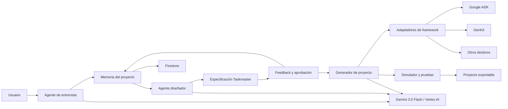

# Documento 01 — Plan maestro del proyecto

## 1. Identificación

- **Nombre provisional:** Collaborative Taskmaster Studio
- **Categoría:** Collaborative Partner
- **Evento:** All Things Agentic Hackathon
- **Objetivo:** crear un socio colaborativo que entrevista y guía al usuario para transformar una tarea compleja en un agente Taskmaster ejecutable, verificable y controlado.
- **Estado:** definición inicial

## 2. Visión del producto

Collaborative Taskmaster Studio será un entorno para diseñar agentes Taskmaster sin obligar al usuario a conocer de antemano la arquitectura, las herramientas ni los controles que necesita.

El socio colaborativo conducirá una entrevista, tomará notas, detectará información faltante, propondrá un flujo de trabajo, recogerá feedback y adaptará el diseño. Cuando el usuario apruebe la especificación, el sistema generará un proyecto ejecutable y lo probará dentro de un entorno seguro.

El producto no se limitará a producir texto. Su resultado será un conjunto verificable de artefactos: especificación, diagrama, configuración, código, pruebas y registro de decisiones.

## 3. Propuesta de valor

> Diseña un Taskmaster una sola vez mediante una conversación guiada y conviértelo en un agente ejecutable con herramientas, memoria, políticas, pruebas y documentación.

El sistema reduce estas dificultades:

- convertir una idea imprecisa en requisitos comprobables;
- decidir qué puede hacer el agente de forma autónoma;
- identificar herramientas, datos, riesgos y aprobaciones;
- diseñar un flujo de trabajo de varios pasos;
- generar una estructura de proyecto reproducible;
- probar el agente antes de conectarlo a servicios reales;
- conservar el razonamiento práctico y el feedback del usuario.

## 4. Requisitos de la convocatoria

El proyecto debe cumplir como mínimo con lo siguiente:

1. Utilizar **Gemini 3.5 Flash o una versión superior** mediante Gemini API o Vertex AI.
2. Utilizar al menos un framework de agentes de Google.
3. Utilizar al menos un servicio de infraestructura de Google Cloud.
4. Operar más allá de un ciclo convencional de chat.
5. Demostrar un agente que dirige el proceso, toma notas, hace preguntas aclaratorias, guía paso a paso y captura feedback.
6. Incluir repositorio, instrucciones reproducibles, diagrama de arquitectura, demostración en vídeo y evidencia de despliegue en Google Cloud.

## 5. Estrategia de frameworks

### Núcleo inicial

- **Google ADK:** orquestación del socio colaborativo, agentes, herramientas, sesiones y flujo principal.
- **Google Gen AI SDK:** comunicación estructurada con Gemini para generar especificaciones, planes y artefactos.

### Adaptadores posteriores

- **GenKit:** destino opcional para Taskmasters orientados a TypeScript y aplicaciones web.
- **Antigravity SDK:** destino opcional cuando exista un caso de uso claramente demostrable.

El MVP se construirá primero con ADK y Gen AI SDK. GenKit y Antigravity se incorporarán mediante adaptadores, sin mezclar responsabilidades dentro del núcleo.

## 6. Servicios de Google Cloud

- **Vertex AI:** acceso a Gemini 3.5 Flash.
- **Cloud Run:** despliegue del backend y la interfaz.
- **Firestore:** persistencia de proyectos, entrevistas, feedback y versiones aprobadas.

Firestore puede sustituirse temporalmente por almacenamiento local durante las primeras etapas, pero la demostración final debe mostrar persistencia en Google Cloud.

## 7. Flujo principal del usuario

1. El usuario describe la tarea que desea convertir en un Taskmaster.
2. El socio colaborativo analiza la descripción e identifica información faltante.
3. El agente formula preguntas sobre objetivo, actores, herramientas, datos, restricciones, riesgos, frecuencia y resultado esperado.
4. El sistema registra las respuestas en un briefing estructurado.
5. El agente presenta un resumen para confirmación.
6. El usuario corrige o aprueba el briefing.
7. El sistema diseña el Taskmaster: pasos, estados, herramientas, memoria, políticas, aprobaciones y criterios de éxito.
8. El usuario entrega feedback y el agente adapta el diseño.
9. El usuario aprueba una versión concreta.
10. El generador crea el proyecto y sus pruebas.
11. El sistema ejecuta una simulación controlada.
12. El usuario revisa los resultados y exporta el Taskmaster.

## 8. Artefactos que debe generar

Cada Taskmaster creado por el estudio debe contener:

- ficha de propósito y alcance;
- flujo de trabajo y estados;
- definición de entradas y salidas;
- catálogo de herramientas;
- configuración de memoria;
- niveles de autonomía;
- políticas y aprobaciones humanas;
- criterios de éxito y verificación;
- escenarios de prueba;
- código fuente;
- archivo de variables de entorno de ejemplo;
- instrucciones de instalación;
- diagrama de arquitectura;
- manifiesto de exportación con framework y versión.

## 9. Arquitectura conceptual



## 10. Agentes internos previstos

### 10.1 Agente de entrevista

- comprende la idea inicial;
- hace preguntas aclaratorias;
- evita preguntas repetidas;
- resume lo aprendido;
- solicita confirmación antes de continuar.

### 10.2 Agente diseñador

- transforma el briefing en un flujo de trabajo;
- define estados, herramientas y responsables;
- identifica acciones de riesgo;
- propone límites de autonomía;
- define condiciones verificables de finalización.

### 10.3 Agente generador

- convierte la especificación aprobada en archivos;
- selecciona las plantillas correspondientes al framework;
- genera configuración, código, pruebas y documentación;
- no modifica una versión aprobada sin crear una revisión nueva.

### 10.4 Agente evaluador

- ejecuta escenarios simulados;
- detecta pasos incompletos o contradictorios;
- comprueba políticas, errores y resultados;
- entrega un informe antes de exportar.

## 11. Directorio previsto

```text
collaborative-taskmaster-studio/
├── app/                         # Interfaz web y API
│   ├── api/                     # Endpoints del estudio
│   └── static/                  # HTML, CSS y JavaScript
├── studio/                      # Dominio principal
│   ├── models/                  # Proyecto, briefing, versión y artefactos
│   ├── services/                # Casos de uso del estudio
│   └── state/                   # Estados y transiciones
├── agents/                      # Agentes ADK
│   ├── interviewer/             # Entrevista y aclaración
│   ├── designer/                # Diseño del Taskmaster
│   ├── generator/               # Generación de archivos
│   └── evaluator/               # Simulación y evaluación
├── tools/                       # Herramientas autorizadas de los agentes
├── memory/                      # Memoria local y adaptador Firestore
├── policies/                    # Autonomía, permisos y aprobaciones
├── adapters/                    # Exportadores por framework
│   ├── adk/                     # Plantillas Google ADK
│   ├── genkit/                  # Plantillas GenKit
│   └── antigravity/             # Integración futura
├── templates/                   # Archivos base reutilizables
├── sandbox/                     # Ejecución simulada y aislada
├── tests/                       # Pruebas unitarias e integrales
├── docs/                        # Documentación numerada
├── examples/                    # Taskmasters de demostración
├── scripts/                     # Utilidades de desarrollo y despliegue
├── .env.example                 # Variables sin secretos
├── .gitignore
├── Dockerfile
├── README.md
└── requirements.txt
```

## 12. Etapas de construcción

### Etapa 1 — Definición y contrato

- cerrar el alcance del MVP;
- definir modelos de datos y estados;
- diseñar el contrato de una especificación Taskmaster;
- definir criterios de aceptación.

**Resultado:** especificación técnica y esquema JSON estable.

### Etapa 2 — Entrevista colaborativa

- crear el agente ADK de entrevista;
- implementar preguntas aclaratorias dinámicas;
- registrar notas y respuestas;
- presentar un resumen editable.

**Resultado:** briefing confirmado por el usuario.

### Etapa 3 — Diseño del Taskmaster

- generar el flujo de trabajo;
- definir herramientas, memoria, riesgos y aprobaciones;
- incorporar feedback y versionar cambios;
- impedir la generación sin aprobación.

**Resultado:** especificación Taskmaster aprobada.

### Etapa 4 — Generación ejecutable

- crear el adaptador inicial para Google ADK;
- generar estructura, configuración y pruebas;
- validar nombres, rutas y dependencias;
- exportar el proyecto a una carpeta separada.

**Resultado:** primer Taskmaster generado y ejecutable.

### Etapa 5 — Simulación y evaluación

- construir el sandbox local;
- ejecutar escenarios normales, ambiguos y fallidos;
- mostrar trayectoria, acciones y resultados;
- producir un informe de preparación.

**Resultado:** evidencia de que el agente generado funciona.

### Etapa 6 — Persistencia y nube

- persistir proyectos y versiones en Firestore;
- desplegar la aplicación en Cloud Run;
- activar Gemini 3.5 Flash mediante Vertex AI;
- comprobar costos, permisos y manejo de errores.

**Resultado:** demostración funcional en Google Cloud.

### Etapa 7 — Entrega

- finalizar README e instrucciones de ejecución;
- crear diagrama definitivo;
- preparar un Taskmaster de ejemplo;
- grabar el video de aproximadamente cuatro minutos;
- completar la descripción y evidencias para Devpost.

**Resultado:** paquete completo de presentación.

## 13. Alcance del MVP

El MVP permitirá:

- crear un proyecto a partir de una tarea descrita en lenguaje natural;
- realizar una entrevista guiada;
- guardar un briefing estructurado;
- generar y revisar una especificación Taskmaster;
- incorporar al menos una ronda de feedback;
- aprobar una versión;
- generar un Taskmaster basado en Google ADK;
- ejecutar una simulación local;
- mostrar el historial de decisiones;
- desplegar el estudio en Cloud Run.

## 14. Fuera del alcance inicial

- ejecutar automáticamente herramientas empresariales reales;
- generar proyectos para todos los lenguajes;
- desplegar automáticamente cada Taskmaster generado;
- admitir simultáneamente todos los frameworks desde la primera versión;
- compartir proyectos entre organizaciones;
- cobrar por el servicio o administrar suscripciones.

## 15. Estados del proyecto

```text
IDEA
  -> ENTREVISTA
  -> BRIEFING_PENDIENTE
  -> BRIEFING_CONFIRMADO
  -> DISEÑO_EN_REVISIÓN
  -> DISEÑO_APROBADO
  -> GENERANDO
  -> VALIDANDO
  -> LISTO_PARA_EXPORTAR
  -> EXPORTADO
```

Los cambios posteriores a una aprobación crearán una nueva versión y no sobrescribirán silenciosamente la anterior.

## 16. Seguridad y gobernanza

- secretos únicamente mediante variables de entorno o Secret Manager;
- catálogo cerrado de herramientas internas;
- separación entre propuesta, aprobación y ejecución;
- validación estructurada de las respuestas de Gemini;
- rutas de exportación limitadas a un directorio de proyectos;
- protección contra sobrescritura accidental;
- registro de feedback, aprobaciones y versiones;
- fallback seguro si Gemini o Google Cloud no están disponibles;
- datos simulados para la demostración inicial.

## 17. Criterios de aceptación del MVP

El MVP estará listo cuando pueda demostrarse, sin editar manualmente los archivos generados, que:

1. una descripción ambigua produce preguntas relevantes;
2. las respuestas se convierten en un briefing visible;
3. el feedback cambia de forma comprobable el diseño;
4. el usuario debe aprobar antes de generar;
5. el sistema crea un proyecto Taskmaster en una carpeta nueva;
6. el proyecto generado incluye código, pruebas y documentación;
7. las pruebas del Taskmaster generado pasan;
8. la trayectoria identifica las intervenciones de Gemini y del usuario;
9. el backend se ejecuta en Cloud Run;
10. la sesión usa Gemini 3.5 Flash mediante Vertex AI.

## 18. Demostración objetivo

La demostración utilizará una tarea concreta y mostrará:

1. una solicitud inicial incompleta;
2. las preguntas del socio colaborativo;
3. el briefing y la primera especificación;
4. una corrección solicitada por el usuario;
5. la versión adaptada;
6. la aprobación explícita;
7. la generación del Taskmaster;
8. la simulación y las pruebas;
9. el proyecto exportado;
10. evidencia de Vertex AI, Firestore y Cloud Run.

## 19. Usuarios objetivo

### 19.1 Creador no técnico

Tiene una tarea repetitiva o compleja, pero no conoce conceptos como herramientas, estados, memoria o políticas. Necesita que el socio colaborativo traduzca sus respuestas a una especificación comprensible y le permita aprobarla antes de generar código.

### 19.2 Desarrollador individual

Quiere acelerar la creación de un agente sin empezar desde una carpeta vacía. Necesita una estructura mantenible, archivos reproducibles, pruebas y puntos claros de extensión.

### 19.3 Equipo pequeño

Necesita acordar cómo funcionará el agente, quién aprueba acciones importantes y qué evidencia demostrará que el flujo terminó correctamente. Valora el historial de feedback y el versionado.

## 20. Casos de uso prioritarios

### CU-01 — Crear un Taskmaster desde una idea

El usuario describe una tarea en lenguaje natural. El estudio detecta vacíos, realiza la entrevista y produce una especificación inicial.

### CU-02 — Refinar el diseño mediante feedback

El usuario solicita cambios. El estudio explica su impacto, crea una nueva versión y conserva la anterior.

### CU-03 — Generar un proyecto ejecutable

Tras la aprobación, el estudio crea una carpeta separada con código, configuración, documentación y pruebas.

### CU-04 — Evaluar el Taskmaster generado

El estudio ejecuta escenarios simulados y entrega un informe con resultados, fallos y controles aplicados.

### CU-05 — Reabrir un proyecto

El usuario recupera desde Firestore un proyecto previo, revisa sus decisiones y continúa desde la última versión aprobada.

### CU-06 — Exportar a otro framework

En una fase posterior, el usuario conserva la misma especificación y selecciona un adaptador de salida diferente.

## 21. Requisitos funcionales

| Código | Requisito | Prioridad MVP |
| --- | --- | --- |
| RF-01 | Crear, abrir y reiniciar un proyecto. | Obligatorio |
| RF-02 | Analizar una descripción inicial y detectar información faltante. | Obligatorio |
| RF-03 | Formular preguntas aclaratorias relevantes y no repetitivas. | Obligatorio |
| RF-04 | Guardar respuestas y notas estructuradas. | Obligatorio |
| RF-05 | Presentar un briefing editable antes de diseñar. | Obligatorio |
| RF-06 | Generar una especificación Taskmaster estructurada. | Obligatorio |
| RF-07 | Capturar feedback y mostrar qué cambió entre versiones. | Obligatorio |
| RF-08 | Exigir aprobación explícita para congelar una versión. | Obligatorio |
| RF-09 | Generar un proyecto Google ADK en un directorio aislado. | Obligatorio |
| RF-10 | Ejecutar pruebas y una simulación del proyecto generado. | Obligatorio |
| RF-11 | Mostrar trayectoria de decisiones, modelos y acciones. | Obligatorio |
| RF-12 | Exportar o descargar los artefactos generados. | Obligatorio |
| RF-13 | Persistir sesiones y versiones en Firestore. | Obligatorio final |
| RF-14 | Generar mediante GenKit. | Posterior |
| RF-15 | Generar mediante Antigravity SDK. | Posterior |

## 22. Requisitos no funcionales

| Código | Requisito |
| --- | --- |
| RNF-01 | La interfaz debe explicar cada etapa sin exigir conocimientos técnicos. |
| RNF-02 | Las respuestas del modelo que afecten al estado deben usar salida estructurada y validación de esquema. |
| RNF-03 | La aplicación debe poder funcionar en modo demostración cuando Vertex AI no esté disponible. |
| RNF-04 | Ningún secreto debe almacenarse en el repositorio, Firestore ni archivos exportados. |
| RNF-05 | La generación debe limitarse a un directorio de salida específico. |
| RNF-06 | Una versión aprobada debe ser inmutable. |
| RNF-07 | Los errores deben quedar registrados y producir una recuperación segura. |
| RNF-08 | El backend debe ejecutarse localmente y en Cloud Run sin cambios de código. |
| RNF-09 | Las pruebas del núcleo no deben depender de llamadas reales a Gemini. |
| RNF-10 | La interfaz debe adaptarse a escritorio y dispositivos móviles. |

## 23. Principios de diseño

1. **La conversación produce estado:** cada respuesta actualiza un briefing o una decisión verificable.
2. **El usuario conserva autoridad:** el agente dirige, pero no aprueba en nombre del usuario.
3. **La especificación es independiente del framework:** los adaptadores consumen un contrato común.
4. **Generar no significa ejecutar:** el código se valida dentro del sandbox antes de exportarse.
5. **Todo cambio importante crea evidencia:** feedback, aprobaciones, generación y pruebas quedan en la trayectoria.
6. **Fallback explícito:** el modo local nunca debe presentarse como una respuesta generada por Gemini.
7. **Primero un camino completo:** se prioriza una exportación ADK excelente antes de añadir más destinos.

## 24. Componentes y responsabilidades

| Componente | Responsabilidad | No debe hacer |
| --- | --- | --- |
| Interfaz web | Guiar al usuario y mostrar estado, cambios y resultados. | Ejecutar lógica de negocio o almacenar secretos. |
| API | Validar solicitudes y exponer casos de uso. | Construir prompts directamente. |
| Orquestador ADK | Coordinar agentes, herramientas y transiciones. | Escribir archivos fuera de las herramientas autorizadas. |
| Memoria del proyecto | Conservar briefing, feedback, decisiones y versiones. | Guardar credenciales. |
| Diseñador | Proponer la especificación Taskmaster. | Aprobarla o ejecutarla. |
| Generador | Renderizar plantillas desde una especificación aprobada. | Modificar el contrato recibido. |
| Adaptador de framework | Traducir el contrato común a una implementación concreta. | Introducir reglas de producto ocultas. |
| Sandbox | Instalar, probar y simular el proyecto generado. | Acceder a recursos externos no autorizados. |
| Evaluador | Comparar resultados con criterios de aceptación. | Cambiar los resultados para forzar éxito. |
| Firestore | Persistir proyectos y versiones. | Ser el único lugar de auditoría de la demo. |

## 25. Modelo de información

### Project

- identificador;
- nombre;
- propietario de la sesión;
- categoría objetivo;
- estado actual;
- framework de salida;
- fecha de creación y modificación.

### Briefing

- problema;
- objetivo;
- usuarios y actores;
- entradas y fuentes de datos;
- resultado esperado;
- frecuencia y duración;
- herramientas implicadas;
- restricciones;
- acciones prohibidas;
- nivel de autonomía;
- criterios de éxito;
- preguntas pendientes.

### TaskmasterSpecification

- metadatos y versión;
- propósito y alcance;
- flujo y estados;
- herramientas;
- memoria;
- políticas;
- aprobaciones;
- presupuesto y límites;
- manejo de errores;
- verificación;
- escenarios de prueba;
- configuración de despliegue.

### Revision

- número de versión;
- especificación completa;
- feedback que la originó;
- resumen de cambios;
- estado de aprobación;
- autor y fecha de decisión.

### AuditEvent

- secuencia;
- tipo de evento;
- actor;
- fecha;
- descripción;
- referencia al proyecto y versión;
- metadatos técnicos sin cadena de razonamiento privada.

### GeneratedArtifact

- ruta relativa;
- tipo;
- checksum;
- framework;
- versión de plantilla;
- resultado de validación.

## 26. Pantallas del MVP

### 26.1 Inicio

- explica qué crea el estudio;
- permite crear o abrir un proyecto;
- muestra ejemplos de tareas adecuadas.

### 26.2 Entrevista

- conversación guiada;
- notas capturadas al costado;
- indicador de información completa y pendiente;
- posibilidad de corregir una respuesta anterior.

### 26.3 Briefing

- resumen estructurado;
- campos editables;
- preguntas todavía abiertas;
- botón de confirmación explícita.

### 26.4 Diseñador

- diagrama del flujo;
- catálogo de herramientas;
- memoria, riesgos y aprobaciones;
- panel para solicitar cambios;
- comparación entre versiones.

### 26.5 Generación

- framework seleccionado;
- lista de artefactos que se crearán;
- progreso y validaciones;
- errores recuperables.

### 26.6 Laboratorio

- escenarios de prueba;
- pasos ejecutados;
- herramientas simuladas;
- resultado esperado frente al obtenido;
- informe de preparación.

### 26.7 Exportación

- árbol de archivos;
- instrucciones de ejecución;
- estado de pruebas;
- descarga o ruta local del proyecto.

## 27. API inicial prevista

| Método | Ruta | Propósito |
| --- | --- | --- |
| POST | `/api/projects` | Crear un proyecto. |
| GET | `/api/projects/{id}` | Recuperar estado y versión activa. |
| POST | `/api/projects/{id}/messages` | Enviar una respuesta a la entrevista. |
| PATCH | `/api/projects/{id}/briefing` | Corregir el briefing. |
| POST | `/api/projects/{id}/briefing/confirm` | Confirmar el briefing. |
| POST | `/api/projects/{id}/design` | Generar una propuesta Taskmaster. |
| POST | `/api/projects/{id}/feedback` | Incorporar feedback y crear una revisión. |
| POST | `/api/projects/{id}/revisions/{version}/approve` | Aprobar una versión. |
| POST | `/api/projects/{id}/generate` | Generar el proyecto. |
| POST | `/api/projects/{id}/evaluate` | Ejecutar simulación y pruebas. |
| GET | `/api/projects/{id}/artifacts` | Listar artefactos exportables. |
| GET | `/api/projects/{id}/events` | Consultar la trayectoria auditable. |

Las rutas son una propuesta y quedarán congeladas después de definir el contrato del Documento 02.

## 28. Herramientas internas del agente

- `create_project`
- `record_answer`
- `update_briefing_field`
- `list_missing_information`
- `confirm_briefing`
- `draft_taskmaster_specification`
- `compare_revisions`
- `record_feedback`
- `approve_revision`
- `generate_project`
- `validate_generated_files`
- `run_sandbox_scenario`
- `create_evaluation_report`
- `export_project`

Cada herramienta tendrá un esquema de entrada cerrado, validación de permisos y resultado estructurado.

## 29. Reglas de autonomía

### Autonomía permitida

- elegir la siguiente pregunta entre las preguntas válidas;
- resumir respuestas confirmadas;
- proponer pasos, herramientas y controles;
- generar borradores y revisiones;
- ejecutar pruebas deterministas dentro del sandbox.

### Requiere confirmación

- cerrar el briefing;
- aprobar una especificación;
- reemplazar el framework de salida;
- generar o regenerar archivos;
- exportar el proyecto;
- conectar una herramienta externa.

### Prohibido en el MVP

- enviar correos o mensajes reales;
- acceder a cuentas externas;
- desplegar automáticamente el Taskmaster generado;
- borrar proyectos existentes;
- ejecutar comandos arbitrarios propuestos por Gemini;
- incluir credenciales en los artefactos.

## 30. Estrategia de prompting y salidas

- separar instrucciones del sistema, contexto confirmado y datos no confiables;
- no enviar conversaciones completas cuando el briefing estructurado sea suficiente;
- solicitar JSON validado para preguntas, especificaciones y revisiones;
- limitar cantidad de preguntas y tamaño de salida por llamada;
- exigir referencias a campos del briefing para justificar cambios prácticos;
- rechazar herramientas, estados o campos desconocidos;
- registrar modelo, latencia, resultado y uso, sin mostrar razonamiento privado;
- mantener respuestas deterministas de respaldo para la demostración local.

## 31. Persistencia en Firestore

Estructura inicial sugerida:

```text
projects/{project_id}
projects/{project_id}/briefings/{briefing_id}
projects/{project_id}/revisions/{version}
projects/{project_id}/events/{event_id}
projects/{project_id}/artifacts/{artifact_id}
```

Las consultas deben limitarse al proyecto activo. Para la demostración se utilizará un identificador de sesión, sin almacenar información personal innecesaria.

## 32. Estrategia de pruebas

### Pruebas unitarias

- validación del briefing;
- transiciones de estado;
- reglas de aprobación;
- versionado;
- validación de especificaciones;
- rutas seguras de generación;
- adaptador ADK.

### Pruebas contractuales

- respuestas estructuradas de Gemini;
- compatibilidad entre contrato y plantillas;
- integridad de los artefactos;
- persistencia y recuperación desde Firestore.

### Pruebas integrales

- idea hasta briefing confirmado;
- feedback hasta nueva revisión;
- aprobación hasta generación;
- generación hasta pruebas exitosas;
- fallo de Vertex AI y fallback;
- reinicio de sesión y recuperación del proyecto.

### Pruebas de seguridad

- prompt injection dentro de la descripción de la tarea;
- rutas de archivo maliciosas;
- herramienta desconocida;
- intento de generar sin aprobación;
- sobrescritura de una versión aprobada;
- secretos incluidos accidentalmente en el briefing.

## 33. Observabilidad

La aplicación registrará:

- identificador de proyecto y solicitud;
- transición de estado;
- agente y herramienta participantes;
- modelo utilizado;
- duración de la operación;
- éxito, fallback o error;
- versión de especificación;
- aprobación humana relacionada;
- resultado de pruebas y exportación.

No se registrarán secretos, tokens, contenido sensible completo ni cadenas privadas de razonamiento. Para la entrega, los eventos se mostrarán en una trayectoria comprensible y podrán emitirse como registros estructurados de Cloud Run.

## 34. Control de costos

- Cloud Run con `min-instances=0`;
- límite bajo de instancias y concurrencia durante la demo;
- Gemini 3.5 Flash con salidas acotadas;
- briefing estructurado para reducir contexto repetido;
- caché de revisiones que no hayan cambiado;
- Firestore con lecturas enfocadas por proyecto;
- presupuesto y alertas del proyecto de Google Cloud;
- modo local determinista para desarrollo de interfaz y pruebas.

## 35. Indicadores de éxito

### Indicadores del producto

- porcentaje de briefings completados sin preguntas repetidas;
- cantidad de correcciones necesarias antes de aprobación;
- porcentaje de proyectos generados que pasan sus pruebas;
- tiempo desde idea hasta Taskmaster ejecutable;
- porcentaje de cambios correctamente reflejados entre revisiones.

### Objetivos iniciales del MVP

- generar el primer briefing en menos de cinco minutos de interacción;
- producir una especificación válida en el 100 % de los escenarios oficiales de demo;
- generar un proyecto ADK que pase todas sus pruebas locales;
- recuperar una sesión persistida sin pérdida de decisiones;
- completar la demostración principal en menos de cuatro minutos.

## 36. Riesgos y mitigaciones

| Riesgo | Impacto | Mitigación |
| --- | --- | --- |
| Alcance demasiado amplio | El MVP no llega a ser demostrable. | Limitar la primera exportación a Google ADK. |
| El producto parece un chatbot | Pierde alineación con la categoría. | Mostrar estado, versiones, generación, pruebas y exportación. |
| Preguntas genéricas o repetidas | Mala experiencia colaborativa. | Esquema de información faltante y pruebas de conversación. |
| Gemini genera contratos inválidos | Fallos del generador. | Salida estructurada, validación y reparación limitada. |
| Código generado inseguro | Riesgo local y mala evaluación. | Plantillas controladas y sandbox sin comandos arbitrarios. |
| Dependencia de conectividad | Demo frágil. | Fallback determinista claramente identificado. |
| Costos inesperados | Consumo de créditos. | Límites, alertas, min-instances cero y pruebas locales. |
| Uso superficial de varios frameworks | Arquitectura confusa. | Adaptadores con función real y prioridad al núcleo ADK. |
| Pérdida de feedback o versiones | Rompe la promesa colaborativa. | Persistencia transaccional y revisiones inmutables. |

## 37. Cronograma de implementación

| Hito | Resultado verificable |
| --- | --- |
| H1 — Contrato | Documento 02 y esquema JSON validados. |
| H2 — Núcleo de estado | Proyectos, briefing, revisiones y eventos con pruebas. |
| H3 — Entrevista | Agente ADK que completa y confirma un briefing. |
| H4 — Diseñador | Especificación visual con feedback y comparación. |
| H5 — Generador ADK | Proyecto independiente creado desde plantillas. |
| H6 — Laboratorio | Simulación, pruebas e informe de evaluación. |
| H7 — Google Cloud | Vertex AI, Firestore y Cloud Run comprobados. |
| H8 — Presentación | Ejemplo final, documentación, video y formulario. |

No se comenzará un adaptador adicional hasta completar H5 con pruebas exitosas.

## 38. Decisiones técnicas iniciales

- **Lenguaje del núcleo:** Python 3.13.
- **Framework principal:** Google ADK.
- **Acceso directo al modelo:** Google Gen AI SDK.
- **Modelo:** Gemini 3.5 Flash mediante Vertex AI.
- **Backend:** API Python preparada para Cloud Run.
- **Frontend:** interfaz web ligera y responsive.
- **Persistencia:** repositorio local durante desarrollo y Firestore para la versión final.
- **Generación:** plantillas controladas más datos estructurados; no archivos completamente libres escritos por el modelo.
- **Pruebas:** `unittest` o `pytest`, según se defina al crear el repositorio base.
- **Versionado:** Git para el estudio y versiones internas para cada especificación generada.

## 39. Definición de terminado

Una función se considera terminada cuando:

1. tiene comportamiento y errores definidos;
2. cuenta con pruebas automatizadas proporcionales al riesgo;
3. registra los eventos importantes;
4. funciona en modo local sin servicios externos cuando corresponda;
5. maneja de forma segura los fallos de Google Cloud;
6. está documentada para el usuario o desarrollador;
7. no introduce secretos ni rutas absolutas en el repositorio;
8. ha sido validada dentro del flujo integral de demostración.

El proyecto completo se considera terminado cuando satisface todos los criterios de aceptación de la sección 17 y existen pruebas visibles de ejecución en Google Cloud.

## 40. Entregables del proyecto

- repositorio del estudio;
- aplicación web funcional;
- agente colaborativo basado en ADK;
- integración Gemini 3.5 Flash en Vertex AI;
- persistencia en Firestore;
- generador de Taskmasters ADK;
- Taskmaster de ejemplo generado;
- laboratorio de simulación;
- pruebas automatizadas;
- README reproducible;
- documentación numerada;
- diagrama final de arquitectura;
- despliegue comprobable en Cloud Run;
- video de demostración;
- texto de presentación para Devpost.

## 41. Próximas acciones inmediatas

1. Crear el Documento 02 con el contrato de `TaskmasterSpecification`.
2. Elegir el primer caso de ejemplo que se utilizará durante todo el desarrollo.
3. Crear la estructura base del repositorio definida en la sección 11.
4. Implementar modelos, estados y validaciones sin conectar Gemini todavía.
5. Construir una prueba vertical mínima: idea → briefing → aprobación → especificación local.

## 42. Próximo documento

El **Documento 02** definirá el contrato técnico de la especificación Taskmaster: campos obligatorios, esquema JSON, reglas de validación, versiones y un ejemplo completo. Ese contrato será la frontera estable entre el socio colaborativo, los adaptadores de framework y el generador de proyectos.
