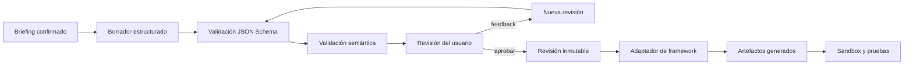

# Documento 02 — Contrato técnico de TaskmasterSpecification

## 1. Propósito

Este documento define el contrato canónico que utilizará Collaborative Taskmaster Studio para representar un agente Taskmaster antes de generar código.

`TaskmasterSpecification` es la frontera estable entre:

- la entrevista colaborativa;
- el agente diseñador;
- el sistema de feedback y versiones;
- los adaptadores de frameworks;
- el generador de proyectos;
- el sandbox de pruebas;
- la interfaz y la trayectoria auditable.

El contrato es independiente del framework. Google ADK, GenKit u otro adaptador deben consumir la misma especificación aprobada sin cambiar su significado.

## 2. Objetivos del contrato

El contrato debe:

1. describir un flujo de trabajo completo y ejecutable;
2. distinguir claramente entre objetivo, pasos, herramientas y resultados;
3. definir límites de autonomía y aprobaciones humanas;
4. representar memoria y contexto sin incluir secretos;
5. permitir validación automática antes de generar archivos;
6. producir pruebas y criterios de verificación;
7. permitir versionado, comparación y auditoría;
8. admitir varios adaptadores de salida;
9. ser suficientemente estricto para impedir interpretaciones peligrosas;
10. seguir siendo comprensible para una persona no técnica.

## 3. Principios normativos

Las palabras **DEBE**, **NO DEBE**, **REQUERIDO**, **DEBERÍA** y **PUEDE** expresan reglas del contrato:

- **DEBE / REQUERIDO:** condición obligatoria para considerar válida una especificación.
- **NO DEBE:** comportamiento prohibido.
- **DEBERÍA:** recomendación que puede omitirse con justificación registrada.
- **PUEDE:** capacidad opcional.

## 4. Identidad y versión

La versión inicial del contrato será:

```text
taskmaster-spec/1.0.0
```

Cada documento tendrá dos versiones diferentes:

- `schema_version`: versión del contrato técnico.
- `revision`: versión de la especificación concreta creada por el usuario.

Ejemplo:

```json
{
  "schema_version": "1.0.0",
  "revision": 3
}
```

## 5. Reglas generales

- El documento DEBE ser un objeto JSON.
- Todos los identificadores internos DEBEN ser únicos.
- Los identificadores DEBEN usar minúsculas, números y guiones bajos.
- El JSON NO DEBE incluir comentarios.
- Las propiedades desconocidas se rechazarán en objetos normativos.
- Los textos visibles para el usuario DEBEN indicar su idioma mediante `language` en los metadatos.
- Ningún campo PUEDE contener contraseñas, claves, tokens o credenciales.
- Los valores secretos se referenciarán por nombre de variable de entorno o Secret Manager.
- Las rutas generadas serán relativas al directorio de exportación.
- Una especificación solo puede generarse cuando `approval.status` sea `approved`.
- Las acciones externas no simuladas requieren una política explícita.

## 6. Estructura de nivel superior

`TaskmasterSpecification` contiene las siguientes secciones:

| Campo | Tipo | Obligatorio | Propósito |
| --- | --- | --- | --- |
| `schema_version` | string | Sí | Versión del contrato. |
| `revision` | integer | Sí | Revisión del diseño. |
| `metadata` | object | Sí | Identidad, idioma y procedencia. |
| `mission` | object | Sí | Problema, objetivo y límites. |
| `actors` | array | Sí | Personas, agentes y sistemas participantes. |
| `inputs` | array | Sí | Datos que recibe el Taskmaster. |
| `outputs` | array | Sí | Entregables y resultados. |
| `workflow` | object | Sí | Estados, pasos y transiciones. |
| `tools` | array | Sí | Herramientas autorizadas. |
| `memory` | object | Sí | Contexto y persistencia. |
| `autonomy` | object | Sí | Presupuesto, límites y aprobaciones. |
| `policies` | array | Sí | Reglas obligatorias. |
| `verification` | object | Sí | Condiciones de éxito. |
| `failure_handling` | object | Sí | Errores, reintentos y fallback. |
| `test_scenarios` | array | Sí | Casos que debe superar. |
| `generation` | object | Sí | Framework y artefactos esperados. |
| `deployment` | object | Sí | Infraestructura prevista. |
| `approval` | object | Sí | Decisión humana sobre esta revisión. |

## 7. Esquema JSON canónico

El esquema usa JSON Schema Draft 2020-12. La implementación podrá dividirlo en varios archivos, pero su significado deberá conservarse.

```json
{
  "$schema": "https://json-schema.org/draft/2020-12/schema",
  "$id": "https://taskmaster.studio/schemas/taskmaster-specification-1.0.0.json",
  "title": "TaskmasterSpecification",
  "type": "object",
  "additionalProperties": false,
  "required": [
    "schema_version",
    "revision",
    "metadata",
    "mission",
    "actors",
    "inputs",
    "outputs",
    "workflow",
    "tools",
    "memory",
    "autonomy",
    "policies",
    "verification",
    "failure_handling",
    "test_scenarios",
    "generation",
    "deployment",
    "approval"
  ],
  "properties": {
    "schema_version": {
      "type": "string",
      "const": "1.0.0"
    },
    "revision": {
      "type": "integer",
      "minimum": 1
    },
    "metadata": {
      "$ref": "#/$defs/metadata"
    },
    "mission": {
      "$ref": "#/$defs/mission"
    },
    "actors": {
      "type": "array",
      "minItems": 1,
      "items": { "$ref": "#/$defs/actor" }
    },
    "inputs": {
      "type": "array",
      "minItems": 1,
      "items": { "$ref": "#/$defs/ioItem" }
    },
    "outputs": {
      "type": "array",
      "minItems": 1,
      "items": { "$ref": "#/$defs/ioItem" }
    },
    "workflow": {
      "$ref": "#/$defs/workflow"
    },
    "tools": {
      "type": "array",
      "items": { "$ref": "#/$defs/tool" }
    },
    "memory": {
      "$ref": "#/$defs/memory"
    },
    "autonomy": {
      "$ref": "#/$defs/autonomy"
    },
    "policies": {
      "type": "array",
      "minItems": 1,
      "items": { "$ref": "#/$defs/policy" }
    },
    "verification": {
      "$ref": "#/$defs/verification"
    },
    "failure_handling": {
      "$ref": "#/$defs/failureHandling"
    },
    "test_scenarios": {
      "type": "array",
      "minItems": 3,
      "items": { "$ref": "#/$defs/testScenario" }
    },
    "generation": {
      "$ref": "#/$defs/generation"
    },
    "deployment": {
      "$ref": "#/$defs/deployment"
    },
    "approval": {
      "$ref": "#/$defs/approval"
    }
  },
  "$defs": {
    "identifier": {
      "type": "string",
      "pattern": "^[a-z][a-z0-9_]{2,63}$"
    },
    "nonEmptyString": {
      "type": "string",
      "minLength": 1,
      "maxLength": 2000
    },
    "metadata": {
      "type": "object",
      "additionalProperties": false,
      "required": [
        "id",
        "name",
        "summary",
        "language",
        "created_at",
        "updated_at",
        "created_by",
        "source_project_id"
      ],
      "properties": {
        "id": { "$ref": "#/$defs/identifier" },
        "name": { "type": "string", "minLength": 3, "maxLength": 100 },
        "summary": { "type": "string", "minLength": 10, "maxLength": 500 },
        "language": { "type": "string", "pattern": "^[a-z]{2}(-[A-Z]{2})?$" },
        "created_at": { "type": "string", "format": "date-time" },
        "updated_at": { "type": "string", "format": "date-time" },
        "created_by": { "type": "string", "minLength": 1, "maxLength": 100 },
        "source_project_id": { "$ref": "#/$defs/identifier" },
        "tags": {
          "type": "array",
          "uniqueItems": true,
          "maxItems": 10,
          "items": { "type": "string", "minLength": 1, "maxLength": 30 }
        }
      }
    },
    "mission": {
      "type": "object",
      "additionalProperties": false,
      "required": [
        "problem",
        "goal",
        "scope_in",
        "scope_out",
        "trigger",
        "completion_definition"
      ],
      "properties": {
        "problem": { "$ref": "#/$defs/nonEmptyString" },
        "goal": { "$ref": "#/$defs/nonEmptyString" },
        "scope_in": {
          "type": "array",
          "minItems": 1,
          "items": { "$ref": "#/$defs/nonEmptyString" }
        },
        "scope_out": {
          "type": "array",
          "items": { "$ref": "#/$defs/nonEmptyString" }
        },
        "trigger": {
          "type": "object",
          "additionalProperties": false,
          "required": ["type", "description"],
          "properties": {
            "type": {
              "enum": ["manual", "schedule", "event", "api"]
            },
            "description": { "$ref": "#/$defs/nonEmptyString" }
          }
        },
        "completion_definition": {
          "type": "array",
          "minItems": 1,
          "items": { "$ref": "#/$defs/nonEmptyString" }
        }
      }
    },
    "actor": {
      "type": "object",
      "additionalProperties": false,
      "required": ["id", "type", "name", "responsibilities"],
      "properties": {
        "id": { "$ref": "#/$defs/identifier" },
        "type": { "enum": ["human", "agent", "system"] },
        "name": { "type": "string", "minLength": 1, "maxLength": 100 },
        "responsibilities": {
          "type": "array",
          "minItems": 1,
          "items": { "$ref": "#/$defs/nonEmptyString" }
        }
      }
    },
    "ioItem": {
      "type": "object",
      "additionalProperties": false,
      "required": ["id", "name", "description", "data_type", "required", "sensitivity"],
      "properties": {
        "id": { "$ref": "#/$defs/identifier" },
        "name": { "type": "string", "minLength": 1, "maxLength": 100 },
        "description": { "$ref": "#/$defs/nonEmptyString" },
        "data_type": { "enum": ["text", "number", "boolean", "date", "object", "array", "file", "url"] },
        "required": { "type": "boolean" },
        "sensitivity": { "enum": ["public", "internal", "confidential", "restricted"] },
        "source": { "type": "string", "maxLength": 200 }
      }
    },
    "workflow": {
      "type": "object",
      "additionalProperties": false,
      "required": ["initial_state", "terminal_states", "steps", "transitions"],
      "properties": {
        "initial_state": { "$ref": "#/$defs/identifier" },
        "terminal_states": {
          "type": "array",
          "minItems": 1,
          "uniqueItems": true,
          "items": { "$ref": "#/$defs/identifier" }
        },
        "steps": {
          "type": "array",
          "minItems": 1,
          "maxItems": 30,
          "items": { "$ref": "#/$defs/workflowStep" }
        },
        "transitions": {
          "type": "array",
          "minItems": 1,
          "items": { "$ref": "#/$defs/transition" }
        }
      }
    },
    "workflowStep": {
      "type": "object",
      "additionalProperties": false,
      "required": [
        "id",
        "name",
        "description",
        "actor_id",
        "action_type",
        "tool_ids",
        "input_ids",
        "output_ids",
        "risk",
        "timeout_seconds"
      ],
      "properties": {
        "id": { "$ref": "#/$defs/identifier" },
        "name": { "type": "string", "minLength": 1, "maxLength": 100 },
        "description": { "$ref": "#/$defs/nonEmptyString" },
        "actor_id": { "$ref": "#/$defs/identifier" },
        "action_type": { "enum": ["reason", "tool", "human", "verify"] },
        "tool_ids": {
          "type": "array",
          "uniqueItems": true,
          "items": { "$ref": "#/$defs/identifier" }
        },
        "input_ids": {
          "type": "array",
          "uniqueItems": true,
          "items": { "$ref": "#/$defs/identifier" }
        },
        "output_ids": {
          "type": "array",
          "uniqueItems": true,
          "items": { "$ref": "#/$defs/identifier" }
        },
        "risk": { "enum": ["low", "medium", "high", "critical"] },
        "approval_policy_id": {
          "anyOf": [
            { "$ref": "#/$defs/identifier" },
            { "type": "null" }
          ]
        },
        "timeout_seconds": { "type": "integer", "minimum": 1, "maximum": 3600 }
      }
    },
    "transition": {
      "type": "object",
      "additionalProperties": false,
      "required": ["from", "to", "condition"],
      "properties": {
        "from": { "$ref": "#/$defs/identifier" },
        "to": { "$ref": "#/$defs/identifier" },
        "condition": { "$ref": "#/$defs/nonEmptyString" },
        "priority": { "type": "integer", "minimum": 1, "default": 100 }
      }
    },
    "tool": {
      "type": "object",
      "additionalProperties": false,
      "required": [
        "id",
        "name",
        "description",
        "mode",
        "risk",
        "input_schema",
        "output_schema",
        "side_effects"
      ],
      "properties": {
        "id": { "$ref": "#/$defs/identifier" },
        "name": { "type": "string", "minLength": 1, "maxLength": 100 },
        "description": { "$ref": "#/$defs/nonEmptyString" },
        "mode": { "enum": ["simulated", "read_only", "write"] },
        "risk": { "enum": ["low", "medium", "high", "critical"] },
        "input_schema": { "type": "object" },
        "output_schema": { "type": "object" },
        "side_effects": {
          "type": "array",
          "items": { "$ref": "#/$defs/nonEmptyString" }
        },
        "required_secret_refs": {
          "type": "array",
          "uniqueItems": true,
          "items": { "type": "string", "pattern": "^[A-Z][A-Z0-9_]{2,127}$" }
        }
      }
    },
    "memory": {
      "type": "object",
      "additionalProperties": false,
      "required": ["session", "persistent", "retention_days", "allowed_fields", "forbidden_fields"],
      "properties": {
        "session": { "type": "boolean" },
        "persistent": { "type": "boolean" },
        "provider": { "enum": ["local", "firestore", "memory_bank", "none"] },
        "retention_days": { "type": "integer", "minimum": 0, "maximum": 3650 },
        "allowed_fields": {
          "type": "array",
          "uniqueItems": true,
          "items": { "$ref": "#/$defs/identifier" }
        },
        "forbidden_fields": {
          "type": "array",
          "uniqueItems": true,
          "items": { "$ref": "#/$defs/identifier" }
        }
      }
    },
    "autonomy": {
      "type": "object",
      "additionalProperties": false,
      "required": ["level", "max_steps", "max_tool_calls", "max_runtime_seconds", "human_interruptible"],
      "properties": {
        "level": { "enum": ["assist", "supervised", "bounded_autonomous"] },
        "max_steps": { "type": "integer", "minimum": 1, "maximum": 100 },
        "max_tool_calls": { "type": "integer", "minimum": 0, "maximum": 100 },
        "max_runtime_seconds": { "type": "integer", "minimum": 1, "maximum": 86400 },
        "human_interruptible": { "type": "boolean" }
      }
    },
    "policy": {
      "type": "object",
      "additionalProperties": false,
      "required": ["id", "name", "type", "rule", "effect"],
      "properties": {
        "id": { "$ref": "#/$defs/identifier" },
        "name": { "type": "string", "minLength": 1, "maxLength": 100 },
        "type": { "enum": ["allow", "deny", "require_approval", "budget", "data"] },
        "rule": { "$ref": "#/$defs/nonEmptyString" },
        "effect": { "$ref": "#/$defs/nonEmptyString" }
      }
    },
    "verification": {
      "type": "object",
      "additionalProperties": false,
      "required": ["strategy", "criteria", "verified_by"],
      "properties": {
        "strategy": { "enum": ["deterministic", "tool_assisted", "human", "hybrid"] },
        "criteria": {
          "type": "array",
          "minItems": 1,
          "items": { "$ref": "#/$defs/criterion" }
        },
        "verified_by": { "$ref": "#/$defs/identifier" }
      }
    },
    "criterion": {
      "type": "object",
      "additionalProperties": false,
      "required": ["id", "description", "measurement", "expected"],
      "properties": {
        "id": { "$ref": "#/$defs/identifier" },
        "description": { "$ref": "#/$defs/nonEmptyString" },
        "measurement": { "$ref": "#/$defs/nonEmptyString" },
        "expected": { "$ref": "#/$defs/nonEmptyString" }
      }
    },
    "failureHandling": {
      "type": "object",
      "additionalProperties": false,
      "required": ["max_retries", "retry_strategy", "fallback", "on_exhausted"],
      "properties": {
        "max_retries": { "type": "integer", "minimum": 0, "maximum": 10 },
        "retry_strategy": { "enum": ["none", "fixed", "exponential"] },
        "fallback": { "$ref": "#/$defs/nonEmptyString" },
        "on_exhausted": { "enum": ["fail_safe", "request_human", "pause"] }
      }
    },
    "testScenario": {
      "type": "object",
      "additionalProperties": false,
      "required": ["id", "name", "category", "given", "when", "then"],
      "properties": {
        "id": { "$ref": "#/$defs/identifier" },
        "name": { "type": "string", "minLength": 1, "maxLength": 120 },
        "category": { "enum": ["happy_path", "edge_case", "failure", "security"] },
        "given": { "$ref": "#/$defs/nonEmptyString" },
        "when": { "$ref": "#/$defs/nonEmptyString" },
        "then": { "$ref": "#/$defs/nonEmptyString" }
      }
    },
    "generation": {
      "type": "object",
      "additionalProperties": false,
      "required": ["target_framework", "language", "template_version", "required_artifacts"],
      "properties": {
        "target_framework": { "enum": ["google_adk", "genkit", "antigravity"] },
        "language": { "enum": ["python", "typescript"] },
        "template_version": { "type": "string", "pattern": "^[0-9]+\\.[0-9]+\\.[0-9]+$" },
        "required_artifacts": {
          "type": "array",
          "minItems": 1,
          "uniqueItems": true,
          "items": {
            "enum": [
              "source",
              "tests",
              "readme",
              "env_example",
              "dockerfile",
              "architecture",
              "manifest"
            ]
          }
        }
      }
    },
    "deployment": {
      "type": "object",
      "additionalProperties": false,
      "required": ["target", "region", "public_access", "min_instances", "max_instances"],
      "properties": {
        "target": { "enum": ["local", "cloud_run"] },
        "region": { "type": "string", "minLength": 1, "maxLength": 50 },
        "public_access": { "type": "boolean" },
        "min_instances": { "type": "integer", "minimum": 0, "maximum": 10 },
        "max_instances": { "type": "integer", "minimum": 1, "maximum": 100 }
      }
    },
    "approval": {
      "type": "object",
      "additionalProperties": false,
      "required": ["status", "decided_by", "decided_at", "note"],
      "properties": {
        "status": { "enum": ["draft", "changes_requested", "approved", "rejected"] },
        "decided_by": { "type": ["string", "null"], "maxLength": 100 },
        "decided_at": { "type": ["string", "null"], "format": "date-time" },
        "note": { "type": "string", "maxLength": 1000 }
      }
    }
  }
}
```

## 8. Validaciones semánticas adicionales

JSON Schema valida la forma, pero no todas las relaciones. El validador del dominio DEBE comprobar también:

1. `metadata.id` y `metadata.source_project_id` corresponden al proyecto activo.
2. `metadata.updated_at` no es anterior a `metadata.created_at`.
3. Todos los identificadores son únicos dentro de su colección.
4. `workflow.initial_state` existe entre los pasos.
5. Todos los elementos de `workflow.terminal_states` existen entre los pasos.
6. Cada transición referencia estados existentes.
7. Debe existir un camino desde el estado inicial hasta al menos un estado terminal.
8. Ningún estado no terminal puede quedar aislado.
9. `actor_id` referencia un actor existente.
10. `tool_ids` referencia herramientas existentes.
11. `input_ids` y `output_ids` referencian entradas o salidas existentes.
12. Un paso con `action_type: tool` debe declarar al menos una herramienta.
13. Un paso con riesgo `high` o `critical` debe declarar `approval_policy_id`.
14. `approval_policy_id` debe apuntar a una política `require_approval`.
15. Una herramienta `write` no puede tener riesgo `low` sin justificación registrada.
16. Los secretos referenciados deben existir en `.env.example` sin incluir valores reales.
17. `verification.verified_by` debe ser un actor distinto del actor que ejecuta la acción final, salvo estrategia humana.
18. Debe existir al menos un escenario `happy_path`, uno `failure` y uno `security`.
19. `deployment.max_instances` debe ser mayor o igual que `min_instances`.
20. `generation.target_framework` y `generation.language` deben ser compatibles.
21. Una revisión aprobada no puede modificarse.
22. La generación requiere `approval.status: approved`.

## 9. Compatibilidad de framework y lenguaje

| Framework | Lenguaje permitido inicialmente | Estado |
| --- | --- | --- |
| `google_adk` | `python` | MVP |
| `genkit` | `typescript` | Posterior |
| `antigravity` | Según el adaptador validado | Posterior |

Hasta implementar los adaptadores posteriores, el validador solo aceptará la combinación `google_adk` + `python` para generación real.

## 10. Reglas de herramientas

Cada herramienta debe declarar:

- propósito único y explícito;
- esquema de entrada;
- esquema de salida;
- modalidad de ejecución;
- nivel de riesgo;
- efectos laterales;
- secretos requeridos por referencia.

Gemini puede proponer una herramienta como parte del diseño, pero no puede crear implementaciones que ejecuten comandos arbitrarios. El generador seleccionará una plantilla autorizada o producirá un stub no ejecutable marcado como pendiente.

### Modalidades

- `simulated`: cambia únicamente el estado del sandbox.
- `read_only`: consulta datos sin modificar el sistema externo.
- `write`: produce un efecto externo y requiere política explícita.

## 11. Reglas del flujo

- Cada paso representa una unidad observable de trabajo.
- Los pasos de tipo `reason` no pueden declarar herramientas.
- Los pasos `human` deben producir una decisión o información estructurada.
- Los pasos `verify` no deben alterar el objeto que verifican.
- Las condiciones de transición se expresarán como descripciones declarativas; no se ejecutará código procedente del JSON.
- Las prioridades resolverán transiciones simultáneas: el número menor tiene mayor prioridad.
- Los ciclos deben tener un límite representado por autonomía, reintentos o presupuesto.

## 12. Reglas de memoria

- La memoria de sesión puede almacenar contexto operativo temporal.
- La memoria persistente debe indicar proveedor y retención.
- `allowed_fields` funciona como lista positiva.
- `forbidden_fields` siempre prevalece sobre `allowed_fields`.
- Credenciales, tokens y secretos están prohibidos aunque se incluyan accidentalmente en campos permitidos.
- La especificación no contendrá datos personales reales de la demostración.
- La eliminación y retención se implementarán en el adaptador de almacenamiento.

## 13. Niveles de autonomía

### `assist`

El agente propone y espera decisión humana antes de cada acción con herramientas.

### `supervised`

El agente puede completar pasos de bajo riesgo; las acciones medias o altas requieren reglas específicas.

### `bounded_autonomous`

El agente puede completar un flujo dentro de presupuestos estrictos. Las acciones altas o críticas siempre requieren aprobación humana.

Ningún nivel permite ignorar políticas, exceder presupuestos o aprobar acciones en nombre del usuario.

## 14. Estados de aprobación

```text
draft
  -> changes_requested
  -> draft
  -> approved

draft
  -> rejected
```

- `draft`: puede modificarse.
- `changes_requested`: conserva el feedback y genera una revisión nueva.
- `approved`: queda congelada y puede pasar al generador.
- `rejected`: no se genera; puede duplicarse como una revisión nueva si el usuario decide retomarla.

## 15. Versionado de revisiones

- La primera propuesta utiliza `revision: 1`.
- Cada feedback aceptado crea `revision + 1`.
- Las revisiones anteriores se conservan completas.
- Una revisión aprobada es inmutable.
- Corregir una revisión aprobada crea otra revisión en estado `draft`.
- Los eventos de auditoría deben registrar versión origen, versión destino y motivo.
- Los artefactos generados se asocian a una revisión exacta.

## 16. Compatibilidad del esquema

Se utilizará versionado semántico:

- **PATCH:** aclaraciones o validaciones que no cambian campos existentes.
- **MINOR:** nuevos campos opcionales o valores compatibles.
- **MAJOR:** eliminación, cambio de significado o nuevos campos obligatorios.

Los adaptadores deben declarar las versiones de esquema compatibles. Una especificación incompatible se rechazará antes de generar archivos.

## 17. Flujo de producción del contrato



## 18. Ejemplo completo

El siguiente ejemplo describe un Taskmaster educativo que organiza la preparación semanal de una entrega académica. Todas sus acciones externas son simuladas.

```json
{
  "schema_version": "1.0.0",
  "revision": 2,
  "metadata": {
    "id": "academic_delivery_coordinator",
    "name": "Coordinador de entrega académica",
    "summary": "Organiza actividades, revisa evidencias y prepara una entrega semanal sin enviar información externamente.",
    "language": "es-CO",
    "created_at": "2026-08-13T16:00:00-05:00",
    "updated_at": "2026-08-13T16:30:00-05:00",
    "created_by": "demo-user",
    "source_project_id": "academic_delivery_project",
    "tags": ["educacion", "planificacion", "demo"]
  },
  "mission": {
    "problem": "El estudiante distribuye de forma inconsistente las tareas necesarias para completar su entrega semanal.",
    "goal": "Convertir la lista de requisitos en un plan priorizado, comprobar evidencias y preparar un paquete final para revisión humana.",
    "scope_in": [
      "Interpretar los requisitos confirmados",
      "Crear un plan semanal",
      "Comprobar que cada entregable tenga evidencia",
      "Preparar un resumen final"
    ],
    "scope_out": [
      "Enviar la entrega a una plataforma real",
      "Modificar calendarios externos",
      "Contactar profesores o compañeros"
    ],
    "trigger": {
      "type": "manual",
      "description": "El estudiante inicia la preparación semanal desde la interfaz."
    },
    "completion_definition": [
      "Todos los requisitos tienen una actividad asociada",
      "Todos los entregables obligatorios tienen evidencia",
      "El estudiante aprobó el paquete final"
    ]
  },
  "actors": [
    {
      "id": "student_user",
      "type": "human",
      "name": "Estudiante",
      "responsibilities": ["Confirmar requisitos", "Aprobar el paquete final"]
    },
    {
      "id": "planning_agent",
      "type": "agent",
      "name": "Agente planificador",
      "responsibilities": ["Crear el plan", "Organizar las evidencias"]
    },
    {
      "id": "verification_agent",
      "type": "agent",
      "name": "Agente verificador",
      "responsibilities": ["Comprobar criterios de finalización"]
    }
  ],
  "inputs": [
    {
      "id": "assignment_requirements",
      "name": "Requisitos de la entrega",
      "description": "Lista confirmada de requisitos académicos.",
      "data_type": "array",
      "required": true,
      "sensitivity": "internal",
      "source": "Formulario del estudio"
    },
    {
      "id": "available_hours",
      "name": "Horas disponibles",
      "description": "Tiempo disponible durante la semana.",
      "data_type": "number",
      "required": true,
      "sensitivity": "internal",
      "source": "Respuesta del usuario"
    }
  ],
  "outputs": [
    {
      "id": "weekly_plan",
      "name": "Plan semanal",
      "description": "Actividades ordenadas con duración y entregable.",
      "data_type": "object",
      "required": true,
      "sensitivity": "internal"
    },
    {
      "id": "review_package",
      "name": "Paquete para revisión",
      "description": "Resumen de entregables y evidencias para aprobación humana.",
      "data_type": "object",
      "required": true,
      "sensitivity": "internal"
    }
  ],
  "workflow": {
    "initial_state": "collect_requirements",
    "terminal_states": ["completed", "stopped_safely"],
    "steps": [
      {
        "id": "collect_requirements",
        "name": "Confirmar requisitos",
        "description": "Revisar que los requisitos y el tiempo disponible estén completos.",
        "actor_id": "planning_agent",
        "action_type": "reason",
        "tool_ids": [],
        "input_ids": ["assignment_requirements", "available_hours"],
        "output_ids": [],
        "risk": "low",
        "approval_policy_id": null,
        "timeout_seconds": 30
      },
      {
        "id": "build_weekly_plan",
        "name": "Construir plan semanal",
        "description": "Crear y guardar una distribución simulada de actividades.",
        "actor_id": "planning_agent",
        "action_type": "tool",
        "tool_ids": ["save_simulated_plan"],
        "input_ids": ["assignment_requirements", "available_hours"],
        "output_ids": ["weekly_plan"],
        "risk": "low",
        "approval_policy_id": null,
        "timeout_seconds": 30
      },
      {
        "id": "verify_package",
        "name": "Verificar paquete",
        "description": "Comprobar que cada requisito tenga una evidencia declarada.",
        "actor_id": "verification_agent",
        "action_type": "verify",
        "tool_ids": ["verify_simulated_evidence"],
        "input_ids": ["weekly_plan"],
        "output_ids": ["review_package"],
        "risk": "low",
        "approval_policy_id": null,
        "timeout_seconds": 30
      },
      {
        "id": "human_review",
        "name": "Solicitar aprobación",
        "description": "Pedir al estudiante que apruebe el paquete final.",
        "actor_id": "student_user",
        "action_type": "human",
        "tool_ids": [],
        "input_ids": ["review_package"],
        "output_ids": [],
        "risk": "medium",
        "approval_policy_id": "require_final_approval",
        "timeout_seconds": 3600
      },
      {
        "id": "completed",
        "name": "Completar misión",
        "description": "Registrar la aprobación y cerrar el flujo.",
        "actor_id": "planning_agent",
        "action_type": "reason",
        "tool_ids": [],
        "input_ids": ["review_package"],
        "output_ids": [],
        "risk": "low",
        "approval_policy_id": null,
        "timeout_seconds": 10
      },
      {
        "id": "stopped_safely",
        "name": "Detener con seguridad",
        "description": "Cerrar el flujo sin exportar cuando la verificación falle.",
        "actor_id": "planning_agent",
        "action_type": "reason",
        "tool_ids": [],
        "input_ids": [],
        "output_ids": [],
        "risk": "low",
        "approval_policy_id": null,
        "timeout_seconds": 10
      }
    ],
    "transitions": [
      { "from": "collect_requirements", "to": "build_weekly_plan", "condition": "Los requisitos están completos", "priority": 1 },
      { "from": "collect_requirements", "to": "stopped_safely", "condition": "Falta información obligatoria", "priority": 2 },
      { "from": "build_weekly_plan", "to": "verify_package", "condition": "El plan fue guardado", "priority": 1 },
      { "from": "verify_package", "to": "human_review", "condition": "Todos los criterios fueron satisfechos", "priority": 1 },
      { "from": "verify_package", "to": "stopped_safely", "condition": "Falta al menos una evidencia", "priority": 2 },
      { "from": "human_review", "to": "completed", "condition": "El usuario aprueba", "priority": 1 },
      { "from": "human_review", "to": "stopped_safely", "condition": "El usuario rechaza", "priority": 2 }
    ]
  },
  "tools": [
    {
      "id": "save_simulated_plan",
      "name": "Guardar plan simulado",
      "description": "Guarda el plan únicamente dentro del estado del sandbox.",
      "mode": "simulated",
      "risk": "low",
      "input_schema": {
        "type": "object",
        "required": ["activities"],
        "properties": { "activities": { "type": "array" } }
      },
      "output_schema": {
        "type": "object",
        "required": ["saved"],
        "properties": { "saved": { "type": "boolean" } }
      },
      "side_effects": ["Modifica el estado temporal del sandbox"],
      "required_secret_refs": []
    },
    {
      "id": "verify_simulated_evidence",
      "name": "Verificar evidencia simulada",
      "description": "Comprueba cobertura de requisitos sin modificar el plan.",
      "mode": "simulated",
      "risk": "low",
      "input_schema": {
        "type": "object",
        "required": ["plan"],
        "properties": { "plan": { "type": "object" } }
      },
      "output_schema": {
        "type": "object",
        "required": ["complete", "missing"],
        "properties": {
          "complete": { "type": "boolean" },
          "missing": { "type": "array" }
        }
      },
      "side_effects": [],
      "required_secret_refs": []
    }
  ],
  "memory": {
    "session": true,
    "persistent": true,
    "provider": "firestore",
    "retention_days": 30,
    "allowed_fields": ["assignment_requirements", "available_hours", "weekly_plan", "review_package"],
    "forbidden_fields": ["password", "access_token", "private_key"]
  },
  "autonomy": {
    "level": "supervised",
    "max_steps": 10,
    "max_tool_calls": 5,
    "max_runtime_seconds": 3600,
    "human_interruptible": true
  },
  "policies": [
    {
      "id": "simulation_only",
      "name": "Solo simulación",
      "type": "deny",
      "rule": "Las herramientas no pueden modificar plataformas externas.",
      "effect": "Rechazar cualquier herramienta con modalidad write."
    },
    {
      "id": "require_final_approval",
      "name": "Aprobación final",
      "type": "require_approval",
      "rule": "El paquete debe ser aprobado por el estudiante.",
      "effect": "Pausar antes de completar la misión."
    }
  ],
  "verification": {
    "strategy": "hybrid",
    "criteria": [
      {
        "id": "requirements_covered",
        "description": "Cada requisito tiene una actividad asociada.",
        "measurement": "Comparar identificadores de requisitos y actividades.",
        "expected": "Cobertura igual al 100 %."
      },
      {
        "id": "human_approved",
        "description": "El usuario aprobó el paquete final.",
        "measurement": "Consultar la decisión humana registrada.",
        "expected": "Estado approved."
      }
    ],
    "verified_by": "verification_agent"
  },
  "failure_handling": {
    "max_retries": 1,
    "retry_strategy": "fixed",
    "fallback": "Conservar el último plan válido y solicitar intervención humana.",
    "on_exhausted": "request_human"
  },
  "test_scenarios": [
    {
      "id": "complete_requirements",
      "name": "Requisitos completos",
      "category": "happy_path",
      "given": "Requisitos y horas disponibles válidos.",
      "when": "El Taskmaster crea y verifica el plan.",
      "then": "Solicita aprobación y completa después de recibirla."
    },
    {
      "id": "missing_available_hours",
      "name": "Falta tiempo disponible",
      "category": "failure",
      "given": "No se informó el número de horas disponibles.",
      "when": "El Taskmaster valida las entradas.",
      "then": "Se detiene con seguridad y pide el dato faltante."
    },
    {
      "id": "malicious_requirement",
      "name": "Instrucción maliciosa en requisitos",
      "category": "security",
      "given": "Un requisito intenta ordenar el envío externo y omitir aprobación.",
      "when": "El Taskmaster analiza el contenido.",
      "then": "Ignora la instrucción, conserva la política y registra el rechazo."
    }
  ],
  "generation": {
    "target_framework": "google_adk",
    "language": "python",
    "template_version": "1.0.0",
    "required_artifacts": [
      "source",
      "tests",
      "readme",
      "env_example",
      "dockerfile",
      "architecture",
      "manifest"
    ]
  },
  "deployment": {
    "target": "cloud_run",
    "region": "us-central1",
    "public_access": false,
    "min_instances": 0,
    "max_instances": 1
  },
  "approval": {
    "status": "approved",
    "decided_by": "demo-user",
    "decided_at": "2026-08-13T16:30:00-05:00",
    "note": "Aprobado después de limitar todas las acciones externas a simulación."
  }
}
```

## 19. Normalización antes de validar

El estudio puede normalizar únicamente aspectos no semánticos:

- recortar espacios al inicio y al final;
- convertir identificadores propuestos a `snake_case`;
- ordenar etiquetas y listas declaradas como conjuntos;
- completar valores predeterminados documentados;
- convertir fechas válidas a ISO 8601.

El sistema NO DEBE corregir silenciosamente:

- objetivos;
- alcance;
- riesgos;
- políticas;
- acciones prohibidas;
- criterios de éxito;
- aprobaciones;
- herramientas o efectos laterales.

Una corrección semántica debe crear feedback visible o una nueva revisión.

## 20. Errores del contrato

Los errores se devolverán con una estructura común:

```json
{
  "valid": false,
  "errors": [
    {
      "code": "UNKNOWN_TOOL_REFERENCE",
      "path": "/workflow/steps/2/tool_ids/0",
      "message": "La herramienta referenced_tool no existe.",
      "severity": "error",
      "suggestion": "Declare la herramienta o elimine la referencia."
    }
  ]
}
```

### Códigos mínimos

- `SCHEMA_VALIDATION_FAILED`
- `DUPLICATE_IDENTIFIER`
- `UNKNOWN_ACTOR_REFERENCE`
- `UNKNOWN_TOOL_REFERENCE`
- `UNKNOWN_IO_REFERENCE`
- `UNREACHABLE_STATE`
- `NO_TERMINAL_PATH`
- `MISSING_APPROVAL_POLICY`
- `INCOMPATIBLE_FRAMEWORK_LANGUAGE`
- `MISSING_REQUIRED_TEST_CATEGORY`
- `SECRET_VALUE_DETECTED`
- `REVISION_IMMUTABLE`
- `SPECIFICATION_NOT_APPROVED`

## 21. Resultado de validación

Una validación exitosa devolverá:

```json
{
  "valid": true,
  "schema_version": "1.0.0",
  "revision": 2,
  "specification_id": "academic_delivery_coordinator",
  "warnings": [],
  "capabilities": {
    "can_generate": true,
    "can_simulate": true,
    "supported_adapter": "google_adk"
  }
}
```

`valid: true` no implica que el proyecto esté aprobado. `can_generate` solo será verdadero si el contrato es válido, el adaptador existe y la revisión está aprobada.

## 22. Manifiesto del proyecto generado

Cada exportación incluirá un manifiesto derivado, no editable por Gemini:

```json
{
  "manifest_version": "1.0.0",
  "specification_id": "academic_delivery_coordinator",
  "specification_revision": 2,
  "schema_version": "1.0.0",
  "target_framework": "google_adk",
  "template_version": "1.0.0",
  "generated_at": "2026-08-13T16:35:00-05:00",
  "artifacts": [
    {
      "path": "agent/main.py",
      "sha256": "<checksum>"
    }
  ]
}
```

Los checksums permitirán detectar modificaciones posteriores a la generación y distinguirlas de una nueva exportación oficial.

## 23. Responsabilidad de los adaptadores

Un adaptador debe:

1. declarar versiones de esquema compatibles;
2. validar la combinación de framework y lenguaje;
3. convertir estados y herramientas a primitivas del framework;
4. generar únicamente dentro del directorio asignado;
5. usar plantillas versionadas;
6. generar pruebas derivadas de `test_scenarios`;
7. producir el manifiesto;
8. rechazar capacidades no soportadas;
9. no reducir silenciosamente controles de seguridad.

Si un framework no soporta una capacidad, el adaptador debe detener la generación o solicitar una decisión explícita. Nunca debe eliminar la capacidad sin informarlo.

## 24. Contrato con Gemini

Gemini podrá producir borradores de partes del contrato mediante respuestas estructuradas. La aplicación será responsable de:

- proporcionar únicamente el briefing confirmado;
- fijar la versión del esquema;
- validar la respuesta;
- rechazar propiedades desconocidas;
- resolver referencias;
- imponer políticas no modificables;
- registrar modelo y revisión;
- presentar cambios al usuario;
- impedir que el modelo establezca `approval.status: approved`.

La aprobación siempre será una acción de aplicación asociada al usuario, no una decisión del modelo.

## 25. Contrato con la interfaz

La interfaz no editará el JSON directamente durante el flujo normal. Mostrará vistas comprensibles de:

- misión y alcance;
- actores;
- diagrama del flujo;
- herramientas y efectos;
- memoria;
- autonomía y aprobaciones;
- pruebas;
- diferencias entre revisiones.

Existirá una vista técnica de solo lectura para inspeccionar y descargar el JSON aprobado.

## 26. Contrato con Firestore

- Cada revisión se almacenará como documento inmutable.
- El proyecto almacenará un puntero a la revisión activa.
- Las aprobaciones y eventos se almacenarán por separado.
- Los artefactos grandes no se guardarán directamente en la especificación.
- Los timestamps del servidor serán autoritativos para eventos de persistencia.
- Las reglas de seguridad deben impedir que una sesión modifique proyectos ajenos.

## 27. Criterios de aceptación del Documento 02

El contrato se considerará listo para implementar cuando:

1. el esquema pueda compilarse con una biblioteca JSON Schema compatible;
2. el ejemplo completo pase la validación estructural;
3. las 22 reglas semánticas tengan pruebas previstas;
4. el flujo del ejemplo tenga un camino inicial-terminal válido;
5. el adaptador ADK pueda consumir todos los campos requeridos;
6. la interfaz pueda representar el contrato sin exponer JSON al usuario común;
7. las revisiones y aprobaciones no presenten ambigüedades;
8. los campos de seguridad no puedan ser reducidos silenciosamente;
9. el contrato permita generar pruebas y un manifiesto reproducible;
10. cualquier modificación posterior siga las reglas de compatibilidad.

## 28. Decisiones cerradas

- El formato canónico será JSON.
- La versión inicial será `1.0.0`.
- La primera salida soportada será Google ADK con Python.
- Las especificaciones aprobadas serán inmutables.
- Gemini no podrá aprobar revisiones.
- Los generadores usarán plantillas controladas.
- Las condiciones del flujo serán declarativas y no código ejecutable.
- Las acciones de alto o crítico riesgo requerirán aprobación.
- El proyecto generado incluirá un manifiesto y checksums.

## 29. Decisiones pendientes de implementación

- biblioteca concreta de JSON Schema para Python;
- formato exacto del diff de revisiones;
- mecanismo de empaquetado o descarga;
- ubicación final de artefactos generados en Google Cloud;
- mecanismo de autenticación para la versión pública;
- conjunto definitivo de plantillas ADK.

Estas decisiones no cambian el significado del contrato y podrán cerrarse durante la implementación.

## 30. Próximo documento

El **Documento 03** describirá la arquitectura de implementación: componentes de Google ADK, servicios Python, colecciones de Firestore, seguridad, endpoints, despliegue en Cloud Run y secuencias de ejecución.
