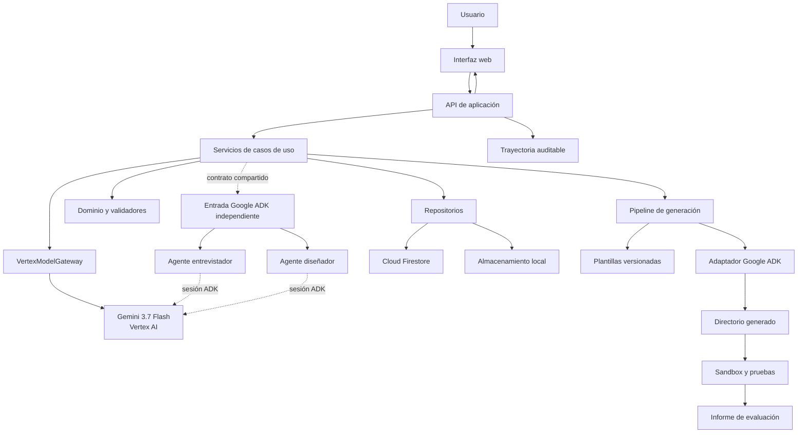
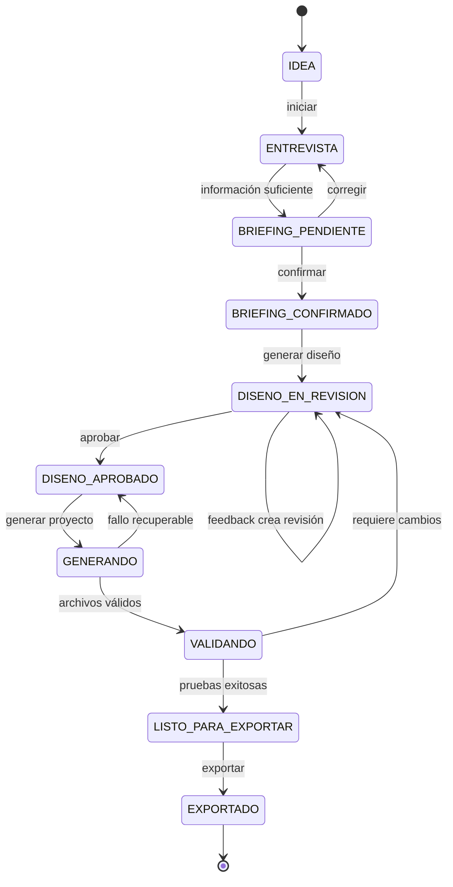
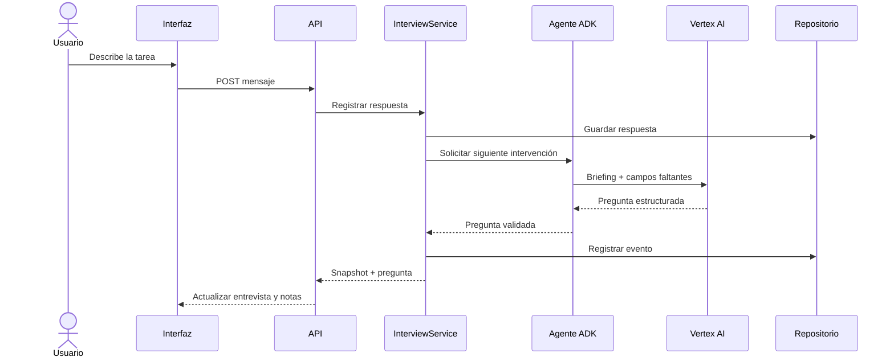
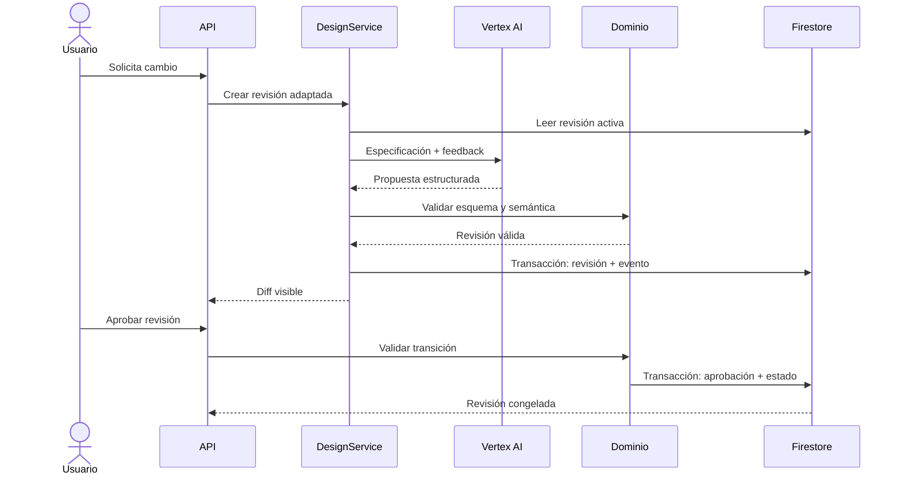
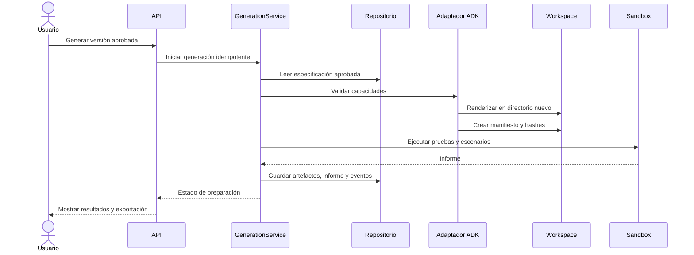
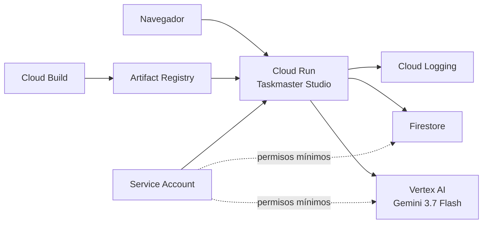

# Documento 03 — Arquitectura de implementación

> **Estado:** este documento conserva el diseño técnico detallado y sus decisiones históricas. La
> vista consolidada de la implementación realmente desplegada está en
> [`12_DIAGRAMA_ARQUITECTURA_FINAL.md`](12_DIAGRAMA_ARQUITECTURA_FINAL.md). Las capacidades añadidas
> después del diseño inicial se documentan en [`23_ESTADO_ACTUAL_PRODUCTO.md`](23_ESTADO_ACTUAL_PRODUCTO.md),
> [`25_ARCHIVOS_DATASETS_Y_VISUALIZACIONES.md`](25_ARCHIVOS_DATASETS_Y_VISUALIZACIONES.md) y
> [`27_OPERACION_PRODUCCION_Y_DIAGNOSTICO.md`](27_OPERACION_PRODUCCION_Y_DIAGNOSTICO.md).

## 1. Propósito

Este documento traduce el Plan Maestro y el contrato `TaskmasterSpecification` a una arquitectura implementable para Collaborative Taskmaster Studio.

Define:

- componentes y límites;
- agentes Google ADK;
- servicios de aplicación;
- persistencia local y Firestore;
- comunicación con Gemini 3.7 Flash en Vertex AI;
- API e interfaz;
- generación segura de proyectos;
- sandbox y evaluación;
- seguridad, identidad y secretos;
- observabilidad;
- despliegue en Cloud Run;
- secuencias principales y manejo de fallos.

## 2. Alcance arquitectónico

La arquitectura cubre el estudio que diseña, genera y ofrece una vista previa segura de los
Taskmasters. Los paquetes exportados siguen siendo proyectos independientes. Dentro del estudio,
solo un agente que haya aprobado el laboratorio puede procesar mensajes: Gemini devuelve una
respuesta estructurada cuando está disponible y el modo local produce una simulación explícita,
sin efectos externos y con las aprobaciones humanas intactas. Cada entregable permanece pendiente
hasta que la persona lo aprueba, solicita cambios o lo rechaza en la misma conversación; la decisión
se incorpora a la trayectoria auditable mediante el identificador de ejecución.

El MVP tendrá una sola aplicación desplegable con módulos internos bien separados. No se dividirá prematuramente en microservicios. Firestore, Vertex AI y Cloud Run serán dependencias externas mediante adaptadores.

## 3. Objetivos de calidad

La arquitectura prioriza:

1. seguridad en la generación de archivos;
2. estado y revisiones reproducibles;
3. trazabilidad de decisiones humanas y automáticas;
4. separación entre conversación, dominio y modelo;
5. pruebas locales sin consumo de servicios externos;
6. despliegue económico en Google Cloud;
7. reemplazo progresivo de adaptadores;
8. demostración clara en menos de cuatro minutos.

## 4. Vista general



## 5. Estilo arquitectónico

Se utilizará una **aplicación modular con arquitectura hexagonal**:

- **Dominio:** reglas puras, estados, validaciones y contratos.
- **Aplicación:** casos de uso que coordinan el dominio.
- **Puertos:** interfaces para modelo, persistencia, generación, tiempo y eventos.
- **Adaptadores:** Vertex AI, Firestore, archivos locales, Google ADK y servidor web.
- **Presentación:** API e interfaz web.

Esta estructura permite ejecutar el mismo flujo con adaptadores locales durante desarrollo y con servicios de Google Cloud en la demostración final.

## 6. Capas

### 6.1 Presentación

- sirve la interfaz;
- valida la forma básica de solicitudes;
- presenta errores seguros;
- transmite el identificador de proyecto y versión;
- no construye prompts ni escribe archivos directamente.

### 6.2 Aplicación

- implementa los casos de uso;
- abre transacciones de dominio;
- coordina agentes y repositorios;
- aplica autorización;
- emite eventos auditables;
- garantiza idempotencia.

### 6.3 Dominio

- contiene `Project`, `Briefing`, `TaskmasterSpecification`, `Revision`, `Approval`, `AuditEvent` y `GeneratedArtifact`;
- valida transiciones y referencias;
- impide modificar revisiones aprobadas;
- no depende de Google Cloud, HTTP ni Google ADK.

### 6.4 Infraestructura

- implementa Firestore;
- configura Vertex AI y Google Gen AI SDK;
- integra Google ADK;
- renderiza plantillas;
- ejecuta el sandbox;
- produce registros estructurados.

## 7. Directorio de implementación

```text
collaborative-taskmaster-studio/
├── app/
│   ├── __init__.py
│   ├── main.py                         # Entrada HTTP y Cloud Run
│   ├── api/
│   │   ├── routes_projects.py
│   │   ├── routes_interview.py
│   │   ├── routes_revisions.py
│   │   ├── routes_generation.py
│   │   └── errors.py
│   └── static/
│       ├── index.html
│       ├── app.js
│       └── styles.css
├── studio/
│   ├── domain/
│   │   ├── models.py
│   │   ├── enums.py
│   │   ├── transitions.py
│   │   ├── validation.py
│   │   └── errors.py
│   ├── application/
│   │   ├── projects.py
│   │   ├── interview.py
│   │   ├── design.py
│   │   ├── revisions.py
│   │   ├── generation.py
│   │   └── evaluation.py
│   └── ports/
│       ├── model_gateway.py
│       ├── repositories.py
│       ├── artifact_writer.py
│       ├── event_sink.py
│       └── clock.py
├── agents/
│   ├── root_agent.py
│   ├── interviewer.py
│   ├── designer.py
│   ├── generator.py
│   ├── evaluator.py
│   ├── instructions/
│   └── tools/
├── infrastructure/
│   ├── vertex/
│   │   ├── client.py
│   │   ├── structured_generation.py
│   │   └── schemas.py
│   ├── firestore/
│   │   ├── client.py
│   │   ├── project_repository.py
│   │   ├── revision_repository.py
│   │   └── event_repository.py
│   ├── local/
│   │   ├── repositories.py
│   │   └── generated_workspace.py
│   └── telemetry/
│       └── structured_logging.py
├── adapters/
│   ├── base.py
│   └── google_adk/
│       ├── adapter.py
│       ├── capability_map.py
│       └── validators.py
├── templates/
│   └── google_adk/
│       └── 1.0.0/
├── sandbox/
│   ├── runner.py
│   ├── policy.py
│   ├── scenarios.py
│   └── reports.py
├── schemas/
│   └── taskmaster-specification-1.0.0.json
├── generated/                        # Ignorado por Git
├── examples/
├── tests/
│   ├── unit/
│   ├── contract/
│   ├── integration/
│   ├── security/
│   └── fixtures/
├── docs/
├── scripts/
├── .env.example
├── .gitignore
├── Dockerfile
├── pyproject.toml
├── README.md
└── agents-cli-manifest.yaml
```

## 8. Definición de agentes con Google ADK

La implementación final separa dos entradas. La aplicación web coordina el flujo autoritativo con
servicios de aplicación y llama al modelo mediante `VertexModelGateway`. En paralelo, `agents/`
expone una aplicación Google ADK descubrible para desarrollo y demostración del patrón de agentes.
Importar la API web no carga ADK, no inicia un Runner y no crea una sesión del modelo.

### 8.1 Agente raíz

El agente raíz representa al socio colaborativo y delega conversación únicamente a los dos
especialistas registrados. No es la fuente del estado de negocio ni puede ejecutar casos de uso.

Responsabilidades:

- orientar el ciclo general del Studio;
- delegar al entrevistador o al diseñador según sus descripciones;
- presentar una respuesta comprensible;
- no inventar estado persistido;
- no ejecutar generación, persistencia, aprobación ni exportación.

### 8.2 Agentes especializados

| Agente | Entrada | Resultado |
| --- | --- | --- |
| Entrevistador | Descripción, briefing y campos faltantes. | Pregunta o resumen estructurado. |
| Diseñador | Briefing confirmado y revisión previa. | Borrador `TaskmasterSpecification`. |

### 8.3 Herramientas ADK

El agente raíz y sus especialistas declaran **cero herramientas de negocio**. ADK crea únicamente
las dos herramientas internas de delegación y el retorno de control entre agentes. Ningún agente
accede directamente a Firestore, archivos, aprobaciones o despliegues.

### 8.4 Sesiones y estado

Si la entrada ADK se ejecuta en desarrollo, su sesión solo mantiene contexto conversacional. El
estado autoritativo permanece en los repositorios del Studio y el flujo web no depende de esa sesión.

La sesión puede contener:

- `project_id`;
- `active_revision`;
- etapa visible;
- último mensaje resumido;
- identificadores de operaciones en curso.

No contendrá como única copia:

- especificaciones aprobadas;
- eventos de auditoría;
- artefactos;
- decisiones humanas;
- secretos.

## 9. Uso de Google Gen AI SDK y Vertex AI

El Google Gen AI SDK será el adaptador directo para operaciones estructuradas que necesiten control preciso de esquema, tokens y fallback.

### Operaciones previstas

- detectar campos faltantes;
- redactar preguntas aclaratorias;
- producir el briefing resumido;
- generar un borrador de especificación;
- explicar diferencias entre revisiones;
- proponer contenido limitado para artefactos autorizados;
- evaluar cualitativamente la claridad, sin sustituir pruebas deterministas.

### Configuración

```text
GOOGLE_CLOUD_PROJECT
GOOGLE_CLOUD_LOCATION=global
GOOGLE_GENAI_USE_VERTEXAI=True
STUDIO_GEMINI_MODEL=gemini-3.5-flash
STUDIO_MAX_OUTPUT_TOKENS
STUDIO_MAX_INTERVIEW_QUESTIONS
```

La autenticación local utilizará Application Default Credentials. En Cloud Run se utilizará la identidad del servicio, sin archivos de claves.

## 10. Fronteras de confianza

```mermaid
flowchart LR
    UNTRUSTED["Entrada no confiable\nusuario y datos"] --> VALIDATE["Validación y normalización"]
    VALIDATE --> CONFIRMED["Briefing confirmado"]
    CONFIRMED --> MODEL["Gemini"]
    MODEL --> STRUCTURED["Salida estructurada no confiable"]
    STRUCTURED --> SCHEMA["JSON Schema"]
    SCHEMA --> SEMANTIC["Reglas semánticas"]
    SEMANTIC --> HUMAN["Revisión humana"]
    HUMAN --> APPROVED["Especificación aprobada"]
    APPROVED --> TEMPLATES["Plantillas autorizadas"]
    TEMPLATES --> SANDBOX["Sandbox"]
```



El contenido de Gemini se considera una propuesta no confiable hasta superar esquema, reglas semánticas y aprobación.

## 11. Servicios de aplicación

### ProjectService

- crea proyectos;
- recupera snapshots;
- valida propietario de sesión;
- gestiona estado general.

### InterviewService

- registra respuestas;
- calcula campos faltantes;
- solicita la siguiente pregunta;
- confirma el briefing.

### DesignService

- genera borradores;
- valida contratos;
- crea revisiones;
- calcula diferencias.

### ApprovalService

- registra aprobación o rechazo;
- comprueba que el actor sea humano;
- congela revisiones aprobadas.

### GenerationService

- comprueba aprobación y compatibilidad;
- reserva un directorio de salida;
- invoca el adaptador;
- valida artefactos y manifiesto.

### EvaluationService

- prepara escenarios;
- ejecuta el sandbox;
- recoge resultados;
- determina preparación para exportación.

## 12. Máquina de estados



Las transiciones se implementarán en el dominio. Ni la interfaz ni Gemini podrán asignar estados directamente.

## 13. Persistencia local

Durante las primeras etapas se utilizará un repositorio local intercambiable:

- archivos JSON dentro de un directorio de datos ignorado por Git, o
- almacenamiento en memoria para pruebas unitarias.

El repositorio local debe implementar los mismos puertos que Firestore y soportar:

- proyectos;
- briefings;
- revisiones;
- aprobaciones;
- eventos;
- metadatos de artefactos.

## 14. Modelo Firestore

Firestore almacena documentos organizados en colecciones y permite subcolecciones. El diseño utilizará documentos pequeños, revisiones inmutables y consultas limitadas por proyecto.

```text
projects/{project_id}
  owner_session_id
  name
  status
  active_revision
  created_at
  updated_at

projects/{project_id}/briefings/{briefing_id}
  fields
  missing_fields
  confirmed
  created_at

projects/{project_id}/revisions/{revision_id}
  schema_version
  revision
  specification
  approval_status
  source_revision
  created_at

projects/{project_id}/approvals/{approval_id}
  revision
  decision
  decided_by
  decided_at
  note

projects/{project_id}/events/{event_id}
  sequence
  type
  actor
  summary
  revision
  created_at

projects/{project_id}/artifacts/{artifact_id}
  revision
  relative_path
  sha256
  framework
  template_version
  validation_status
```

### Índices previstos

- proyectos por `owner_session_id` y `updated_at`;
- revisiones por `revision`;
- eventos por `sequence`;
- artefactos por `revision` y `relative_path`.

## 15. Consistencia y transacciones

Se utilizarán transacciones o escrituras agrupadas para operaciones que deben ser atómicas:

- crear revisión y actualizar `active_revision`;
- aprobar revisión y actualizar estado del proyecto;
- reservar generación e impedir duplicados;
- registrar resultado y estado final de evaluación.

Cada comando incluirá una clave de idempotencia. Repetir la misma solicitud no debe crear dos revisiones, aprobaciones o exportaciones.

## 16. API HTTP

### Convenciones

- prefijo `/api/v1`;
- JSON UTF-8;
- identificador de solicitud en respuesta;
- códigos HTTP semánticos;
- errores con `code`, `message`, `details` y `request_id`;
- control de concurrencia mediante revisión esperada.

### Endpoints

| Método | Ruta | Caso de uso |
| --- | --- | --- |
| POST | `/api/v1/projects` | Crear proyecto. |
| GET | `/api/v1/projects/{id}` | Obtener snapshot. |
| POST | `/api/v1/projects/{id}/interview/messages` | Registrar respuesta y obtener siguiente guía. |
| PATCH | `/api/v1/projects/{id}/briefing` | Corregir campos. |
| POST | `/api/v1/projects/{id}/briefing/confirm` | Confirmar briefing. |
| POST | `/api/v1/projects/{id}/revisions` | Generar borrador. |
| GET | `/api/v1/projects/{id}/revisions/{revision}` | Consultar revisión. |
| GET | `/api/v1/projects/{id}/revisions/{revision}/diff` | Comparar con revisión anterior. |
| POST | `/api/v1/projects/{id}/revisions/{revision}/feedback` | Crear revisión adaptada. |
| POST | `/api/v1/projects/{id}/revisions/{revision}/approval` | Aprobar o rechazar. |
| POST | `/api/v1/projects/{id}/generations` | Generar artefactos. |
| POST | `/api/v1/projects/{id}/evaluations` | Ejecutar evaluación. |
| GET | `/api/v1/projects/{id}/events` | Consultar trayectoria. |
| GET | `/api/v1/projects/{id}/artifacts` | Listar artefactos. |

## 17. Eventos de dominio

Eventos mínimos:

- `project_created`
- `interview_answer_recorded`
- `briefing_ready`
- `briefing_confirmed`
- `design_requested`
- `revision_created`
- `revision_validation_failed`
- `feedback_recorded`
- `revision_approved`
- `revision_rejected`
- `generation_started`
- `artifact_generated`
- `generation_failed`
- `evaluation_started`
- `scenario_completed`
- `evaluation_completed`
- `project_exported`
- `model_fallback_used`

Los eventos describirán decisiones y resultados, no cadenas privadas de razonamiento.

## 18. Pipeline de generación

```mermaid
flowchart LR
    APPROVED["Especificación aprobada"] --> VALIDATE["Validar contrato"]
    VALIDATE --> CAPABILITIES["Comprobar capacidades"]
    CAPABILITIES --> RESERVE["Reservar directorio"]
    RESERVE --> RENDER["Renderizar plantillas"]
    RENDER --> FORMAT["Formatear archivos"]
    FORMAT --> STATIC["Validación estática"]
    STATIC --> MANIFEST["Crear manifiesto y hashes"]
    MANIFEST --> TEST["Ejecutar pruebas"]
    TEST --> REPORT["Registrar resultado"]
```



### Reglas

- El directorio de salida será `generated/{project_id}/revision-{n}/`.
- La ruta debe resolverse y comprobarse dentro de `generated/`.
- No se aceptan rutas provenientes directamente del modelo.
- El adaptador elige nombres de archivo desde plantillas.
- Los archivos existentes no se sobrescriben.
- Una regeneración idéntica reutiliza o crea una exportación versionada.
- Todo artefacto recibe checksum SHA-256.

## 19. Adaptador Google ADK

La primera implementación convertirá el contrato a un proyecto Python ADK.

### Mapeo

| Contrato | Salida ADK |
| --- | --- |
| `metadata` | Nombre, paquete y documentación. |
| `mission.goal` | Instrucción principal del agente. |
| `actors` de tipo `agent` | Agente raíz o subagentes. |
| `workflow.steps` | Orquestación y herramientas. |
| `tools` | Funciones Python con docstrings y esquemas. |
| `memory` | Configuración de sesión y repositorio. |
| `autonomy` | Límites del runner y plano de políticas. |
| `policies` | Guardas antes de herramientas y callbacks. |
| `test_scenarios` | Fixtures y casos de evaluación. |
| `deployment` | Dockerfile y manifiesto. |

### Artefactos mínimos

```text
generated-taskmaster/
├── app/
│   ├── __init__.py
│   ├── agent.py
│   ├── tools.py
│   ├── policies.py
│   └── services.py
├── tests/
│   ├── unit/
│   └── eval/
├── .env.example
├── .gitignore
├── Dockerfile
├── pyproject.toml
├── agents-cli-manifest.yaml
├── taskmaster.manifest.json
├── ARCHITECTURE.md
└── README.md
```

## 20. Uso limitado de generación libre

Gemini podrá generar:

- instrucciones del agente;
- descripciones de herramientas;
- texto del README;
- casos de ejemplo;
- contenido de pruebas declarativas.

Las plantillas controlarán:

- imports;
- inicialización del framework;
- servidor;
- acceso a secretos;
- políticas;
- escritura de archivos;
- ejecución del sandbox;
- Dockerfile;
- manifiestos.

El modelo no generará comandos para ejecutar directamente.

## 21. Sandbox

El sandbox del MVP es una frontera lógica y de procesos para probar proyectos generados con herramientas simuladas.

### Permitido

- crear un directorio temporal dedicado;
- instalar dependencias ya aprobadas cuando sea necesario;
- ejecutar pruebas con tiempo límite;
- leer únicamente el proyecto generado y fixtures;
- escribir resultados dentro del directorio temporal;
- capturar código de salida y registros sanitizados.

### Prohibido

- usar credenciales de producción;
- acceder a rutas fuera del workspace temporal;
- desplegar recursos;
- enviar mensajes reales;
- ejecutar comandos construidos por Gemini;
- aceptar dependencias no incluidas en la lista aprobada;
- conservar procesos después del tiempo límite.

## 22. Informe de evaluación

El informe incluirá:

- especificación y revisión;
- versión de plantilla;
- pruebas ejecutadas;
- escenarios aprobados y fallidos;
- políticas activadas;
- herramientas simuladas invocadas;
- tiempo total;
- archivos generados;
- advertencias;
- decisión `ready`, `needs_changes` o `failed_safe`.

Un juicio cualitativo de Gemini puede complementar, pero no reemplazar, los resultados deterministas.

## 23. Interfaz web

La interfaz seguirá una navegación por etapas:

```text
Inicio
  -> Entrevista
  -> Briefing
  -> Diseñador
  -> Revisión y feedback
  -> Aprobación
  -> Generación
  -> Laboratorio
  -> Exportación
```

### Estado visible permanente

- proyecto;
- etapa;
- revisión activa;
- modelo o fallback utilizado;
- campos pendientes;
- aprobación;
- resultado de validación.

### Actualización

El MVP puede utilizar solicitudes HTTP y sondeo breve del estado. La arquitectura deja abierta la incorporación de Server-Sent Events para progreso de generación y evaluación.

## 24. Secuencia: entrevista



## 25. Secuencia: feedback y aprobación



## 26. Secuencia: generación y evaluación



## 27. Ejecución local

El modo local utilizará:

- repositorios en memoria o JSON;
- Gemini desactivable;
- planificador determinista de demostración;
- directorio `generated/` local;
- sandbox con herramientas simuladas;
- servidor en `127.0.0.1` y puerto configurable.

Configuración prevista:

```text
STUDIO_ENV=local
STUDIO_STORAGE=local
STUDIO_ENABLE_VERTEX=false
STUDIO_GENERATED_ROOT=generated
STUDIO_HOST=127.0.0.1
STUDIO_PORT=8002
```

El modo local no debe afirmar que Gemini o Firestore participaron cuando estén desactivados.

## 28. Despliegue en Google Cloud

### Componentes

- Cloud Run Service para API e interfaz;
- Vertex AI para Gemini;
- Firestore en modo Native;
- Artifact Registry para la imagen;
- Cloud Build para construir y desplegar;
- Secret Manager solo si aparecen secretos externos;
- Cloud Logging para eventos operativos.

### Contrato del contenedor

El proceso debe:

- escuchar en `0.0.0.0`;
- usar el puerto indicado por `PORT`;
- responder dentro del timeout configurado;
- no administrar TLS dentro del contenedor;
- funcionar en Linux x86_64;
- manejar apagado y reinicio sin depender de memoria local.

### Escalado inicial

```text
min-instances: 0
max-instances: 1
concurrency: 1
memory: 2Gi
cpu: 1
```

La memoria se elevó desde los 512 MiB del despliegue inicial para permitir la inspección acotada de
datasets grandes. El límite de concurrencia sigue siendo deliberado mientras las cargas parciales
usen disco temporal de la instancia.

## 29. Topología de nube



## 30. Identidad e IAM

Se creará una cuenta de servicio dedicada para la ejecución.

Permisos mínimos previstos:

- invocar Vertex AI;
- leer y escribir únicamente en la base Firestore del proyecto;
- escribir registros;
- no acceder a secretos en el MVP actual; la política queda preparada para versiones futuras.

La identidad de construcción será diferente de la identidad de ejecución. No se utilizará una cuenta personal ni un archivo JSON de credenciales dentro del contenedor.

## 31. Autenticación del usuario

### Demostración inicial

Puede utilizar una sesión anónima firmada y de corta duración, con un único propietario lógico por proyecto.

### Evolución

- Identity Platform o proveedor compatible;
- identificador estable de usuario;
- reglas de acceso por propietario;
- posibilidad de colaboración explícita.

Un URL de proyecto no otorga por sí solo autorización.

## 32. Secretos

- `.env.example` solo contiene nombres y valores no sensibles.
- Desarrollo local utiliza ADC para Google Cloud.
- Cloud Run utiliza identidad de servicio.
- Credenciales externas se almacenan en Secret Manager.
- Los secretos montados como variables deben usar una versión fijada para despliegues reproducibles.
- Los valores se redactan en logs, errores, prompts y artefactos.

## 33. Seguridad de entrada

- límite de tamaño por campo y solicitud;
- normalización Unicode;
- escape al renderizar HTML;
- validación de identificadores;
- listas positivas para enums;
- detección de posibles secretos;
- separación visual entre instrucciones del agente y datos del usuario;
- rechazo de rutas absolutas y segmentos `..`;
- protección CSRF si se utilizan cookies;
- cabeceras de seguridad y `Cache-Control` apropiados.

## 34. Seguridad frente a prompt injection

La descripción de una tarea, documentos y feedback se tratarán como datos. El sistema:

1. no mezclará datos con instrucciones del sistema;
2. proporcionará a Gemini un contrato de salida cerrado;
3. no expondrá herramientas de sistema de archivos al modelo;
4. validará acciones contra un catálogo;
5. impedirá que el modelo apruebe revisiones;
6. evitará propagar instrucciones incrustadas a artefactos ejecutables;
7. probará escenarios de inyección en cada versión.

## 35. Observabilidad

### Registros

Formato JSON con:

- `timestamp`;
- `severity`;
- `request_id`;
- `project_id` anonimizado;
- `event_type`;
- `agent_name`;
- `tool_name`;
- `model`;
- `latency_ms`;
- `revision`;
- `outcome`;
- `fallback_used`.

### Métricas

- solicitudes por endpoint;
- errores por código;
- latencia de Gemini;
- validaciones fallidas;
- revisiones por proyecto;
- generaciones exitosas;
- escenarios aprobados;
- uso de fallback;
- tiempo hasta aprobación.

### Trazas

Cada operación debe compartir un `request_id` entre API, servicio, invocación de modelo, repositorio y evento. Las trazas no contendrán cadenas privadas de razonamiento.

## 36. Manejo de fallos

| Fallo | Respuesta |
| --- | --- |
| Vertex AI no disponible | Fallback local identificado; no crear aprobación automática. |
| Respuesta JSON inválida | Reintento limitado con reparación estructurada; luego fallback. |
| Firestore no disponible | No afirmar persistencia; devolver operación recuperable. |
| Conflicto de revisión | Rechazar con versión actual y solicitar recarga. |
| Plantilla incompatible | Detener generación antes de escribir. |
| Error durante renderizado | Conservar revisión, descartar directorio incompleto recuperablemente. |
| Timeout del sandbox | Terminar proceso y marcar `failed_safe`. |
| Prueba fallida | Conservar informe y volver a diseño. |
| Secreto detectado | Bloquear generación y solicitar corrección. |

## 37. Idempotencia y concurrencia

- Crear proyecto utiliza un identificador de operación único.
- Feedback incluye la revisión de origen.
- Aprobar requiere que la revisión siga activa y en estado permitido.
- Generar utiliza `project_id + revision + template_version` como clave lógica.
- Firestore confirma operaciones críticas mediante transacción.
- La API devuelve `409 Conflict` cuando otra operación cambió la revisión.
- Un bloqueo de generación tiene vencimiento para recuperarse de procesos interrumpidos.

## 38. Rendimiento

Objetivos iniciales:

- endpoints sin modelo: p95 menor de 500 ms;
- carga de proyecto: menor de 1 s;
- respuesta colaborativa de Gemini: objetivo menor de 15 s;
- generación local del proyecto: menor de 20 s sin instalar dependencias;
- evaluación de demo: menor de 60 s;
- interfaz utilizable durante operaciones mediante indicadores de progreso.

Estos valores se medirán y ajustarán; no son compromisos externos.

## 39. Control de costos

- `min-instances=0` en Cloud Run;
- una instancia máxima durante desarrollo y demo inicial;
- límite de tokens por operación;
- contexto construido desde estado estructurado;
- no regenerar revisiones idénticas;
- lecturas Firestore enfocadas;
- retención corta para sesiones de demostración;
- pruebas unitarias sin Vertex AI;
- presupuesto y alertas de Google Cloud;
- apagado del servicio cuando no se necesite después de la entrega.

## 40. Configuración por entorno

### Desarrollo

- almacenamiento local;
- Gemini opcional;
- logs legibles;
- servidor local;
- herramientas simuladas.

### Pruebas

- repositorios en memoria;
- reloj controlable;
- gateway de modelo falso;
- directorios temporales;
- sin red.

### Producción de demo

- Firestore;
- Vertex AI;
- identidad de servicio;
- logs JSON;
- Cloud Run;
- sandbox restringido;
- límites de costo.

## 41. Dependencias previstas

- Python 3.13;
- `google-adk[gcp]`;
- `google-genai`;
- cliente oficial de Firestore;
- biblioteca JSON Schema compatible con Draft 2020-12;
- framework HTTP ligero compatible con Cloud Run;
- motor de plantillas con autoescape cuando corresponda;
- herramienta de formato y análisis estático;
- framework de pruebas.

Las versiones exactas se fijarán después de comprobar compatibilidad en el entorno local y quedarán acotadas en `pyproject.toml`.

## 42. Estrategia de pruebas arquitectónicas

### Dominio

- transiciones;
- validaciones semánticas;
- inmutabilidad;
- referencias;
- políticas.

### Aplicación

- casos de uso con puertos falsos;
- idempotencia;
- conflictos;
- eventos emitidos.

### Infraestructura

- contrato del gateway Vertex;
- repositorio Firestore contra emulador cuando sea viable;
- rutas seguras;
- manifiestos y checksums.

### End-to-end

- idea hasta exportación;
- feedback y nueva revisión;
- fallo de modelo;
- fallo de almacenamiento;
- inyección de prompt;
- generación bloqueada sin aprobación.

## 43. Estrategia de construcción y despliegue

1. ejecutar pruebas y análisis estático;
2. construir imagen reproducible;
3. analizar dependencias e imagen;
4. publicar en Artifact Registry;
5. desplegar una revisión de Cloud Run sin tráfico si se requiere validación;
6. ejecutar smoke test;
7. dirigir tráfico a la revisión;
8. conservar la revisión anterior para rollback.

El MVP puede desplegar desde fuente con Cloud Build, pero el README documentará el comando exacto y la configuración utilizada.

## 44. Rollback y recuperación

- Código: dirigir tráfico a una revisión anterior de Cloud Run.
- Esquema: los adaptadores declaran compatibilidad; no migrar destructivamente durante el MVP.
- Firestore: documentos nuevos y revisiones inmutables minimizan rollback de datos.
- Plantillas: cada exportación registra `template_version`.
- Proyecto generado: manifiesto y checksums permiten reproducir la exportación.

## 45. Evidencias para el jurado

La demo debe mostrar:

- entrevista realmente guiada;
- notas o briefing que evolucionan;
- feedback reflejado en un diff;
- revisión aprobada;
- generación de archivos;
- pruebas en sandbox;
- Taskmaster exportado;
- evento que identifica Gemini 3.7 Flash en Vertex AI;
- proyecto persistido en Firestore;
- servicio ejecutándose en Cloud Run;
- arquitectura en el repositorio.

## 46. Decisiones arquitectónicas cerradas

- aplicación modular antes de microservicios;
- dominio independiente de ADK y Google Cloud;
- servicios de aplicación como orquestador del flujo web y Google ADK como topología de agentes
  independiente y formato de exportación;
- Google Gen AI SDK para generación estructurada;
- Firestore como persistencia final;
- Cloud Run como despliegue;
- plantillas controladas para código sensible;
- primera exportación: Google ADK con Python;
- revisiones aprobadas inmutables;
- sandbox sin comandos generados libremente;
- identidad de servicio sin archivos de claves.

## 47. Decisiones resueltas por el prototipo

- FastAPI sirve la API y los archivos estáticos;
- Pydantic y el esquema versionado validan el contrato estructural;
- Google ADK aporta el agente raíz y los especialistas entrevistador y diseñador, sin herramientas
  de negocio ni autoridad de aprobación;
- el sandbox usa procesos confinados, sin red ni credenciales, con timeout;
- la interfaz usa solicitudes HTTP y no necesita Server-Sent Events para el MVP;
- los artefactos locales viven bajo `generated/` y en Cloud Run bajo `/tmp/generated`;
- la demo pública usa acceso anónimo y no debe recibir secretos ni datos personales;
- Secret Manager no es necesario porque el MVP usa ADC e identidad administrada;
- Cloud Run opera con concurrencia uno, mínimo cero y máximo una instancia.

## 48. Criterios de aceptación del Documento 03

La arquitectura se considerará implementable cuando:

1. cada requisito funcional tenga un componente responsable;
2. las transiciones de estado pertenezcan al dominio;
3. ADK y Gen AI SDK tengan responsabilidades diferentes;
4. el modelo no tenga acceso directo al sistema de archivos ni a Firestore;
5. la persistencia local y Firestore compartan puertos;
6. el pipeline solo acepte revisiones aprobadas;
7. el directorio de salida esté confinado;
8. el sandbox tenga límites y fallos seguros;
9. Cloud Run cumpla su contrato de puerto e identidad;
10. existan estrategias de pruebas, logs, costos y rollback.

## 49. Fuentes oficiales de referencia

- Google ADK y estructura de proyectos: <https://google.github.io/adk-docs/>
- Google Agents CLI y ciclo de desarrollo: <https://google.github.io/agents-cli/guide/getting-started/>
- Google Gen AI SDK en Vertex AI: <https://cloud.google.com/vertex-ai/generative-ai/docs/sdks/overview>
- Inicio rápido de Gemini API en Vertex AI: <https://cloud.google.com/vertex-ai/generative-ai/docs/start/quickstart>
- Modelo de datos de Firestore: <https://cloud.google.com/firestore/docs/data-model>
- Contrato de contenedores de Cloud Run: <https://cloud.google.com/run/docs/container-contract>
- Secretos en Cloud Run: <https://cloud.google.com/run/docs/configuring/services/secrets>

## 50. Próximo documento

El **Documento 04** definirá la experiencia de usuario: mapa de pantallas, navegación, componentes, estados visuales, textos, accesibilidad y guion exacto de la demostración.
