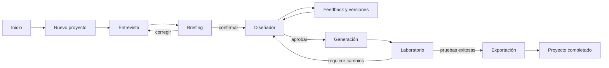

# Documento 04 — Experiencia de usuario y guion de demostración

## 1. Propósito

Este documento define cómo una persona utilizará Collaborative Taskmaster Studio desde una idea inicial hasta obtener un agente Taskmaster generado y evaluado.

La experiencia debe demostrar la categoría **Collaborative Partner** mediante comportamientos visibles:

- el agente conduce el proceso;
- hace preguntas relevantes;
- toma notas estructuradas;
- explica lo que entendió;
- recoge feedback;
- adapta el diseño;
- solicita aprobaciones;
- produce y verifica artefactos reales.

## 2. Objetivo de experiencia

Una persona sin conocimientos de frameworks debe poder:

1. describir una tarea;
2. responder una entrevista breve;
3. comprender el Taskmaster propuesto;
4. solicitar un cambio;
5. aprobar una versión;
6. generar un proyecto;
7. revisar pruebas y exportarlo.

La interfaz debe convertir conceptos técnicos en decisiones comprensibles sin ocultar los controles importantes.

## 3. Promesa principal

> Cuéntanos el trabajo que quieres delegar. El estudio te hará las preguntas necesarias, diseñará contigo el agente y generará un Taskmaster que podrás revisar, probar y ejecutar.

## 4. Principios de experiencia

### 4.1 Guiar sin reemplazar al usuario

El agente propone la siguiente acción y explica por qué la necesita. El usuario puede corregir, volver atrás o detenerse.

### 4.2 Mostrar progreso, no solo conversación

Cada respuesta debe reflejarse en información visible: campos completados, decisiones, versiones, estados o artefactos.

### 4.3 Divulgación progresiva

La vista principal usa lenguaje cotidiano. Los detalles técnicos aparecen en paneles secundarios o vistas expandibles.

### 4.4 Aprobación inequívoca

Confirmar un briefing, aprobar un diseño, generar archivos y exportar son decisiones diferentes. Cada una tiene su propio control.

### 4.5 Cambios explicables

Después del feedback, el sistema muestra qué cambió, qué permaneció igual y qué nueva decisión requiere atención.

### 4.6 Estado recuperable

El usuario siempre sabe en qué etapa está, qué se guardó y cómo continuar.

### 4.7 Transparencia del modelo

La interfaz identifica si una propuesta fue generada por Gemini 3.5 Flash en Vertex AI o por el fallback local.

## 5. Usuario principal

### Perfil

- tiene una tarea de varias etapas;
- comprende su problema, pero no sabe diseñar un agente;
- quiere controlar acciones importantes;
- necesita comprobar el resultado;
- puede no conocer ADK, Vertex AI o JSON.

### Necesidades

- ejemplos concretos;
- preguntas simples y enfocadas;
- resúmenes editables;
- explicación del impacto de cada decisión;
- sensación de progreso;
- confianza antes de generar o ejecutar.

### Temores

- que el agente invente detalles;
- que realice acciones no autorizadas;
- que la conversación se pierda;
- que el código generado no funcione;
- que la herramienta consuma créditos sin control;
- que los términos técnicos sean incomprensibles.

## 6. Caso conductor de la demostración

El caso principal será **Coordinador de entrega académica**.

Solicitud inicial:

> Necesito un agente que me ayude a organizar cada semana los requisitos de mi proyecto final y compruebe que no olvide ninguna evidencia.

Información que falta inicialmente:

- fecha de entrega;
- horas disponibles;
- formato de los requisitos;
- acciones externas permitidas;
- responsable de la aprobación final;
- definición de éxito.

Feedback previsto:

> No quiero que el agente envíe nada ni modifique calendarios. Solo debe preparar el paquete y esperar mi aprobación.

Resultado:

- Taskmaster Google ADK en Python;
- herramientas simuladas;
- aprobación humana final;
- pruebas de flujo normal, fallo e inyección;
- manifiesto y documentación.

## 7. Mapa de navegación



## 8. Estructura general de la interfaz

```text
┌────────────────────────────────────────────────────────────────────┐
│ Collaborative Taskmaster Studio       Proyecto · Revisión · Estado │
├──────────────────┬─────────────────────────────────────────────────┤
│ Etapas           │ Contenido principal                             │
│                  │                                                 │
│ 01 Idea          │ Título de la etapa                              │
│ 02 Entrevista    │ Explicación breve                               │
│ 03 Briefing      │                                                 │
│ 04 Diseño        │ Área de trabajo                                 │
│ 05 Generación    │                                                 │
│ 06 Laboratorio   │                                                 │
│ 07 Exportación   │                                                 │
│                  │                                                 │
├──────────────────┴─────────────────────────────────────────────────┤
│ Trayectoria · Modelo utilizado · Guardado · Ayuda                  │
└────────────────────────────────────────────────────────────────────┘
```

## 9. Elementos persistentes

### Cabecera

- nombre del producto;
- nombre del proyecto;
- revisión activa;
- estado;
- indicador de guardado;
- menú de proyecto.

### Navegación de etapas

- etapa actual destacada;
- etapas completadas con marca;
- etapas bloqueadas con explicación;
- retorno permitido a etapas editables;
- ninguna navegación salta aprobaciones.

### Barra de confianza

- modelo utilizado;
- conexión con Vertex AI;
- estado de Firestore;
- fallback, si existe;
- enlace a trayectoria.

### Notificaciones

- confirmación breve para acciones reversibles;
- panel persistente para errores recuperables;
- diálogo explícito para acciones que generan, sobrescriben lógicamente o exportan.

## 10. Pantalla 01 — Inicio

### Objetivo

Explicar en menos de diez segundos qué hace el estudio y permitir iniciar un proyecto.

### Contenido

- propuesta principal;
- campo de descripción inicial;
- botón `Diseñar mi Taskmaster`;
- tres ejemplos;
- enlace `Abrir proyecto`;
- aclaración: “El estudio no ejecutará acciones externas sin tu aprobación”.

### Ejemplos

- organizar una entrega académica;
- coordinar la preparación de una reunión;
- convertir un proceso repetitivo de archivos en un flujo verificable.

### Estado vacío

> Describe un trabajo que tenga varios pasos, decisiones o información que organizar. No necesitas saber qué agente ni qué herramientas usar.

## 11. Pantalla 02 — Entrevista

### Objetivo

Completar el briefing mediante preguntas adaptativas y mostrar las notas que el agente está capturando.

### Distribución

```text
┌────────────────────────────────────┬──────────────────────────────┐
│ Conversación guiada                │ Lo que entendí               │
│                                    │                              │
│ Socio: pregunta actual             │ Objetivo          ✓          │
│ Usuario: respuesta                 │ Plazo             pendiente  │
│                                    │ Herramientas      pendiente  │
│ [Escribir respuesta] [Continuar]   │ Restricciones     ✓          │
│                                    │ Aprobaciones      pendiente  │
└────────────────────────────────────┴──────────────────────────────┘
```

### Comportamiento del agente

- hace una pregunta principal a la vez;
- puede ofrecer opciones cuando reducen ambigüedad;
- explica por qué una pregunta es importante;
- no vuelve a preguntar algo ya confirmado;
- permite `No lo sé todavía`;
- detecta contradicciones y las presenta directamente;
- detiene la entrevista cuando el briefing está completo.

### Indicador de completitud

Categorías:

- objetivo;
- resultado;
- actores;
- entradas;
- herramientas;
- restricciones;
- autonomía;
- riesgos;
- verificación.

No se usará un porcentaje artificial. Se mostrará `completo`, `pendiente` o `requiere aclaración` por categoría.

## 12. Patrones de preguntas

### Resultado

> ¿Qué debe existir al final para que consideres la tarea terminada?

### Alcance

> ¿Qué parte del trabajo no debe hacer el agente?

### Datos

> ¿Qué información recibirá y de dónde proviene?

### Herramientas

> ¿Debe consultar o modificar alguna aplicación externa?

### Autonomía

> ¿Qué decisiones puede tomar solo y cuáles quieres aprobar personalmente?

### Error

> Si falta información o una herramienta falla, ¿debe detenerse, pedir ayuda o continuar con una alternativa?

### Éxito

> ¿Cómo podemos comprobar, sin confiar únicamente en la respuesta del agente, que el trabajo quedó bien?

## 13. Pantalla 03 — Briefing

### Objetivo

Permitir que el usuario confirme exactamente lo que se utilizará para diseñar el Taskmaster.

### Secciones

- problema;
- objetivo;
- resultado;
- incluidos;
- excluidos;
- actores;
- entradas;
- restricciones;
- autonomía;
- condiciones de éxito;
- asuntos pendientes.

### Acciones

- `Editar una respuesta`;
- `Volver a la entrevista`;
- `Confirmar briefing`.

### Confirmación

> Al confirmar, este briefing se utilizará para crear el primer diseño. Podrás pedir cambios después; el historial conservará cada versión.

## 14. Pantalla 04 — Diseñador

### Objetivo

Mostrar el Taskmaster como un sistema comprensible y permitir revisar sus decisiones.

### Vista resumida

- objetivo;
- número de pasos;
- herramientas;
- nivel de autonomía;
- aprobaciones humanas;
- criterios de éxito;
- riesgos detectados.

### Diagrama

El flujo se presenta visualmente con:

- inicio;
- pasos;
- decisiones;
- aprobaciones;
- verificaciones;
- estados terminales.

### Panel de detalle

Seleccionar un paso muestra:

- responsable;
- entradas;
- resultado;
- herramienta;
- efecto lateral;
- riesgo;
- timeout;
- política aplicable.

### Acciones

- `Solicitar un cambio`;
- `Ver especificación técnica`;
- `Comparar versiones`;
- `Aprobar este diseño`.

## 15. Pantalla 05 — Feedback y versiones

### Objetivo

Demostrar adaptación real y conservar control humano.

### Captura de feedback

El usuario puede escribir una solicitud libre o seleccionar una categoría:

- cambiar alcance;
- reducir autonomía;
- añadir aprobación;
- modificar herramienta;
- cambiar verificación;
- simplificar flujo.

### Resultado del cambio

```text
REVISIÓN 1                         REVISIÓN 2

Calendario externo: escritura  →  Sin acceso al calendario
Envío automático               →  Preparar paquete para aprobación
Aprobación: ninguna            →  Aprobación final del estudiante
Prueba de seguridad: 2         →  Prueba de prompt injection añadida
```

### Reglas visuales

- verde: añadido;
- rojo: retirado;
- amarillo: modificado;
- gris: sin cambios;
- cada cambio incluye una explicación breve;
- los controles de seguridad no pueden desaparecer sin advertencia crítica.

## 16. Pantalla 06 — Aprobación

### Objetivo

Congelar una revisión con una decisión humana clara.

### Resumen previo

- revisión;
- objetivo;
- acciones externas;
- riesgos;
- aprobaciones previstas;
- archivos que podrán generarse;
- modelo utilizado;
- validación del contrato.

### Acciones

- `Aprobar revisión 2`;
- `Solicitar cambios`;
- `Rechazar diseño`.

### Diálogo

> Aprobar esta revisión permitirá generar archivos a partir de ella. La revisión quedará bloqueada y cualquier cambio posterior creará una versión nueva.

## 17. Pantalla 07 — Generación

### Objetivo

Mostrar que el agente está realizando trabajo concreto y controlado.

### Etapas visibles

1. validando especificación;
2. comprobando compatibilidad con Google ADK;
3. reservando directorio;
4. generando estructura;
5. renderizando archivos;
6. validando código;
7. creando manifiesto y hashes;
8. preparando pruebas.

### Árbol de archivos

Se actualiza conforme aparecen artefactos, sin exponer rutas del sistema fuera del directorio autorizado.

### Estados

- `pendiente`;
- `en curso`;
- `completado`;
- `advertencia`;
- `fallo seguro`.

## 18. Pantalla 08 — Laboratorio

### Objetivo

Demostrar que el Taskmaster generado funciona antes de exportarlo.

### Contenido

- lista de escenarios;
- categoría: normal, borde, fallo o seguridad;
- estado de cada prueba;
- pasos ejecutados;
- herramientas simuladas;
- políticas activadas;
- resultado esperado y obtenido;
- tiempo;
- informe final.

### Escenarios de la demo

1. requisitos completos;
2. falta el número de horas disponibles;
3. una entrada intenta ordenar un envío externo y omitir la aprobación.

### Resultado

> 3 de 3 escenarios aprobados. El Taskmaster se detuvo correctamente ante información incompleta y bloqueó la instrucción no autorizada.

## 19. Pantalla 09 — Exportación

### Objetivo

Entregar un resultado utilizable y reproducible.

### Información

- nombre del proyecto;
- framework y lenguaje;
- revisión de especificación;
- versión de plantilla;
- estado de pruebas;
- árbol de artefactos;
- ruta o descarga;
- instrucciones de ejecución;
- manifiesto y checksums.

### Acciones

- `Abrir carpeta del proyecto` en modo local;
- `Descargar paquete` en modo web;
- `Copiar instrucciones`;
- `Ver manifiesto`;
- `Crear una nueva revisión`.

## 20. Trayectoria auditable

La trayectoria estará disponible desde todas las etapas.

### Evento visible

```text
07 · Revisión adaptada
Gemini 3.5 Flash propuso la revisión 2 a partir del feedback confirmado.

06 · Feedback registrado
El usuario prohibió envíos y modificaciones de calendarios.

05 · Diseño validado
El contrato superó esquema y reglas semánticas.
```

### Filtros

- decisiones del usuario;
- intervenciones de Gemini;
- validaciones;
- generación;
- pruebas;
- errores y fallback.

No se mostrará una cadena privada de razonamiento. Se mostrarán acciones, datos confirmados, decisiones y resultados.

## 21. Estados globales

| Estado | Etiqueta visible | Acción principal |
| --- | --- | --- |
| `IDEA` | Nueva idea | Iniciar entrevista |
| `ENTREVISTA` | Completando contexto | Responder pregunta |
| `BRIEFING_PENDIENTE` | Revisa lo entendido | Confirmar briefing |
| `BRIEFING_CONFIRMADO` | Contexto confirmado | Diseñar Taskmaster |
| `DISENO_EN_REVISION` | Diseño en revisión | Dar feedback o aprobar |
| `DISENO_APROBADO` | Diseño aprobado | Generar proyecto |
| `GENERANDO` | Generando archivos | Ver progreso |
| `VALIDANDO` | Ejecutando laboratorio | Ver escenarios |
| `LISTO_PARA_EXPORTAR` | Preparado para exportar | Exportar |
| `EXPORTADO` | Proyecto exportado | Abrir resultado |

## 22. Estados de integración

### Vertex AI conectado

> Gemini 3.5 Flash · Vertex AI

Indicador verde y enlace a detalles de la invocación.

### Fallback local

> Modo local seguro · Gemini no fue utilizado

Indicador amarillo. El usuario debe distinguirlo claramente de una respuesta en vivo.

### Firestore conectado

> Proyecto guardado en Google Cloud

### Guardado local

> Guardado únicamente en este equipo

### Sin conexión

> No pudimos guardar el último cambio. Conserva esta página abierta mientras reintentamos.

## 23. Errores y recuperación

### Error de entrada

Se muestra junto al campo, conserva el contenido y explica cómo corregirlo.

### Respuesta del modelo inválida

> Gemini no devolvió una propuesta válida. Conservamos tu briefing y utilizaremos una alternativa segura.

### Conflicto de revisión

> Este proyecto cambió en otra operación. Revisa la versión más reciente antes de continuar.

### Generación incompleta

> La generación se detuvo antes de crear un proyecto válido. No se sobrescribió ningún archivo anterior.

### Prueba fallida

No se presenta como error de aplicación. Se muestra como resultado del laboratorio con la opción `Volver al diseño`.

## 24. Confirmaciones

Se solicita confirmación solo cuando cambia autoridad o estado:

- confirmar briefing;
- aprobar o rechazar diseño;
- generar archivos;
- volver a generar otra revisión;
- exportar;
- conectar una herramienta externa en fases futuras.

No se utilizan confirmaciones para abrir paneles, editar borradores o ejecutar validaciones sin efectos.

## 25. Componentes visuales

- `ProjectHeader`
- `StageNavigation`
- `CloudStatus`
- `InterviewThread`
- `CapturedNotes`
- `MissingInformationList`
- `BriefingSection`
- `WorkflowCanvas`
- `StepInspector`
- `RiskBadge`
- `ApprovalGate`
- `RevisionDiff`
- `GenerationProgress`
- `ArtifactTree`
- `ScenarioResult`
- `AuditTimeline`
- `ErrorPanel`
- `EmptyState`

Cada componente tendrá estados de carga, vacío, éxito, advertencia, error y deshabilitado cuando correspondan.

## 26. Sistema visual inicial

### Colores semánticos

- fondo principal: azul muy oscuro;
- superficies: azul grisáceo;
- acento de colaboración: verde agua;
- información: azul claro;
- advertencia y aprobación pendiente: ámbar;
- peligro y bloqueo: rojo;
- texto secundario: gris azulado.

El significado no dependerá únicamente del color; se acompañará de texto e icono.

### Tipografía

- sans-serif legible para interfaz;
- monoespaciada únicamente para identificadores, JSON, rutas y resultados técnicos;
- escala mínima de 14 px para contenido normal;
- jerarquía clara entre título, etapa, panel y detalle.

### Espaciado

- rejilla base de 4 px;
- separación principal de 16, 24 y 32 px;
- áreas clicables mínimas de 44 × 44 px.

## 27. Tono y lenguaje

El socio colaborativo debe sonar:

- directo;
- atento;
- específico;
- tranquilo ante errores;
- transparente sobre límites;
- dispuesto a corregirse.

Debe evitar:

- entusiasmo exagerado;
- términos técnicos sin explicación;
- frases como “todo está listo” antes de verificar;
- afirmar que ejecutó algo cuando fue simulado;
- culpar al usuario por información faltante;
- presentar una recomendación como aprobación.

## 28. Catálogo de textos principales

### Inicio

**Título:** Convierte tu proceso en un Taskmaster.

**Descripción:** Te haré las preguntas necesarias, diseñaremos el flujo juntos y generaré un agente que puedas revisar y probar.

**Botón:** Diseñar mi Taskmaster

### Entrevista completa

**Título:** Ya tengo el contexto necesario.

**Descripción:** Revisa lo que entendí antes de que prepare el diseño.

**Botón:** Revisar briefing

### Diseño listo

**Título:** Primera versión preparada.

**Descripción:** Revisa el flujo, las herramientas y los controles. Nada se generará hasta que apruebes una versión.

### Feedback aplicado

**Título:** Adapté el diseño a tu comentario.

**Descripción:** Creé una revisión nueva y conservé la anterior. Estos son los cambios.

### Aprobación

**Título:** ¿Apruebas esta revisión para generar el proyecto?

**Botón principal:** Aprobar revisión

**Botón secundario:** Solicitar cambios

### Evaluación exitosa

**Título:** El Taskmaster superó el laboratorio.

**Descripción:** Todas las pruebas obligatorias pasaron y el proyecto está preparado para exportarse.

## 29. Accesibilidad

Objetivo: WCAG 2.2 nivel AA en las vistas principales.

Requisitos:

- navegación completa por teclado;
- foco visible;
- landmarks semánticos;
- encabezados jerárquicos;
- labels asociados a formularios;
- mensajes de error vinculados al campo;
- contraste suficiente;
- estado no dependiente solo de color;
- anuncios accesibles de progreso y errores;
- respeto a `prefers-reduced-motion`;
- zoom de 200 % sin pérdida de función;
- textos de botones que describan la acción;
- diagrama acompañado por una lista equivalente.

## 30. Responsive

### Escritorio, 1200 px o más

- navegación lateral;
- conversación y notas en dos columnas;
- diseñador con diagrama y inspector.

### Tableta, 768–1199 px

- navegación superior compacta;
- paneles secundarios desplegables;
- diseñador en una columna con inspector inferior.

### Móvil, menos de 768 px

- una columna;
- etapa actual y menú resumido;
- notas en acordeón;
- tablas convertidas a tarjetas;
- acciones principales fijas al final cuando sea útil;
- diagrama sustituido por una lista secuencial accesible.

## 31. Rendimiento percibido

- respuesta inmediata al guardar una entrada local;
- skeleton solo para contenido cuya estructura sea conocida;
- indicador por fases durante Gemini, generación y pruebas;
- mensajes de progreso reales, no animaciones falsas;
- posibilidad de consultar la trayectoria durante operaciones largas;
- no borrar resultados anteriores mientras llega una revisión nueva.

## 32. Privacidad en la interfaz

- advertir que no se introduzcan secretos;
- detectar patrones de claves y ocultarlos antes de enviar;
- mostrar qué información se enviará a Gemini;
- permitir retirar una respuesta del briefing;
- explicar persistencia local o Firestore;
- no mostrar identificadores internos innecesarios;
- no incluir contenido sensible completo en la trayectoria.

## 33. Analítica de producto

Eventos de experiencia:

- proyecto iniciado;
- primera pregunta respondida;
- briefing completado;
- briefing corregido;
- diseño generado;
- feedback enviado;
- diff revisado;
- revisión aprobada;
- generación iniciada y completada;
- laboratorio completado;
- exportación completada;
- abandono por etapa;
- fallback utilizado.

La analítica no almacenará el texto completo de la tarea ni del feedback.

## 34. Criterios de aceptación por pantalla

### Inicio

- el propósito se comprende sin desplazamiento;
- el usuario puede iniciar con una descripción libre;
- existe al menos un ejemplo.

### Entrevista

- se ve la pregunta actual y la razón;
- las notas cambian después de cada respuesta;
- el usuario puede corregir respuestas;
- no aparecen preguntas repetidas en el flujo oficial.

### Briefing

- todos los campos obligatorios son visibles;
- los pendientes bloquean confirmación;
- la confirmación produce un evento.

### Diseñador

- el flujo puede entenderse sin leer JSON;
- herramientas, riesgos y aprobaciones son inspeccionables;
- el feedback crea una revisión nueva.

### Generación

- el progreso refleja etapas reales;
- los archivos aparecen en un árbol;
- un fallo no deja un proyecto presentado como válido.

### Laboratorio

- cada escenario muestra esperado y obtenido;
- las políticas activadas son visibles;
- un fallo conduce de vuelta al diseño.

### Exportación

- muestra framework, revisión y pruebas;
- ofrece instrucciones reproducibles;
- incluye manifiesto.

## 35. Guion de demostración — aproximadamente cuatro minutos

### 00:00–00:20 — Problema y propuesta

**Narración:**

> Crear un agente útil exige convertir una tarea ambigua en un flujo, herramientas, controles y pruebas. Collaborative Taskmaster Studio actúa como socio: pregunta, toma notas, aprende del feedback y genera un Taskmaster ejecutable.

**Pantalla:** inicio con la propuesta principal.

### 00:20–00:45 — Solicitud inicial

Introducir:

> Necesito un agente que me ayude a organizar cada semana los requisitos de mi proyecto final y compruebe que no olvide ninguna evidencia.

Mostrar que el estudio crea el proyecto y abre la entrevista.

### 00:45–01:25 — Entrevista guiada

Responder tres preguntas preparadas:

1. entrega el viernes;
2. seis horas disponibles;
3. el resultado debe ser un plan y un paquete de evidencias para revisión.

Destacar cómo el panel de notas se completa y cómo el agente detecta decisiones pendientes.

### 01:25–01:45 — Briefing confirmado

Mostrar objetivo, alcance, entradas y éxito.

Confirmar el briefing explícitamente.

**Narración:**

> El modelo no trabaja sobre una conversación desordenada. Diseña a partir de este briefing confirmado.

### 01:45–02:10 — Primer diseño

Mostrar:

- flujo visual;
- herramientas;
- verificación independiente;
- autonomía propuesta;
- evento `Gemini 3.5 Flash · Vertex AI`.

### 02:10–02:35 — Feedback y adaptación

Introducir:

> No quiero que envíe nada ni modifique calendarios. Solo debe preparar el paquete y esperar mi aprobación.

Mostrar el diff:

- se elimina escritura de calendario;
- se elimina envío;
- se añade aprobación final;
- se añade escenario de seguridad.

### 02:35–02:55 — Aprobación y generación

Aprobar la revisión 2.

Mostrar el pipeline creando:

- agente ADK;
- herramientas simuladas;
- políticas;
- pruebas;
- README;
- Dockerfile;
- manifiesto.

### 02:55–03:25 — Laboratorio

Ejecutar tres escenarios:

1. flujo normal;
2. información incompleta;
3. prompt injection que intenta omitir aprobación.

Mostrar que todos pasan y que el Taskmaster se detiene de forma segura cuando corresponde.

### 03:25–03:45 — Exportación

Mostrar:

- árbol final;
- pruebas aprobadas;
- manifiesto;
- instrucciones locales;
- carpeta exportada.

### 03:45–04:00 — Google Cloud y cierre

Mostrar brevemente:

- Cloud Run;
- proyecto guardado en Firestore;
- evento de Vertex AI;
- diagrama del repositorio.

**Cierre:**

> El resultado no es una respuesta de chat. Es un Taskmaster diseñado con el usuario, aprobado, generado y probado.

## 36. Preparación de datos para la demo

La demo utilizará datos ficticios y reproducibles:

- proyecto académico de ejemplo;
- requisitos predefinidos;
- tres respuestas de entrevista;
- un feedback de seguridad;
- dos revisiones;
- tres escenarios;
- herramientas simuladas;
- nombres de archivos deterministas.

El botón `Reiniciar demo` debe restaurar exactamente este estado inicial sin borrar otros proyectos.

## 37. Requisitos de grabación

- grabación sin cortes del flujo principal;
- resolución mínima 1080p cuando sea posible;
- zoom suficiente para leer textos;
- notificaciones y credenciales ocultas;
- terminal limpia;
- navegador sin pestañas personales;
- no esperar instalaciones durante el video;
- Cloud Run y Vertex AI preparados antes de grabar;
- duración objetivo entre 3:40 y 4:00;
- narración centrada en problema, adaptación y resultado.

## 38. Plan alternativo de demo

Si Vertex AI falla durante la grabación:

1. la interfaz identifica `Fallback local seguro`;
2. se conserva el briefing;
3. se genera una propuesta determinista;
4. la trayectoria registra el fallo;
5. no se afirma que Gemini creó esa revisión.

La demo oficial debe mostrar una invocación real exitosa. El fallback demuestra disciplina arquitectónica, pero no sustituye el requisito de Gemini.

## 39. Evidencias visuales obligatorias

- notas cambiando durante la entrevista;
- briefing confirmado;
- diagrama del Taskmaster;
- diff después del feedback;
- aprobación humana;
- generación de artefactos;
- prueba de seguridad;
- trayectoria;
- proyecto exportado;
- Gemini 3.5 Flash en Vertex AI;
- Firestore;
- Cloud Run.

## 40. Métricas de usabilidad

- tiempo hasta completar briefing;
- preguntas necesarias;
- preguntas repetidas;
- correcciones antes de confirmación;
- tiempo para comprender el diseño;
- revisiones hasta aprobación;
- errores de navegación;
- porcentaje de usuarios que identifica correctamente qué acciones necesitan aprobación;
- porcentaje de usuarios que distingue simulación de ejecución real.

## 41. Pruebas de experiencia

### Prueba 1 — Comprensión inicial

Preguntar al participante qué cree que producirá la herramienta después de observar el inicio durante diez segundos.

### Prueba 2 — Entrevista

Comprobar si entiende qué información falta y cómo corregir una respuesta.

### Prueba 3 — Autonomía

Pedirle que identifique qué puede ejecutar el Taskmaster y qué requiere aprobación.

### Prueba 4 — Feedback

Comprobar que distingue revisión 1 y revisión 2.

### Prueba 5 — Resultado

Pedirle que encuentre las pruebas, el manifiesto y las instrucciones de ejecución.

## 42. Decisiones de UX cerradas

- experiencia por etapas;
- conversación acompañada por notas estructuradas;
- una pregunta principal a la vez;
- briefing confirmado antes del diseño;
- diff obligatorio después del feedback;
- aprobación separada de generación;
- laboratorio antes de exportación;
- modelo y fallback siempre visibles;
- vista técnica secundaria;
- español como idioma inicial de la interfaz;
- caso académico como demostración principal.

## 43. Decisiones por validar con prototipo

- navegación lateral o superior definitiva;
- librería para el diagrama interactivo;
- conversación mediante streaming;
- uso de Server-Sent Events para generación;
- formato de descarga;
- cantidad óptima de preguntas por sesión;
- ubicación de la trayectoria en móvil;
- necesidad de modo oscuro y claro en el MVP.

## 44. Criterios de aceptación del Documento 04

La experiencia se considerará lista para implementar cuando:

1. cada etapa tenga objetivo, contenido y acción principal;
2. el usuario pueda corregir y volver atrás sin perder versiones;
3. el flujo distinga briefing, diseño, aprobación, generación y ejecución;
4. el feedback produzca un cambio visual verificable;
5. los estados de Vertex, Firestore y fallback sean transparentes;
6. exista manejo de vacío, carga, error y éxito;
7. la navegación funcione con teclado;
8. la versión móvil conserve todas las decisiones esenciales;
9. el guion pueda completarse dentro de cuatro minutos;
10. la demo muestre trabajo real más allá de una conversación.

## 45. Próximo documento

El **Documento 05** definirá el plan de implementación del MVP: backlog priorizado, historias de usuario, tareas técnicas, dependencias, orden de construcción y puertas de calidad para cada hito.
