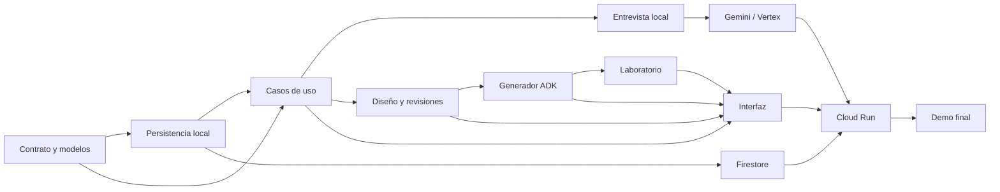

# Documento 05 — Plan de implementación del MVP

## 1. Propósito

Este documento convierte los cuatro documentos anteriores en un plan de construcción ejecutable para Collaborative Taskmaster Studio.

Define:

- alcance congelado del MVP;
- orden de implementación;
- backlog priorizado;
- historias de usuario;
- tareas técnicas;
- dependencias;
- puertas de calidad;
- estrategia de pruebas;
- hitos y resultados verificables;
- criterios para considerar la demo terminada.

## 2. Resultado esperado

Al finalizar el plan, un usuario podrá describir una tarea, completar una entrevista colaborativa, confirmar un briefing, revisar y adaptar una especificación, aprobarla, generar un proyecto Google ADK, ejecutar pruebas simuladas y exportar el resultado.

La aplicación funcionará localmente y tendrá evidencia de ejecución con Gemini 3.5 Flash, Firestore y Cloud Run.

## 3. Alcance congelado del MVP

### Incluido

- un proyecto por sesión activa;
- interfaz web en español;
- entrevista guiada;
- notas estructuradas;
- briefing editable y confirmable;
- diseño de `TaskmasterSpecification`;
- una o más revisiones mediante feedback;
- comparación entre dos revisiones;
- aprobación humana;
- generación Google ADK con Python;
- plantillas versionadas;
- sandbox con herramientas simuladas;
- tres escenarios de evaluación;
- trayectoria auditable;
- persistencia local y Firestore;
- Gemini 3.5 Flash mediante Vertex AI;
- despliegue del estudio en Cloud Run;
- un caso de demostración completo.

### Excluido

- generación real para GenKit;
- generación real para Antigravity;
- despliegue automático del Taskmaster generado;
- herramientas externas con escritura;
- colaboración multiusuario;
- facturación o planes comerciales;
- marketplace de agentes;
- ejecución prolongada en segundo plano;
- edición libre de código desde la interfaz;
- aplicación móvil nativa.

## 4. Regla de control de alcance

Una función nueva solo entra al MVP si cumple una de estas condiciones:

1. es necesaria para un requisito de la convocatoria;
2. completa la ruta crítica de la demostración;
3. corrige un riesgo de seguridad o reproducibilidad;
4. elimina un bloqueo técnico comprobado.

Las demás ideas se registrarán en un backlog posterior y no interrumpirán la ruta crítica.

## 5. Prioridades

Se utilizará MoSCoW:

- **Must:** obligatorio para entregar.
- **Should:** importante, pero puede simplificarse.
- **Could:** mejora opcional.
- **Won't:** fuera del MVP.

La prioridad no sustituye dependencias. Una tarea `Should` que desbloquea una `Must` se trata como obligatoria durante ese hito.

## 6. Unidades de estimación

- **XS:** cambio aislado y predecible.
- **S:** tarea pequeña con pruebas directas.
- **M:** componente o flujo con varias piezas.
- **L:** integración o pantalla completa.
- **XL:** debe dividirse antes de entrar en ejecución.

No se implementarán tareas `XL` sin descomponerlas.

## 7. Frentes de trabajo

| Frente | Responsabilidad |
| --- | --- |
| Dominio | Modelos, estados, contratos y validaciones. |
| Agentes | ADK, Gemini, entrevista y diseño. |
| Aplicación | Casos de uso, permisos, idempotencia y eventos. |
| Persistencia | Repositorios locales y Firestore. |
| Generación | Plantillas, adaptador ADK, manifiesto y archivos. |
| Laboratorio | Sandbox, escenarios e informe. |
| Interfaz | Navegación, formularios, diseñador y resultados. |
| Nube | Vertex AI, Cloud Run, Firestore, IAM y costos. |
| Calidad | Pruebas, seguridad, documentación y demo. |

## 8. Dependencias de alto nivel



## 9. Ruta crítica

```text
Modelos y esquema
  -> estados y repositorio local
  -> entrevista local completa
  -> diseño y revisiones
  -> aprobación
  -> generador ADK
  -> sandbox y pruebas
  -> interfaz integral
  -> Vertex AI
  -> Firestore
  -> Cloud Run
  -> demo y entrega
```

GenKit y Antigravity no forman parte de la ruta crítica.

## 10. Hito H0 — Base del repositorio

### Objetivo

Crear una base reproducible, segura y lista para pruebas.

### Tareas

- `H0-01` Crear el directorio definido en el Documento 03. **S / Must**
- `H0-02` Inicializar Git y rama principal. **XS / Must**
- `H0-03` Crear `.gitignore` y `.env.example`. **XS / Must**
- `H0-04` Crear `pyproject.toml` con Python 3.13. **S / Must**
- `H0-05` Configurar framework de pruebas. **S / Must**
- `H0-06` Configurar formato y análisis estático. **S / Should**
- `H0-07` Añadir README mínimo con ejecución local. **S / Must**
- `H0-08` Copiar el esquema canónico a `schemas/`. **S / Must**

### Puerta QG0

- instalación desde entorno limpio;
- comando de pruebas funciona;
- no hay secretos;
- estructura coincide con la arquitectura;
- primer commit reproducible.

## 11. Hito H1 — Dominio y contrato

### Objetivo

Implementar el estado y las reglas sin Google Cloud ni Gemini.

### Tareas

- `H1-01` Crear enums de estados, riesgos, aprobación y autonomía. **S / Must**
- `H1-02` Crear modelos `Project` y `Briefing`. **M / Must**
- `H1-03` Crear modelos `Revision`, `Approval` y `AuditEvent`. **M / Must**
- `H1-04` Crear modelo `TaskmasterSpecification`. **L / Must**
- `H1-05` Compilar y cargar JSON Schema. **M / Must**
- `H1-06` Implementar validación estructural. **M / Must**
- `H1-07` Implementar reglas semánticas. **L / Must**
- `H1-08` Implementar máquina de estados. **M / Must**
- `H1-09` Impedir cambios sobre revisiones aprobadas. **S / Must**
- `H1-10` Crear errores de dominio estructurados. **S / Must**

### Pruebas

- JSON válido e inválido;
- identificadores duplicados;
- referencias desconocidas;
- estados inalcanzables;
- falta de aprobación en alto riesgo;
- combinación framework/lenguaje inválida;
- revisión aprobada inmutable;
- categorías de prueba obligatorias.

### Puerta QG1

- ejemplo del Documento 02 valida;
- todas las reglas semánticas tienen pruebas;
- cobertura del dominio suficiente para detectar regresiones críticas;
- dominio no importa ADK, Firestore ni HTTP.

## 12. Hito H2 — Repositorios y eventos locales

### Objetivo

Permitir desarrollo integral sin consumir Google Cloud.

### Tareas

- `H2-01` Definir puertos de repositorios. **M / Must**
- `H2-02` Crear repositorio en memoria para pruebas. **M / Must**
- `H2-03` Crear repositorio JSON local. **M / Must**
- `H2-04` Crear repositorio de eventos. **S / Must**
- `H2-05` Crear reloj inyectable. **S / Must**
- `H2-06` Implementar snapshots de proyecto. **M / Must**
- `H2-07` Implementar claves de idempotencia. **M / Must**
- `H2-08` Proteger escrituras concurrentes por revisión. **M / Must**

### Puerta QG2

- reiniciar la aplicación conserva un proyecto local;
- operaciones repetidas no duplican revisiones;
- eventos mantienen secuencia;
- pruebas no usan disco salvo directorios temporales.

## 13. Hito H3 — Entrevista colaborativa local

### Objetivo

Completar la ruta idea → preguntas → briefing confirmado con lógica local determinista.

### Historias

#### US-01 — Crear proyecto

> Como usuario, quiero describir una tarea para iniciar un proyecto sin conocer términos técnicos.

**Aceptación:** se crea un proyecto en estado `IDEA`, se registra el evento y la descripción se conserva.

#### US-02 — Recibir preguntas

> Como usuario, quiero que el socio detecte la información faltante y me haga una pregunta relevante a la vez.

**Aceptación:** cada pregunta corresponde a un campo pendiente y no se repite después de confirmarlo.

#### US-03 — Ver notas

> Como usuario, quiero ver qué entendió el agente para corregir errores durante la entrevista.

**Aceptación:** las notas cambian después de cada respuesta y muestran pendientes.

#### US-04 — Confirmar briefing

> Como usuario, quiero revisar y confirmar el briefing antes de que se diseñe el agente.

**Aceptación:** campos obligatorios pendientes bloquean confirmación; confirmar cambia estado y emite evento.

### Tareas técnicas

- `H3-01` Implementar `ProjectService`. **M / Must**
- `H3-02` Implementar `InterviewService`. **L / Must**
- `H3-03` Crear catálogo local de preguntas. **M / Must**
- `H3-04` Crear cálculo de campos faltantes. **M / Must**
- `H3-05` Registrar y corregir respuestas. **M / Must**
- `H3-06` Construir resumen del briefing. **M / Must**
- `H3-07` Confirmar briefing. **S / Must**

### Puerta QG3

- flujo completo mediante pruebas de aplicación;
- ninguna pregunta repetida en el fixture oficial;
- corrección de respuesta actualiza notas;
- no se puede diseñar sin briefing confirmado.

## 14. Hito H4 — Diseño, feedback y aprobación local

### Objetivo

Crear una especificación determinista, adaptarla y aprobar una revisión.

### Historias

#### US-05 — Revisar diseño

> Como usuario, quiero ver pasos, herramientas, riesgos y verificaciones sin leer JSON.

#### US-06 — Solicitar cambios

> Como usuario, quiero dar feedback para que el estudio cree una revisión nueva y conserve la anterior.

#### US-07 — Comparar revisiones

> Como usuario, quiero ver exactamente qué fue añadido, retirado o modificado.

#### US-08 — Aprobar diseño

> Como usuario, quiero aprobar explícitamente una revisión antes de generar archivos.

### Tareas técnicas

- `H4-01` Implementar `DesignService`. **L / Must**
- `H4-02` Crear diseñador determinista del caso oficial. **M / Must**
- `H4-03` Crear revisión inicial. **M / Must**
- `H4-04` Aplicar feedback como nueva revisión. **L / Must**
- `H4-05` Implementar diff estructural. **M / Must**
- `H4-06` Implementar `ApprovalService`. **M / Must**
- `H4-07` Congelar revisiones aprobadas. **S / Must**
- `H4-08` Validar políticas no reducibles silenciosamente. **M / Must**

### Puerta QG4

- revisión 1 y 2 permanecen disponibles;
- el feedback oficial modifica alcance, herramientas, aprobación y prueba de seguridad;
- el diff coincide con los cambios;
- Gemini no puede aprobar;
- generar sin aprobación falla.

## 15. Hito H5 — API e interfaz vertical

### Objetivo

Hacer visible el flujo completo hasta aprobación antes de conectar Gemini.

### Tareas de API

- `H5-01` Crear entrada HTTP. **M / Must**
- `H5-02` Crear middleware de `request_id`. **S / Must**
- `H5-03` Crear errores JSON. **S / Must**
- `H5-04` Exponer proyectos y snapshots. **M / Must**
- `H5-05` Exponer entrevista y briefing. **M / Must**
- `H5-06` Exponer revisiones, feedback, diff y aprobación. **L / Must**
- `H5-07` Añadir validación de tamaño y formato. **M / Must**

### Tareas de interfaz

- `H5-08` Crear layout, cabecera y navegación. **M / Must**
- `H5-09` Crear pantalla de inicio. **M / Must**
- `H5-10` Crear entrevista y notas. **L / Must**
- `H5-11` Crear briefing editable. **L / Must**
- `H5-12` Crear diseñador en formato secuencial. **L / Must**
- `H5-13` Crear diff de revisiones. **M / Must**
- `H5-14` Crear aprobación. **M / Must**
- `H5-15` Crear trayectoria. **M / Must**
- `H5-16` Crear estados de carga, vacío y error. **M / Must**
- `H5-17` Implementar responsive y teclado. **M / Should**

### Puerta QG5

- flujo idea → aprobación utilizable desde navegador;
- la API no permite saltar etapas;
- interfaz funciona a 375 px y escritorio;
- navegación principal funciona con teclado;
- fallback local está claramente identificado.

## 16. Hito H6 — Generador Google ADK

### Objetivo

Crear un proyecto independiente y reproducible desde una revisión aprobada.

### Historias

#### US-09 — Generar proyecto

> Como usuario, quiero convertir el diseño aprobado en archivos reales sin editar plantillas manualmente.

#### US-10 — Ver artefactos

> Como usuario, quiero conocer qué se creó y con qué versión.

### Tareas técnicas

- `H6-01` Crear interfaz de adaptadores. **M / Must**
- `H6-02` Crear mapa de capacidades ADK. **M / Must**
- `H6-03` Crear plantillas ADK `1.0.0`. **L / Must**
- `H6-04` Generar agente raíz. **M / Must**
- `H6-05` Generar herramientas simuladas. **L / Must**
- `H6-06` Generar políticas y aprobaciones. **L / Must**
- `H6-07` Generar pruebas derivadas del contrato. **L / Must**
- `H6-08` Generar README, arquitectura y `.env.example`. **M / Must**
- `H6-09` Generar Dockerfile y manifiesto ADK. **M / Must**
- `H6-10` Confinar rutas a `generated/`. **M / Must**
- `H6-11` Evitar sobrescritura. **S / Must**
- `H6-12` Crear checksums y manifiesto. **M / Must**
- `H6-13` Formatear y validar archivos. **M / Should**

### Puerta QG6

- se genera el caso oficial en una carpeta nueva;
- no existen rutas absolutas en archivos exportados;
- repetir la misma generación no sobrescribe;
- el manifiesto referencia revisión y plantilla;
- checksums coinciden;
- el proyecto generado importa correctamente.

## 17. Hito H7 — Sandbox y evaluación

### Objetivo

Probar el Taskmaster generado en un entorno controlado.

### Historias

#### US-11 — Ejecutar laboratorio

> Como usuario, quiero probar el agente antes de exportarlo para comprobar que sus límites funcionan.

#### US-12 — Comprender fallos

> Como usuario, quiero ver qué escenario falló y volver al diseño con información útil.

### Tareas técnicas

- `H7-01` Crear política del sandbox. **M / Must**
- `H7-02` Crear directorio temporal aislado. **M / Must**
- `H7-03` Crear runner con timeout. **L / Must**
- `H7-04` Capturar código de salida y logs. **M / Must**
- `H7-05` Ejecutar pruebas unitarias generadas. **M / Must**
- `H7-06` Ejecutar escenario normal. **M / Must**
- `H7-07` Ejecutar escenario de información faltante. **M / Must**
- `H7-08` Ejecutar escenario de prompt injection. **M / Must**
- `H7-09` Crear informe de evaluación. **M / Must**
- `H7-10` Mostrar resultados en interfaz. **L / Must**
- `H7-11` Impedir exportación si el resultado es `failed_safe`. **S / Must**

### Puerta QG7

- tres escenarios pasan en el fixture oficial;
- timeout termina el proceso;
- no se utilizan credenciales;
- pruebas fallidas no se presentan como éxito;
- el informe permite volver al diseño.

### Resultado de implementación — 2026-08-13

H7 se completó con sandbox temporal sin credenciales, red bloqueada, runner de `pytest`
con timeout y limpieza del proceso, captura sanitizada de logs, tres escenarios derivados
del contrato, informe persistente e interfaz de laboratorio. La puerta de exportación exige
estado `listo_para_exportar`; `needs_changes` y `failed_safe` regresan a revisión.

Evidencia automatizada: fixture oficial 3/3, timeout terminado, entorno sin credenciales,
prueba fallida convertida en `failed_safe`, API de evaluación restaurable y suite completa
de 74 pruebas aprobada.

## 18. Hito H8 — Gemini 3.5 Flash y Google ADK

### Objetivo

Reemplazar componentes deterministas por generación estructurada sin perder validaciones ni fallback.

### Tareas técnicas

- `H8-01` Añadir dependencias ADK y Gen AI SDK. **S / Must**
- `H8-02` Configurar ADC y Vertex AI. **M / Must**
- `H8-03` Crear `ModelGateway`. **M / Must**
- `H8-04` Implementar salida estructurada para preguntas. **M / Must**
- `H8-05` Implementar salida estructurada para briefing. **M / Must**
- `H8-06` Implementar salida estructurada para especificaciones. **L / Must**
- `H8-07` Implementar salida estructurada para revisiones. **L / Must**
- `H8-08` Crear agente raíz ADK. **L / Must**
- `H8-09` Crear agentes entrevistador y diseñador. **L / Must**
- `H8-10` Registrar modelo y latencia. **S / Must**
- `H8-11` Aplicar límites de tokens y preguntas. **S / Must**
- `H8-12` Implementar fallback local. **M / Must**
- `H8-13` Crear pruebas contractuales con respuestas grabadas. **M / Must**

#### H8-01 completado — 2026-08-13

Las dependencias oficiales se incorporaron como extra opcional `vertex`: `google-adk`
2.x y `google-genai` 2.x. El conjunto base y las pruebas ordinarias no importan estos SDK,
por lo que continúan sin credenciales, sin llamadas a Vertex AI y sin costo cloud.

#### H8-02 completado — 2026-08-13

La configuración de Vertex AI ahora es explícita, validada y cerrada por defecto. Requiere
`GOOGLE_CLOUD_PROJECT`, ubicación, modo Vertex del Gen AI SDK, modelo y endpoint estable `v1`.
La autenticación utiliza exclusivamente Application Default Credentials; las API keys se
rechazan para evitar mezclar modos de autenticación.

El diagnóstico de preparación descubre ADC sin renovar tokens ni llamar a Gemini, omite todo
secreto y publica uno de cuatro estados: `disabled`, `ready`, `missing_dependency` o
`adc_unavailable`. Incluso en estado `ready`, las llamadas cloud permanecen bloqueadas hasta
que H8-03 implemente el `ModelGateway`.

#### H8-03 completado — 2026-08-13

Se creó un puerto de aplicación independiente del proveedor y un adaptador
`VertexModelGateway` sobre Google Gen AI SDK. El gateway solo admite generación JSON
estructurada, valida el esquema antes de crear el cliente y vuelve a validar la respuesta como
entrada no confiable. No proporciona herramientas, permisos, mutaciones de estado ni ejecución
de acciones al modelo.

Cada solicitud permite una única invocación sin reintentos ocultos. El resultado registra modelo,
versión reportada, ubicación, identificador de respuesta, latencia y conteos de tokens cuando el
proveedor los ofrece. Los fallos se convierten en códigos estables y omiten prompts, credenciales
y detalles sensibles. El cliente oficial se crea de forma diferida con Vertex AI y API `v1`;
las 93 pruebas utilizan exclusivamente clientes falsos y no consumen servicios cloud.

#### H8-04 completado — 2026-08-13

La entrevista puede personalizar mediante Gemini la siguiente pregunta seleccionada por las
reglas locales. El modelo recibe contexto delimitado como no confiable y una salida estructurada;
no puede cambiar el identificador, los campos objetivo ni el tipo de respuesta. El resultado
muestra su origen y registra modelo, latencia y uso de tokens sin cadena de razonamiento.

Cada pregunta se conserva en la auditoría por versión del proyecto. Repeticiones y restauraciones
reutilizan el resultado y no generan otra llamada. Una salida inválida, un cambio de alcance o un
fallo del proveedor activa el catálogo local con `model_fallback_used`. La capacidad requiere una
segunda autorización explícita, `STUDIO_ENABLE_MODEL_QUESTIONS=true`; preparar Vertex o ADC no
envía por sí solo el briefing. Las 99 pruebas usan gateways falsos, sin red ni costo cloud.

#### H8-05 completado — 2026-08-13

Cada respuesta de entrevista puede convertirse en valores del briefing mediante un esquema
específico y cerrado para la pregunta activa. Existen contratos separados para plazo y horas,
entradas y resultados, y autonomía y aprobación. El texto del usuario se delimita como no
confiable y Gemini no puede añadir campos fuera del contrato.

La propuesta vuelve a pasar por las validaciones locales existentes antes de persistirse. Los
errores de proveedor, esquema o dominio activan el extractor determinista y registran
`model_fallback_used`. Los eventos de éxito conservan modelo, latencia, tokens y nombres de
campos, nunca la respuesta ni los valores extraídos. La idempotencia impide repetir llamadas al
reenviar la misma respuesta.

Esta capacidad requiere `STUDIO_ENABLE_MODEL_BRIEFING=true`, independientemente de la puerta de
preguntas; ambas están apagadas en `.env.example`. Las 107 pruebas utilizan gateways simulados,
sin red, credenciales ni consumo de Vertex AI.

#### H8-06 completado — 2026-08-13

Gemini puede proponer una `TaskmasterSpecification` completa a partir del briefing confirmado.
La salida estructurada contiene misión, actores, entradas, salidas, workflow, herramientas,
memoria, autonomía, políticas, verificación, fallos, pruebas, generación y despliegue. El contrato
del modelo excluye revisión y aprobación: Studio asigna localmente la identidad del proyecto,
timestamps, revisión 1 y estado `draft`, por lo que Gemini no puede aprobar su propia propuesta.

Antes de persistir, la propuesta pasa por Pydantic, JSON Schema y las reglas semánticas del
contrato canónico. Referencias rotas, grafos inválidos, riesgos sin aprobación, categorías de prueba
incompletas o un adaptador no soportado activan el diseñador determinista. El evento de auditoría
solo registra operación, modelo, ubicación, latencia y tokens; nunca el payload ni errores internos.

La capacidad exige `STUDIO_ENABLE_MODEL_SPECIFICATION=true` además de Vertex y permanece apagada
en `.env.example`. Reintentar la creación de una revisión ya existente no repite la llamada. Las 113
pruebas usan gateways falsos, sin red, credenciales ni consumo de Vertex AI.

#### H8-07 completado — 2026-08-13

El feedback humano puede producir una revisión estructurada completa mediante Gemini. El modelo
recibe la especificación anterior y el feedback en bloques delimitados como no confiables, sin
herramientas ni permisos de ejecución. Su contrato omite deliberadamente revisión y aprobación:
Studio asigna localmente la revisión siguiente, conserva identidad y fecha de creación, actualiza
la trazabilidad y devuelve siempre el resultado a estado `draft` para decisión humana.

La revisión se valida contra Pydantic, JSON Schema, reglas semánticas y protección de políticas.
No puede eliminar ni cambiar el tipo de políticas `deny`, `data` o `require_approval` existentes.
El diff estructural continúa calculándose localmente. Auditoría registra modelo, latencia, tokens,
revisión fuente y destino; el feedback se conserva solo como hash y longitud.

La capacidad requiere `STUDIO_ENABLE_MODEL_REVISION=true` y está apagada por defecto. Reintentos
con el mismo feedback reutilizan la revisión 2 sin otra llamada. Una salida inválida, reducción de
políticas o fallo del proveedor activa el revisor local. Si la fuente fue generada por Gemini y
contiene políticas desconocidas por la demo académica, el fallback crea una copia conservadora que
las mantiene intactas. Las pruebas ordinarias usan gateways falsos y no consumen Vertex AI.

#### H8-08 completado — 2026-08-13

Se creó el agente raíz real de Google ADK y su `App` descubrible en `agents.agent`. El punto de
entrada sigue el contrato oficial `Agent` + `App`, declara Gemini 3.5 Flash y puede ser cargado por
el `AgentLoader` de ADK 2.7. El manifiesto de Agents CLI apunta al directorio `agents` con sesiones
en memoria y sin destino de despliegue durante desarrollo.

El agente raíz no posee herramientas directas ni acceso a repositorios. Su instrucción limita su
función a guiar el ciclo del Studio y delegar exclusivamente a subagentes registrados. Prohíbe
autoaprobar, inventar estado persistido, ejecutar acciones externas, revelar prompts o credenciales
y aceptar instrucciones incrustadas en contenido no confiable. H8-09 incorpora los especialistas
manteniendo esos límites.

La construcción es diferida: importar la API web no carga Google ADK ni inicia Runner, sesión o
modelo. Las factorías pueden probarse sin el SDK y convierten la ausencia de la dependencia en un
error de dominio estable. La comprobación con el cargador oficial crea los objetos en memoria, sin
enviar mensajes ni consumir Vertex AI.

#### H8-09 completado — 2026-08-13

Se añadieron `interviewer_agent` y `designer_agent` como subagentes hoja del coordinador ADK. Sus
descripciones son específicas para que el agente raíz pueda enrutar: el entrevistador aclara una
idea, detecta el dato faltante y formula una sola pregunta; el diseñador transforma exclusivamente
un briefing confirmado o feedback humano en una propuesta revisable.

Ambos especialistas operan en modo colaborativo `task`. ADK crea automáticamente las herramientas
internas que delegan desde el coordinador y `finish_task` para devolver el control al agente raíz.
Los agentes no declaran herramientas de negocio, no pueden transferir trabajo directamente entre
pares y no poseen acceso a repositorios, aprobación, generación, despliegue o exportación.

Las instrucciones separan responsabilidades y tratan idea, briefing, especificación y feedback como
datos no confiables. El cargador oficial verifica la jerarquía completa en memoria sin iniciar una
sesión ni llamar a Gemini. La API local publica los dos especialistas y distingue cero herramientas
declaradas de las dos herramientas internas de delegación de ADK.

#### H8-10 completado — 2026-08-13

Se unificó la telemetría de modelo para preguntas, extracción de briefing, especificaciones y
revisiones. Cada evento exitoso registra una lista permitida estable: proveedor, modelo solicitado,
versión reportada, ubicación, identificador de respuesta, latencia y conteos de tokens disponibles.

El gateway mide también la duración de timeouts, errores del proveedor y respuestas rechazadas. Si
Gemini respondió pero la validación posterior de Studio rechaza la propuesta, los metadatos seguros
acompañan al evento `model_fallback_used`. Esto permite distinguir fallo remoto, salida inválida y
rechazo local sin perder el costo temporal de la invocación.

Los eventos nunca almacenan prompt, respuesta textual, payload estructurado completo, credenciales,
excepciones internas ni cadenas de razonamiento. El endpoint de metadatos publica el contrato de
telemetría y confirma que el contenido sensible no se registra. Las pruebas utilizan relojes,
respuestas y gateways falsos; no invocan Vertex AI.

#### H8-11 completado — 2026-08-13

Se añadieron dos límites centrales, explícitos y validados. `STUDIO_MAX_MODEL_OUTPUT_TOKENS` acepta
de 64 a 8192 tokens y actúa como techo para cualquier `ModelRequest`. Si una operación solicita más,
el gateway devuelve `MODEL_TOKEN_LIMIT_EXCEEDED` antes de construir el cliente o contactar Vertex AI.

`STUDIO_MAX_MODEL_QUESTIONS_PER_PROJECT` acepta de 0 a 20 y limita solo las preguntas generadas por
Gemini. Las preguntas ya almacenadas se reutilizan sin consumir presupuesto. Cuando se alcanza el
tope, la entrevista continúa con el catálogo local, marca la respuesta como `local_limit` y registra
un evento `model_fallback_used` idempotente con el límite y los intentos observados. Así, reducir el
presupuesto no bloquea la ruta hasta el briefing confirmado.

Los valores predeterminados son 8192 tokens y 3 preguntas, suficientes para los contratos actuales.
La configuración inválida falla al iniciar; el endpoint de metadatos publica los límites efectivos.
Las pruebas demuestran que ni el exceso de tokens ni el agotamiento de preguntas crean llamadas
adicionales al cliente de Vertex AI.

#### H8-12 completado — 2026-08-13

Se creó una política central de fallback para las cuatro operaciones asistidas por Gemini. Cada
decisión identifica operación, estrategia determinista, código y categoría de causa, si existió un
intento de modelo, si el fallo admite reintento y la garantía `state_preserved=true`.

Las estrategias permitidas son `local_catalog` para preguntas, `local_parser` para respuestas de
entrevista, `deterministic_designer` para la primera especificación y `deterministic_reviewer` para
revisiones. Las causas distinguen indisponibilidad del proveedor, salida inválida, rechazo de
seguridad, límite de presupuesto, recuperación de caché y rechazo de la aplicación.

Todos los fallbacks de modelo generan `model_fallback_used` con el mismo contrato. La recuperación
de una pregunta almacenada inválida también queda auditada. Los eventos conservan únicamente la
telemetría permitida y excluyen mensajes del proveedor, prompts, payloads, feedback, credenciales y
cadenas de razonamiento. El modo local deliberado sigue siendo el comportamiento normal cuando
Vertex está apagado y no se registra falsamente como fallo.

#### H8-13 completado — 2026-08-13

Se incorporó un catálogo `1.0.0` con cinco respuestas de modelo sintéticas y sanitizadas. Cuatro
representan respuestas válidas para pregunta de entrevista, briefing, especificación y revisión;
la quinta introduce deliberadamente un campo no permitido para comprobar que una deriva del
contrato produce `MODEL_OUTPUT_INVALID` antes de llegar a la aplicación.

El reproductor inyecta esas respuestas en el `VertexModelGateway` real y conserva metadatos
deterministas de modelo, respuesta, latencia y tokens. Por tanto, las pruebas ejercitan el JSON
Schema, Pydantic, las reglas semánticas y los generadores estructurados sin abrir red, cargar ADC ni
consumir créditos. Los payloads grandes se derivan mediante una proyección explícita del fixture
canónico para mantener una sola fuente versionada.

La prueba también detectó y corrigió una divergencia real entre el modelo Pydantic y el esquema
canónico: `outputs[].source` es opcional y ahora admite `string` o `null`, mientras los campos nulos
obligatorios de una aprobación en borrador permanecen presentes. Las pruebas en vivo, cuando se
habiliten deliberadamente, continuarán separadas de la suite ordinaria.

### Puerta QG8

- una sesión real muestra Gemini 3.5 Flash en Vertex AI;
- preguntas dependen del briefing;
- feedback produce la revisión esperada;
- salida inválida activa fallback;
- herramientas y aprobaciones no se aceptan directamente del modelo;
- pruebas ordinarias no consumen Vertex AI.

## 19. Hito H9 — Firestore

### Objetivo

Persistir proyectos y versiones de forma recuperable.

### Tareas técnicas

- `H9-01` Crear proyecto o base Firestore Native. **S / Must**
- `H9-02` Implementar cliente e inicialización. **S / Must**
- `H9-03` Implementar repositorio de proyectos. **M / Must**
- `H9-04` Implementar briefings y revisiones. **L / Must**
- `H9-05` Implementar aprobaciones y eventos. **M / Must**
- `H9-06` Implementar artefactos. **M / Must**
- `H9-07` Crear transacciones críticas. **L / Must**
- `H9-08` Crear índices necesarios. **S / Must**
- `H9-09` Añadir retención de sesiones demo. **M / Should**
- `H9-10` Crear pruebas de contrato con emulador o dobles. **M / Must**

#### Preparación pre-H9 registrada — 2026-08-14

Se versionó la declaración de la base `collaborative-taskmaster`: Firestore Native, edición Standard,
región `us-central1`, concurrencia pesimista y protección contra borrado. Una base nombrada evita
colisiones con la base `(default)` de otros productos cuando se comparte temporalmente un proyecto
de desarrollo, aunque el ID del proyecto Google Cloud nunca se presupone ni se guarda en código.

El módulo `infrastructure.firestore.provisioning` ofrece un plan cerrado por defecto y una opción
explícita `--apply`. Al aplicar, habilita `firestore.googleapis.com`, enumera las bases existentes,
reutiliza solo una que coincida exactamente, crea la ausente y verifica el recurso resultante. Una
diferencia de región, tipo, edición, concurrencia o protección detiene el proceso en vez de modificar
silenciosamente una base existente.

Las pruebas usan un ejecutor de `gcloud` simulado: cubren planificación sin red, creación,
idempotencia, verificación de deriva e IDs inválidos. La creación real quedó deliberadamente
separada porque exige un proyecto seleccionado y autenticación válida; tampoco activa el runtime.
Esta preparación no completa H9-01: el hito H9 se documentará y comenzará después de resolver
`docs/07_PENDIENTES_PRE_H9.md`.

#### H9-02 completado localmente — 2026-08-14

Se añadió `google-cloud-firestore>=2.28,<3` como extra opcional independiente. La configuración está
cerrada por defecto y valida la bandera de activación, el proyecto, la base nombrada y la región
contra la declaración versionada de H9-01. Una divergencia detiene el inicio antes de cargar ADC.

`initialize_firestore` carga ADC y el SDK de forma diferida, construye `firestore.Client` con
`project` y `database` explícitos y no ejecuta consultas al inicializar. Su estado distingue cliente
inicializado, base verificada, repositorio activo y llamadas cloud; H9-02 solo puede establecer el
primero. Los fallos de dependencia, ADC o construcción se convierten en estados sanitizados sin
exponer rutas de credenciales ni detalles internos.

Las pruebas verifican el modo local sin imports, configuración inválida, ADC ausente, dependencia
ausente, error de cliente, cliente simulado y cliente oficial 2.28.1 con una base nombrada, todo sin
RPCs. H9-01 continúa pendiente como recurso real y H9-03 decidirá cuándo sustituir el repositorio
local.

#### H9-03 completado localmente — 2026-08-14

Se implementó `FirestoreProjectRepository` para la colección raíz `projects`, limitado a crear,
leer y guardar el agregado de proyecto. La creación usa la operación atómica `create`; las
actualizaciones combinan la versión del dominio con la precondición `LastUpdateOption` del SDK para
detectar escrituras concurrentes. Los conflictos, documentos ausentes, contenido inválido y fallos
del backend se traducen a errores estables sin filtrar detalles internos.

La idempotencia conserva únicamente hashes SHA-256 de la clave y de la operación, nunca la clave en
claro. La lectura admite el propietario lógico esperado y rechaza una sesión ajena antes de devolver
el agregado. Los snapshots retornados son copias defensivas. Las pruebas con un doble documental
cubren creación atómica, reintentos, colisiones de idempotencia, control de versión, precondiciones,
aislamiento por propietario, documentos corruptos y sanitización de fallos sin ejecutar RPCs.

En H9-03 el adaptador permaneció inactivo a la espera de las subcolecciones, posteriormente
completadas por H9-04 a H9-06. H9-03 por sí solo no completó H9-01 ni generó consumo de Google Cloud.

#### H9-04 completado localmente — 2026-08-14

Los briefings se separaron del documento raíz y se conservan como documentos versionados
`briefings/vNNNNNN`; el proyecto mantiene únicamente `briefing_version` como puntero. Esto permite
recuperar el briefing autoritativo sin inflar el documento consultable y conserva las versiones
anteriores para auditoría.

Cada revisión se crea una sola vez en `revisions/rNNNNNN` y nunca se actualiza desde este adaptador.
El documento incluye versión del esquema, especificación, estado de aprobación, revisión fuente y
fecha de creación. El proyecto mantiene una lista ordenada de revisiones y el puntero activo; la
lectura reconstruye el `ProjectSnapshot` completo con copias defensivas.

La creación de proyecto, la actualización de briefing y la incorporación de una revisión utilizan
escrituras agrupadas con precondición sobre el documento raíz. Así, un conflicto no deja una revisión
huérfana ni mueve el puntero parcialmente. Las pruebas cubren historial, autoridad del subdocumento,
restauración, idempotencia, pertenencia, documentos corruptos e inmutabilidad. El adaptador continúa
inactivo y no se realizó ninguna llamada a Google Cloud.

#### H9-05 completado localmente — 2026-08-14

Las decisiones humanas se almacenan en `approvals/{approval_id}` con revisión, estado, responsable,
fecha y nota. La revisión Firestore original no se sobrescribe: al reconstruir el snapshot, el
repositorio aplica las decisiones en orden sobre copias del modelo. Una revisión aprobada rechaza
decisiones posteriores mediante la garantía de inmutabilidad del dominio.

Los eventos se crean en `events/{event_id}` con secuencia monotónica, tipo, actor, resumen, revisión,
fecha y detalles auditables. El documento raíz conserva solamente el contador de secuencia y el
registro idempotente; listar eventos usa una consulta ordenada y permite `after_sequence` sin exponer
contenido interno adicional.

Crear una aprobación o evento y actualizar sus metadatos raíz es una escritura agrupada con
precondición. Las carreras producen un conflicto recuperable y no dejan documentos huérfanos. H9-07
ampliará estas garantías con transacciones y política de reintento para operaciones críticas de
varios agregados. Las pruebas de H9-05 no ejecutan RPCs ni consumen Google Cloud.

#### H9-06 completado localmente — 2026-08-14

Los metadatos de cada salida se crean de forma inmutable en `artifacts/{artifact_id}` y se incorporan
al `ProjectSnapshot` al recuperar el proyecto. El documento contiene únicamente revisión, ruta
relativa, SHA-256, framework, versión de plantilla y estado de validación; no almacena código fuente,
manifiestos, informes, archivos binarios ni credenciales.

Antes de persistir, el repositorio exige una revisión existente y rechaza rutas absolutas, segmentos
`..`, separadores incompatibles y rutas con volumen. La lista de artefactos del documento raíz se
actualiza en la misma escritura agrupada con precondición, por lo que un conflicto no produce
metadatos huérfanos. Las lecturas vuelven a validar pertenencia, revisión, contrato y ruta.

Las pruebas cubren restauración, creación exclusiva, reintentos idempotentes, duplicados, versiones
obsoletas, revisión inexistente, traversal, atomicidad y documentos corruptos. H9-06 completa las
subcolecciones previstas, pero el adaptador continúa inactivo y no se realizaron llamadas a Google
Cloud.

### Puerta QG9

- reiniciar backend recupera proyecto;
- revisiones aprobadas permanecen inmutables;
- conflicto concurrente produce `409`;
- un proyecto no lee datos de otro propietario lógico;
- interfaz identifica persistencia real.

## 20. Hito H10 — Cloud Run

### Objetivo

Desplegar una revisión segura, económica y reproducible.

### Tareas técnicas

- `H10-01` Crear Dockerfile. **M / Must**
- `H10-02` Escuchar `0.0.0.0:$PORT`. **S / Must**
- `H10-03` Crear health check. **S / Must**
- `H10-04` Crear cuenta de servicio de ejecución. **M / Must**
- `H10-05` Asignar permisos mínimos. **M / Must**
- `H10-06` Configurar Artifact Registry y Cloud Build. **M / Must**
- `H10-07` Configurar variables y secretos. **M / Must**
- `H10-08` Desplegar con `min-instances=0`. **M / Must**
- `H10-09` Configurar límites de instancia y concurrencia. **S / Must**
- `H10-10` Ejecutar smoke tests. **M / Must**
- `H10-11` Documentar despliegue y rollback. **S / Must**
- `H10-12` Configurar presupuesto y alertas. **S / Must**

### Puerta QG10

- URL de Cloud Run responde;
- sesión real utiliza Vertex AI y Firestore;
- identidad no depende de claves JSON;
- logs muestran solicitud y resultado sin secretos;
- escala a cero;
- existe comando de rollback.

## 21. Hito H11 — Pulido y entrega

### Objetivo

Convertir el MVP funcional en una presentación reproducible.

### Tareas

- `H11-01` Completar README. **M / Must**
- `H11-02` Finalizar diagrama de arquitectura. **M / Must**
- `H11-03` Validar instalación limpia. **M / Must**
- `H11-04` Preparar datos de demo. **M / Must**
- `H11-05` Añadir botón de reinicio seguro. **S / Must**
- `H11-06` Ejecutar revisión de accesibilidad. **M / Must**
- `H11-07` Ejecutar revisión responsive. **M / Must**
- `H11-08` Ejecutar revisión de seguridad. **L / Must**
- `H11-09` Ensayar guion cronometrado. **M / Must**
- `H11-10` Grabar video sin cortes. **L / Must**
- `H11-11` Preparar texto de Devpost. **M / Must**
- `H11-12` Verificar repositorio y URL pública o evidencia. **S / Must**

### Puerta QG11

- demo dura máximo cuatro minutos;
- video muestra backend en Google Cloud;
- repositorio reproduce instalación;
- no se ven secretos ni datos personales;
- descripción coincide con lo que realmente funciona.

## 22. Backlog de historias de usuario

| ID | Historia resumida | Hito | Prioridad |
| --- | --- | --- | --- |
| US-01 | Crear proyecto desde una idea. | H3 | Must |
| US-02 | Recibir preguntas relevantes. | H3/H8 | Must |
| US-03 | Ver y corregir notas. | H3/H5 | Must |
| US-04 | Confirmar briefing. | H3/H5 | Must |
| US-05 | Revisar diseño comprensible. | H4/H5 | Must |
| US-06 | Solicitar cambios. | H4/H5 | Must |
| US-07 | Comparar revisiones. | H4/H5 | Must |
| US-08 | Aprobar diseño. | H4/H5 | Must |
| US-09 | Generar proyecto ADK. | H6 | Must |
| US-10 | Inspeccionar artefactos. | H6/H5 | Must |
| US-11 | Ejecutar laboratorio. | H7 | Must |
| US-12 | Comprender y corregir fallos. | H7/H5 | Must |
| US-13 | Reabrir proyecto guardado. | H9 | Must |
| US-14 | Exportar resultado. | H7/H11 | Must |
| US-15 | Ver trayectoria. | H2/H5 | Must |
| US-16 | Distinguir Gemini y fallback. | H8/H5 | Must |
| US-17 | Exportar a GenKit. | Futuro | Won't |
| US-18 | Colaborar con otro usuario. | Futuro | Won't |

## 23. Matriz de trazabilidad

| Requisito | Historias | Hitos | Evidencia |
| --- | --- | --- | --- |
| Preguntas aclaratorias | US-02 | H3, H8 | Entrevista y pruebas. |
| Guía paso a paso | US-01–US-14 | H3–H7 | Navegación por etapas. |
| Captura de feedback | US-06, US-07 | H4, H5 | Revisiones y diff. |
| Adaptación al usuario | US-06 | H4, H8 | Revisión 2 modificada. |
| Más allá del chat | US-09–US-14 | H6, H7 | Archivos, pruebas y exportación. |
| Gemini 3.5 Flash | US-02, US-06 | H8 | Evento Vertex AI. |
| Framework Google | US-09 | H6, H8 | Proyecto Google ADK. |
| Google Cloud | US-13 | H9, H10 | Firestore y Cloud Run. |
| Reproducibilidad | US-09, US-14 | H6, H11 | README y manifiesto. |

## 24. Pruebas obligatorias por hito

| Hito | Unitarias | Contrato | Integración | UI/E2E | Seguridad |
| --- | --- | --- | --- | --- | --- |
| H0 | ✓ | — | — | — | Secretos |
| H1 | ✓ | ✓ | — | — | Referencias |
| H2 | ✓ | ✓ | ✓ | — | Aislamiento |
| H3 | ✓ | — | ✓ | — | Datos de entrada |
| H4 | ✓ | ✓ | ✓ | — | Aprobación |
| H5 | ✓ | ✓ | ✓ | ✓ | XSS/CSRF según diseño |
| H6 | ✓ | ✓ | ✓ | — | Path traversal |
| H7 | ✓ | ✓ | ✓ | ✓ | Timeout/injection |
| H8 | ✓ | ✓ | ✓ | ✓ | Prompt injection |
| H9 | ✓ | ✓ | ✓ | ✓ | Acceso por proyecto |
| H10 | — | ✓ | ✓ | ✓ | IAM/secretos |
| H11 | ✓ | ✓ | ✓ | ✓ | Revisión final |

## 25. Fixtures oficiales

### Fixture A — Caso principal

Coordinador de entrega académica con seis horas disponibles, entrega semanal y aprobación final.

### Fixture B — Información faltante

La descripción no incluye plazo ni responsable de aprobación.

### Fixture C — Feedback de seguridad

El usuario prohíbe envíos y modificaciones de calendario.

### Fixture D — Prompt injection

Un requisito intenta ordenar al agente que ignore políticas y envíe automáticamente.

### Fixture E — Conflicto de revisión

Dos solicitudes intentan modificar la misma revisión de origen.

## 26. Datos de prueba

- todos los datos serán ficticios;
- no se usarán correos, nombres o documentos reales;
- fechas y resultados serán deterministas;
- cada fixture podrá reiniciarse;
- las respuestas grabadas de Gemini se almacenarán sin credenciales;
- la prueba en vivo será mínima y separada del conjunto determinista.

## 27. Puertas de calidad globales

### Q-A — Seguridad

- no hay secretos en Git;
- rutas confinadas;
- aprobación obligatoria;
- inyección bloqueada;
- permisos mínimos.

### Q-B — Confiabilidad

- fallback funciona;
- errores no pierden revisiones;
- idempotencia comprobada;
- rollback documentado.

### Q-C — Experiencia

- flujo comprensible;
- notas y pendientes visibles;
- diff claro;
- estados reales;
- accesibilidad básica aprobada.

### Q-D — Reproducibilidad

- instalación limpia;
- pruebas documentadas;
- generación determinista desde revisión aprobada;
- manifiesto y checksums.

### Q-E — Convocatoria

- Gemini 3.5 o superior;
- framework de agente Google;
- infraestructura Google Cloud;
- video, repo, diagrama y explicación.

## 28. Definición de terminado por tarea

Una tarea está terminada cuando:

1. cumple aceptación;
2. incluye pruebas adecuadas;
3. pasa formato y análisis estático;
4. maneja errores;
5. registra eventos relevantes;
6. no expone secretos;
7. tiene documentación proporcional;
8. fue integrada sin romper la ruta principal.

## 29. Definición de terminado por hito

Un hito está terminado cuando:

- todas sus tareas `Must` están terminadas;
- su puerta de calidad pasa;
- existe una demostración breve del resultado;
- no hay fallos críticos abiertos;
- documentación y decisiones reflejan la implementación real;
- el siguiente hito puede comenzar sin usar stubs ocultos.

## 30. Política de commits

- commits pequeños y temáticos;
- mensaje en imperativo;
- pruebas antes de commit;
- no mezclar documentación, refactor y función grande sin razón;
- no incluir `.env`, credenciales, datos locales ni `generated/`;
- etiquetar hitos estables cuando corresponda;
- conservar un historial comprensible para el jurado.

Ejemplos:

```text
Define Taskmaster specification domain models
Add local project repository
Implement briefing confirmation flow
Generate ADK project manifest
Persist immutable revisions in Firestore
```

## 31. Política de ramas

Para un equipo individual:

- `main` siempre ejecutable;
- ramas cortas por función cuando el cambio sea riesgoso;
- integración frecuente;
- tags por hitos demostrables.

No se mantendrán ramas de larga duración para cada componente.

## 32. Orden de implementación de la interfaz

1. tokens visuales y layout;
2. cabecera y navegación;
3. estados vacíos;
4. inicio;
5. entrevista y notas;
6. briefing;
7. diseñador secuencial;
8. feedback y diff;
9. aprobación;
10. progreso de generación;
11. laboratorio;
12. exportación;
13. trayectoria;
14. responsive;
15. accesibilidad.

El diagrama interactivo se añadirá después de que la representación secuencial funcione y sea accesible.

## 33. Orden de integración con Google Cloud

1. comprobar proyecto y facturación;
2. activar Vertex AI;
3. autenticar ADC local;
4. probar una llamada mínima a Gemini;
5. implementar gateway y límites;
6. crear Firestore;
7. probar repositorio localmente;
8. crear cuenta de servicio de runtime;
9. asignar IAM mínimo;
10. construir contenedor;
11. desplegar Cloud Run;
12. ejecutar smoke test;
13. configurar presupuesto;
14. registrar evidencia.

## 34. Presupuesto de llamadas Gemini para desarrollo

- pruebas unitarias: cero llamadas;
- pruebas contractuales ordinarias: respuestas grabadas;
- sesión manual de entrevista: solo cuando se valide integración;
- generación de revisión: una llamada por revisión durante pruebas dirigidas;
- demo: una sesión limpia;
- evitar recargar o repetir operaciones sin cambios;
- registrar el número de invocaciones.

## 35. Riesgos de ejecución

| Riesgo | Señal temprana | Respuesta |
| --- | --- | --- |
| Dominio demasiado complejo | H1 supera tamaño previsto. | Reducir campos opcionales, no reglas críticas. |
| Entrevista poco natural | Preguntas repetidas. | Mejorar selector de campos antes de prompts. |
| Generador frágil | Archivos requieren edición manual. | Aumentar cobertura de plantillas. |
| ADK cambia API | Instalación o ejemplos no coinciden. | Fijar versión compatible y adaptar detrás del puerto. |
| Sandbox inseguro | Necesita comandos libres. | Limitarlo a comandos internos conocidos. |
| Firestore retrasa ruta crítica | H9 bloquea interfaz. | Mantener repositorio local y añadir nube después. |
| UI tarda demasiado | H5 crece sin terminar flujo. | Priorizar funcionalidad y accesibilidad sobre animación. |
| Demo supera cuatro minutos | Ensayo mayor a 4:10. | Reducir narración, no eliminar evidencia esencial. |

## 36. Estrategia de reducción de alcance

Si el tiempo se reduce, se recortará en este orden:

1. animaciones y transiciones visuales;
2. diagrama interactivo, conservando lista;
3. múltiples proyectos visibles simultáneamente;
4. descarga empaquetada, conservando exportación local;
5. analítica avanzada;
6. Secret Manager si no existen secretos externos;
7. Firestore para artefactos, conservando metadatos;
8. preguntas totalmente dinámicas, conservando entrevista guiada con Gemini.

No se recortarán:

- feedback y adaptación;
- aprobación;
- generación real;
- pruebas;
- Gemini;
- Google ADK;
- Cloud Run;
- evidencia de persistencia;
- seguridad de rutas.

## 37. Cronograma por bloques de trabajo

| Bloque | Hitos | Resultado |
| --- | --- | --- |
| B1 — Fundamentos | H0–H2 | Repositorio, dominio y almacenamiento local. |
| B2 — Colaboración | H3–H5 | Entrevista, diseño, feedback, aprobación e interfaz. |
| B3 — Acción | H6–H7 | Proyecto generado y laboratorio. |
| B4 — Inteligencia | H8 | Gemini y ADK reales con fallback. |
| B5 — Nube | H9–H10 | Firestore y Cloud Run. |
| B6 — Entrega | H11 | Demo, documentación y Devpost. |

Cada bloque debe terminar con un flujo demostrable, no únicamente con módulos aislados.

## 38. Tablero de estado sugerido

Columnas:

```text
Backlog
  -> Ready
  -> In progress
  -> Review
  -> Verification
  -> Done
```

Cada tarea debe incluir:

- ID;
- objetivo;
- prioridad;
- tamaño;
- dependencia;
- aceptación;
- pruebas;
- documentos relacionados.

## 39. Primera iteración ejecutable

La primera iteración debe entregar únicamente:

1. estructura del repositorio;
2. modelos `Project` y `Briefing`;
3. estados `IDEA`, `ENTREVISTA`, `BRIEFING_PENDIENTE` y `BRIEFING_CONFIRMADO`;
4. repositorio en memoria;
5. catálogo determinista de preguntas;
6. caso de uso para responder y confirmar;
7. pruebas unitarias;
8. una interfaz mínima o prueba de terminal del flujo.

No se conectará Gemini antes de que esta iteración funcione.

## 40. Primera demo interna

La primera demo interna debe mostrar:

- creación del proyecto académico;
- tres preguntas;
- notas actualizadas;
- un campo corregido;
- briefing completo;
- confirmación;
- eventos registrados.

Duración máxima: 90 segundos.

## 41. Segunda demo interna

Debe añadir:

- especificación local;
- feedback de seguridad;
- revisión 2;
- diff;
- aprobación.

Duración máxima acumulada: dos minutos.

## 42. Tercera demo interna

Debe añadir:

- generación ADK;
- manifiesto;
- tres escenarios;
- exportación.

Duración máxima acumulada: tres minutos.

## 43. Cuarta demo interna

Debe añadir:

- Gemini 3.5 Flash;
- Firestore;
- Cloud Run;
- evidencia y trayectoria final.

Debe coincidir con el guion oficial de aproximadamente cuatro minutos.

## 44. Checklist previa a cada sesión de trabajo

- confirmar directorio del nuevo proyecto;
- revisar estado Git;
- identificar tarea e hito;
- comprobar dependencias;
- ejecutar pruebas de referencia;
- no activar Google Cloud si no es necesario;
- mantener `generated/` y datos locales ignorados.

## 45. Checklist posterior a cada sesión

- ejecutar pruebas relevantes;
- revisar diff;
- comprobar que no hay secretos;
- actualizar tarea e hito;
- documentar decisión nueva;
- realizar commit cuando el estado sea coherente;
- anotar el siguiente paso exacto.

## 46. Checklist de entrega técnica

- [ ] Repositorio accesible.
- [ ] README reproducible.
- [ ] `.env.example` sin secretos.
- [ ] Esquema y ejemplo válidos.
- [ ] Entrevista colaborativa funcional.
- [ ] Feedback y revisiones funcionales.
- [ ] Aprobación explícita.
- [ ] Generador ADK funcional.
- [ ] Sandbox y pruebas funcionales.
- [ ] Manifiesto y checksums.
- [ ] Gemini 3.5 Flash en Vertex AI.
- [ ] Persistencia Firestore.
- [ ] Cloud Run comprobado.
- [ ] Pruebas automatizadas exitosas.
- [ ] Arquitectura actualizada.
- [ ] Video final.
- [ ] Formulario Devpost completo.

## 47. Criterios de aceptación del Documento 05

El plan se considera listo cuando:

1. todas las funciones del MVP pertenecen a un hito;
2. cada hito produce un resultado demostrable;
3. dependencias y ruta crítica están claras;
4. cada historia obligatoria tiene aceptación;
5. las integraciones de nube ocurren después del flujo local;
6. generación y sandbox tienen puertas específicas;
7. existen estrategias de reducción sin romper requisitos;
8. la trazabilidad conecta convocatoria, historias y evidencia;
9. hay checklists de trabajo y entrega;
10. la primera iteración puede comenzar sin otra decisión arquitectónica.

## 48. Decisiones cerradas

- MVP con Google ADK y Python;
- Gemini después del flujo determinista local;
- Firestore después del repositorio local;
- interfaz vertical antes de pulido visual;
- generación mediante plantillas;
- sandbox antes de exportación;
- caso académico como fixture oficial;
- cuatro demos internas incrementales;
- no iniciar GenKit ni Antigravity durante la ruta crítica.

## 49. Siguiente acción

Comenzar **H0 — Base del repositorio** creando el directorio técnico, configuración Python, pruebas, esquema canónico y README mínimo.

Después se iniciará **H1 — Dominio y contrato**, sin conectar todavía Gemini, Firestore ni Cloud Run.

## 50. Próximo documento

El **Documento 06** definirá el caso de demostración y sus fixtures: briefing inicial, respuestas, revisiones, herramientas simuladas, escenarios de prueba, resultados esperados y datos para reiniciar la demo.

## 51. H9-07 completado localmente — 2026-08-14

- revisiones, aprobaciones, eventos y metadatos de artefactos usan transacciones Firestore;
- cada operación crítica relee y revalida el agregado dentro del callback reintentable;
- el máximo de intentos es configurable, cerrado al rango `1..10` y predeterminado a `5`;
- conflictos e idempotencia conservan sus contratos de dominio;
- el agotamiento se traduce a `FIRESTORE_TRANSACTION_RETRY_EXHAUSTED` sin datos internos;
- las pruebas simulan repetición del callback y agotamiento sin llamadas de red;
- Firestore continúa inactivo y H9-01 permanece pendiente hasta autorización de nube.

Siguiente historia: **H9-08 — índices Firestore declarados, verificables y sin aprovisionamiento
automático**.

## 52. H9-08 completado localmente — 2026-08-14

- se inventariaron las consultas Firestore implementadas por el repositorio;
- `projects/{project_id}/events` ordenada por `sequence` es la única consulta indexada actual;
- esa consulta usa el índice automático de campo único de Firestore;
- `infrastructure/firestore/indexes.json` declara cero índices compuestos; H9-09 añadió después las
  excepciones de campo necesarias para TTL;
- el verificador offline rechaza índices faltantes, duplicados, innecesarios y manifiestos inválidos;
- el arranque valida la declaración antes de habilitar cualquier integración;
- `python -m infrastructure.firestore.indexes` entrega evidencia JSON sin llamadas de red;
- no se creó ni modificó ningún índice en Google Cloud y `cloud_applied` permanece en `false`.

Siguiente historia: **H9-09 — política de retención de sesiones demo**, clasificada como `Should`.

## 53. H9-09 completado localmente — 2026-08-14

- la retención demo es fija desde la creación y predeterminada a siete días;
- `STUDIO_FIRESTORE_DEMO_RETENTION_DAYS` admite únicamente valores `1..30`;
- proyecto, briefings, revisiones, aprobaciones, eventos y artefactos comparten `expires_at`;
- las lecturas rechazan subdocumentos con una expiración ausente o diferente a la raíz;
- se declaran seis políticas TTL con exención de índice sobre `expires_at`;
- no se supone borrado en cascada: cada grupo de colección tiene su propia política;
- el diagnóstico offline informa que la eliminación suele ocurrir dentro de las 24 horas posteriores
  al vencimiento, no de forma instantánea;
- `python -m infrastructure.firestore.retention_check` produce evidencia JSON local;
- `cloud_applied` permanece en `false`: no se habilitó ninguna política ni se generaron borrados.

Siguiente historia: **H9-10 — pruebas de contrato del adaptador Firestore con emulador o dobles**.

## 54. H9-10 completado localmente — 2026-08-14

- se creó una matriz contractual única parametrizada para `InMemoryRepository` y
  `FirestoreProjectRepository`;
- Firestore se ejecuta mediante un doble documental determinista, sin emulador ni llamadas de red;
- ambos backends deben devolver snapshots defensivos y conservar la misma semántica observable;
- el contrato verifica creación y replay idempotente, control de propietario y entidad ausente;
- reutilizar una clave idempotente con contenido diferente falla en ambos backends;
- una escritura con versión obsoleta se rechaza mediante concurrencia optimista;
- revisión, aprobación humana y metadatos de artefacto se reconstruyen como un único agregado;
- los eventos de auditoría son secuenciales, filtrables e idempotentes;
- la matriz contiene doce ejecuciones: seis comportamientos por cada backend;
- la validación es local y no carga ADC, no consume el emulador y no genera costos de Google Cloud.

H9 queda implementado localmente de H9-02 a H9-10. H9-01, la activación del adaptador y las pruebas
contra una base Firestore real continúan bloqueadas hasta que el equipo autorice el aprovisionamiento
cloud descrito en `docs/07_PENDIENTES_PRE_H9.md`.

## 55. H10-01 completado localmente — 2026-08-14

- el contenedor usa etapas separadas `builder` y `runtime` sobre Python 3.13 slim;
- las dependencias se instalan en un entorno virtual transferido a la imagen final;
- el runtime ejecuta con UID/GID `10001`, sin shell interactiva ni directorio home persistente;
- el código se copia mediante listas explícitas; no se usa `COPY . .`;
- `.studio-data` y `generated` existen y pertenecen al usuario de la aplicación;
- `.dockerignore` excluye Git, credenciales, `.env`, entornos virtuales, cachés, pruebas,
  documentación, estado local y resultados generados;
- cinco pruebas estáticas verifican stages, usuario, copias, exclusiones y recursos necesarios;
- no se construyó la imagen porque Docker no está instalado en este equipo;
- no se publicó ninguna imagen y no se utilizó Artifact Registry ni Cloud Build.

Siguiente historia: **H10-02 — escuchar `0.0.0.0:$PORT` con compatibilidad local explícita**.

## 56. H10-02 completado localmente — 2026-08-14

- `PORT`, cuando está presente, tiene prioridad absoluta sobre `STUDIO_PORT`;
- el modo Cloud Run fuerza `0.0.0.0` aunque exista un `STUDIO_HOST` local diferente;
- sin `PORT`, el modo local conserva `STUDIO_HOST` y `STUDIO_PORT`;
- el valor predeterminado local sigue siendo `127.0.0.1:8080`;
- los puertos se validan como enteros en el rango `1..65535`;
- variables vacías o inválidas detienen el arranque en lugar de seleccionar un puerto implícito;
- el Dockerfile dejó de declarar `STUDIO_PORT`, evitando ocultar el valor de Cloud Run;
- diez pruebas unitarias cubren defaults, overrides, precedencia, errores y el enlace con Uvicorn;
- el contrato estático del contenedor comprueba que la imagen no fija el puerto de plataforma.

Siguiente historia: **H10-03 — health check explícito para startup y disponibilidad**.

## 57. H10-03 completado localmente — 2026-08-14

- `/health` conserva su contrato para clientes existentes;
- `/health/live` verifica únicamente que el proceso HTTP responde;
- `/health/startup` confirma que la composición de servicios terminó;
- `/health/ready` confirma que aplicación y persistencia están disponibles;
- startup y readiness responden `503` cuando su condición no se cumple;
- las sondas no invocan Vertex AI, Firestore, ADC ni servicios de red;
- las respuestas son mínimas y no incluyen credenciales, endpoints ni detalles de proveedor;
- cinco pruebas cubren éxito, aislamiento de información y fallos cerrados.

Siguiente historia: **H10-04 — cuenta de servicio de ejecución declarada y verificable**.

## 58. H10-04 completado localmente — 2026-08-19

- se declaró la identidad dedicada `taskmaster-studio-runtime`;
- el correo se deriva de forma verificable a partir del proyecto Google Cloud definitivo;
- la declaración prohíbe claves administradas por el usuario;
- el plan contiene un comando explícito de creación, pero no lo ejecuta por defecto;
- la verificación futura compara correo, nombre, descripción y estado habilitado;
- una segunda lectura comprueba que no existan claves administradas por el usuario;
- nombres de proyecto inválidos se rechazan antes de invocar `gcloud`;
- H10-04 no crea claves, no asigna roles y no modifica políticas IAM;
- el metadato de la aplicación informa `cloud_verified=false` y `roles_assigned=false`;
- las pruebas utilizan un doble determinista y no consumen Google Cloud.

La creación real de la cuenta continúa pendiente hasta confirmar proyecto, facturación e identidad
administradora. Siguiente historia: **H10-05 — permisos mínimos declarados y verificables**.

## 59. H10-05 completado localmente — 2026-08-19

- el runtime recibe únicamente `roles/aiplatform.user`, `roles/datastore.user` y
  `roles/secretmanager.secretAccessor`, este último condicionado a los seis secretos declarados;
- Firestore queda limitado mediante condición IAM a la base `collaborative-taskmaster`;
- Vertex AI conserva el rol de usuario, sin permisos administrativos;
- Owner, Editor, Viewer y roles administrativos sensibles se declaran prohibidos;
- el plan genera dos comandos de binding explícitos, pero no los ejecuta;
- la verificación futura lee la política del proyecto y exige coincidencia exacta;
- roles faltantes, inesperados, prohibidos o condiciones alteradas detienen la verificación;
- permisos pertenecientes a otros principales no interfieren con el contrato;
- `cloud_verified=false` y `bindings_applied=false` permanecen visibles en metadatos;
- las pruebas usan una política IAM simulada y no realizan llamadas cloud.

La asignación real sigue pendiente de autorización. Siguiente historia: **H10-06 — Artifact
Registry y Cloud Build declarados de forma reproducible**.

## 60. H10-06 completado localmente — 2026-08-19

- se declaran exclusivamente las APIs de Artifact Registry y Cloud Build;
- el repositorio Docker `collaborative-taskmaster` reside en `us-central1`;
- las etiquetas del repositorio son inmutables y `latest` está prohibida;
- el escaneo automático queda desactivado durante el MVP para evitar consumo no autorizado;
- `cloudbuild.yaml` prueba, construye, publica y registra la imagen resultante;
- cada compilación exige una etiqueta explícita y trazable;
- la receta queda sellada mediante una huella SHA-256 declarada;
- `taskmaster-studio-builder` es una identidad separada y sin claves de usuario;
- el builder recibe solo Writer en el repositorio y Logs Writer en el proyecto;
- los logs se envían a Cloud Logging, como exige una cuenta de build personalizada;
- el comando normal solo produce el plan y no ejecuta `gcloud`;
- la verificación cloud futura es de solo lectura y detecta deriva de configuración;
- `cloud_verified=false`, `resources_applied=false` y `build_submitted=false` permanecen visibles.

La provisión y la primera compilación se ejecutaron durante H10-09. Siguiente historia:
**H10-07 — variables de entorno y secretos declarados de forma segura**.

## 61. H10-07 completado localmente — 2026-08-20

- se declaran 23 variables no sensibles con propósito explícito;
- `GOOGLE_CLOUD_PROJECT` se materializa únicamente al producir el plan de despliegue;
- Vertex AI queda forzado mediante ADC, sin API keys;
- Firestore usa la misma identidad runtime y no credenciales descargadas;
- `PORT` y las variables del contrato Cloud Run permanecen reservadas;
- `GOOGLE_APPLICATION_CREDENTIALS`, `GOOGLE_API_KEY` y `GEMINI_API_KEY` están prohibidas;
- el MVP actual requiere cero secretos de aplicación y cero permisos Secret Accessor;
- la política para secretos futuros exige Secret Manager y una versión numérica;
- payloads en texto plano y el alias móvil `latest` están prohibidos;
- un escáner local revisa `.env.example`, `cloudbuild.yaml` y la declaración runtime;
- el escaneo ocurre antes de construir; esos archivos de desarrollo no entran en la imagen runtime;
- la futura verificación cloud exige coincidencia exacta de variables e identidad;
- la salida nunca contiene valores secretos ni realiza accesos a Secret Manager;
- `cloud_verified=false`, `configuration_applied=false` y `secret_payloads_created=false` son
  visibles en los metadatos de la aplicación.

La aplicación de esta configuración queda pendiente del despliegue. Siguiente historia:
**H10-08 — despliegue declarativo en Cloud Run con `min-instances=0`**.

## 62. H10-08 completado localmente — 2026-08-20

- se declaró `collaborative-taskmaster-studio` como servicio Cloud Run administrado en
  `us-central1`;
- el mínimo se fija en cero a nivel del servicio mediante `--min=0`;
- no se declara un mínimo por revisión y la verificación rechaza mezclar ambos ámbitos;
- el runtime usa Gen2, puerto 8080 y la cuenta `taskmaster-studio-runtime`;
- la imagen debe provenir del Artifact Registry declarado y estar fijada por digest SHA-256;
- etiquetas móviles como `latest` no forman parte del contrato de despliegue;
- las 23 variables no sensibles de H10-07 se incorporan al comando planificado;
- el acceso público inicial se declara con `--allow-unauthenticated` y se verifica mediante
  `roles/run.invoker` para `allUsers` sin condición;
- la revisión más reciente debe estar lista y recibir el 100 % del tráfico;
- el verificador exige URL HTTPS, etiquetas trazables, ingress, entorno, identidad, imagen y
  puerto exactos;
- el contenedor instala los extras `vertex` y `firestore` necesarios en producción;
- cuando Firestore está habilitado, la composición activa `FirestoreProjectRepository`; si su
  cliente no está listo, `/health/ready` falla cerrado;
- el plan y la verificación nunca ejecutan el despliegue ni habilitan APIs automáticamente;
- las pruebas usan respuestas simuladas y no consumen Google Cloud.

El despliegue real se ejecutó de forma autorizada durante H10-09 con una imagen fijada por digest.
Siguiente historia: **H10-09 — validación del servicio desplegado y recorrido de humo controlado**.

## 63. H10-09 completado en Google Cloud — 2026-08-20

- Cloud Build `654968d3-c276-4b4a-ac1c-26d34e91c1ad` terminó correctamente;
- la imagen quedó publicada con digest inmutable `f06cf824…f95da3b`;
- Cloud Run creó la revisión final limitada `collaborative-taskmaster-studio-00002-9mk`;
- la revisión lista recibe el 100 % del tráfico y ejecuta con la identidad runtime declarada;
- el servicio escala a cero, tiene máximo de una instancia, concurrencia uno y acceso público explícito;
- las cinco APIs requeridas están habilitadas;
- liveness, startup, readiness y metadatos respondieron HTTP 200;
- una creación HTTP 201 y su lectura HTTP 200 confirmaron persistencia real en Firestore;
- el recorrido automatizado es de solo lectura por defecto y la escritura exige `--functional`;
- la cuenta de build añadió únicamente Object Viewer sobre su bucket de fuentes;
- los verificadores se adaptaron a la CLI actual y a la representación real de min instances cero;
- la evidencia no sensible quedó versionada en `deployment-evidence.json`.

Detalle operativo y rollback: `docs/09_HITO_H10_CLOUD_RUN.md`.

## 64. H10-10 completado localmente — 2026-08-20

- se implementó un recorrido integral de 13 pasos sobre la API pública;
- la entrevista responde dinámicamente al `question_id` del catálogo, no a una redacción fija;
- briefing, feedback, diff y aprobación humana son puertas obligatorias;
- la generación exige revisión 2 aprobada y artefacto Google ADK válido;
- el laboratorio debe devolver `ready` con al menos tres escenarios aprobados;
- la trayectoria debe contener confirmación, aprobación, generación y evaluación;
- se informan por separado generaciones de Gemini y fallbacks seguros;
- el recorrido falla cerrado ante cualquier contrato incompleto;
- una prueba de integración ejecuta el flujo real local sin credenciales ni consumo cloud;
- la imagen declara el extra mínimo `laboratory` para poder probar el proyecto generado;
- el recorrido cloud se reserva a una ejecución autorizada por revisión candidata.

Detalle: `docs/10_HITO_H10_RECORRIDO_INTEGRAL.md`.

## 65. H10-11 completado — 2026-08-20

- la documentación operativa se actualizó a la revisión candidata final
  `collaborative-taskmaster-studio-00004-fqp`;
- el build `6fbd6f25-df34-4183-a530-08ef2a5c6e34` y el digest inmutable
  `sha256:3cedab2f2a07e62a2ae593d7b6f1cd78368c7528fd91f58723cc5363cf29c1a5` quedaron
  alineados con la evidencia versionada;
- el rollback cambia tráfico entre revisiones y nunca reconstruye imágenes ni modifica Firestore;
- el procedimiento captura el estado inicial, exige una revisión anterior lista, ejecuta humo tras
  la reversión y define restauración inmediata de la candidata;
- `collaborative-taskmaster-studio-00002-9mk` queda identificada como revisión anterior con humo
  aprobado, sujeta a confirmar que continúa disponible antes de utilizarla;
- ninguna revisión se elimina antes de comprobar tráfico y salud;
- una reversión real no se ejecutó sobre el servicio público porque no existe una incidencia ni una
  autorización específica para desplazar tráfico;
- la consulta local de revisiones permanece bloqueada por el almacén de certificados de Windows y
  debe repetirse desde Cloud Shell sin desactivar TLS.

Detalle operativo: `docs/09_HITO_H10_CLOUD_RUN.md`.

Siguiente historia: **H10-12 — presupuesto y alertas de gasto**.

## 66. H10-12 completado — 2026-08-20

- se adoptó el presupuesto existente `sentinel-mvp-20k-cop` sin crear un duplicado;
- la consola confirmó un alcance exclusivo a `sentinel-taskmaster-dev`;
- el importe mensual es 20.000 COP y los umbrales de gasto real son 50 %, 80 % y 100 %;
- reciben correo los responsables de facturación y los propietarios del proyecto;
- no existen canales de Monitoring, Pub/Sub ni límites automáticos de inversión;
- `budget.json` declara la política sin almacenar el identificador de la cuenta de facturación;
- `budget_check` produce un plan offline y verifica de solo lectura cuenta, proyecto, API,
  presupuesto, importe, umbrales y notificaciones;
- la evidencia visual no sensible quedó registrada en `budget-evidence.json`;
- el verificador CLI conserva `cloud_verified=false` hasta ejecutarse desde Cloud Shell, porque el
  almacén de certificados del equipo Windows impide renovar credenciales sin desactivar TLS;
- las pruebas cubren el contrato, los comandos, duplicados, deriva e identificadores inválidos.

Detalle: `docs/11_HITO_H10_PRESUPUESTO_ALERTAS.md`.

Con H10-12 queda cerrado **H10 — Cloud Run**. Siguiente historia: **H11-01 — completar README**.

## 67. H11-01 completado — 2026-08-20

- el README dejó de funcionar como diario incremental y se convirtió en la portada final del MVP;
- la propuesta explica que Studio crea un flujo verificable y no termina en una respuesta de chat;
- la URL pública, revisión desplegada y resultado integral aparecen al comienzo;
- el recorrido de nueve etapas conecta entrevista, briefing, feedback, aprobación, generación y
  laboratorio;
- la arquitectura resume interfaz, API, dominio, Gemini, repositorios, generador, laboratorio y
  auditoría;
- la instalación local predeterminada no requiere credenciales ni consume Google Cloud;
- las instrucciones de Vertex AI y Firestore separan diagnóstico, planificación y operaciones que
  sí pueden generar consumo o modificar recursos;
- configuración, pruebas, despliegue, seguridad, costos y límites conocidos son explícitos;
- el documento elimina afirmaciones históricas ya obsoletas sobre recursos cloud pendientes;
- el índice enlaza los documentos autoritativos de contrato, arquitectura, UX, Firestore, Cloud Run,
  recorrido y presupuesto.

Siguiente historia: **H11-02 — finalizar el diagrama de arquitectura**.

## 68. H11-02 completado — 2026-08-20

- se creó `12_DIAGRAMA_ARQUITECTURA_FINAL.md` como vista autoritativa del sistema desplegado;
- el diagrama principal representa el monolito modular en Cloud Run, sus puertos y los servicios
  externos realmente usados;
- el recorrido conecta entrevista, briefing, feedback, revisiones, aprobación humana, generación y
  laboratorio en trece etapas verificables;
- la frontera de confianza deja explícito que las salidas del modelo no se vuelven autoridad ni
  código ejecutable sin esquema, validación semántica y decisión humana;
- la vista operativa separa identidad de construcción y ejecución, imagen por digest, escalado,
  registros y presupuesto;
- la matriz de autoridad precisa qué puede y qué no puede hacer usuario, Gemini, aplicación,
  dominio, repositorio, generador y laboratorio;
- se corrigieron en el Documento 03 decisiones prospectivas ya resueltas: agentes ADK reales,
  concurrencia uno, ausencia de secretos y composición final;
- README enlaza directamente la vista final sin perder el documento técnico detallado;
- los diagramas evitan afirmar cadenas de pensamiento y muestran únicamente datos, decisiones y
  resultados auditables.

Siguiente historia: **H11-03 — verificar instalación limpia y recorrido local reproducible**.

## 69. H11-03 completado — 2026-08-20

- `scripts/verify_clean_install.py` reproduce el repositorio en una carpeta temporal sin estado
  local, credenciales ni artefactos previos;
- crea un segundo entorno Python 3.13 e instala únicamente el perfil documentado `.[dev]`;
- fuerza Vertex AI, todas las operaciones de modelo y Firestore a apagado;
- ejecuta la importación del paquete, el recorrido integral y la suite base completa;
- levanta un servidor nuevo en un puerto libre y verifica interfaz, liveness, readiness y OpenAPI;
- la primera auditoría descubrió pruebas que suponían instalados los extras Google ADK y Firestore;
- esas pruebas ahora se omiten solo cuando falta su extra y continúan activas en el entorno completo;
- la última reverificación, después de H11-05, aprobó 421 pruebas, omitió 5 opcionales y obtuvo HTTP 200 en los cuatro
  endpoints sin habilitar cloud;
- el verificador termina el proceso y elimina el entorno temporal aun cuando ocurre un fallo;
- README incluye un comando único y la evidencia quedó versionada sin rutas personales ni secretos.

Detalle: `docs/13_HITO_H11_INSTALACION_LIMPIA.md`.

Siguiente historia: **H11-04 — preparar los datos oficiales de la demostración**.

## 70. H11-04 completado — 2026-08-20

- `official_demo.json` consolida el nombre, solicitud, tres respuestas, cuatro requisitos, feedback,
  aprobación, entrada adversarial y resultados esperados;
- todos los datos están marcados como ficticios, sin información personal, secretos ni acciones
  externas;
- los cuatro requisitos ocupan exactamente 360 minutos y el flujo converge en la revisión 2;
- `demo_fixture.py` valida el catálogo, tiempos, revisiones, escenarios, privacidad y vocabularios
  cerrados antes de exponer los datos;
- `prepare_demo_data.py` valida también la especificación final aprobada y calcula hashes SHA-256;
- el recorrido integral dejó de duplicar textos y consume la misma fuente oficial;
- la demo exige escenarios normal, fallo y seguridad, decisión `ready` y al menos 18 eventos;
- el Documento 06 identifica ahora la fuente autoritativa y corrige solicitud, respuestas y
  autonomía que habían quedado desalineadas durante la implementación;
- la ficha H11-04 contiene textos listos para copiar, requisitos, resultado y reglas de privacidad;
- la evidencia versionada confirma `status: ready` sin realizar llamadas cloud.

Detalle: `docs/14_HITO_H11_DATOS_OFICIALES_DEMO.md`.

Siguiente historia: **H11-05 — añadir un botón y una operación de reinicio seguro**.

## 71. H11-05 completada — reinicio seguro de la demostración

- la interfaz exige confirmación literal antes de restaurar;
- la API restringe el reinicio al proyecto activo y a su sesión propietaria;
- los repositorios local, JSON y Firestore reemplazan el agregado completo;
- revisiones, aprobaciones, eventos y artefactos de esa instancia desaparecen;
- los archivos generados se eliminan bajo una ruta validada y acotada;
- la misma clave de idempotencia puede repetirse sin producir estados divergentes;
- el evento administrativo queda fuera de la trayectoria visible restaurada;
- las pruebas demuestran que ningún otro proyecto resulta afectado.

Siguiente historia: **H11-06 — preparar el guion cronometrado del video de demostración**.
