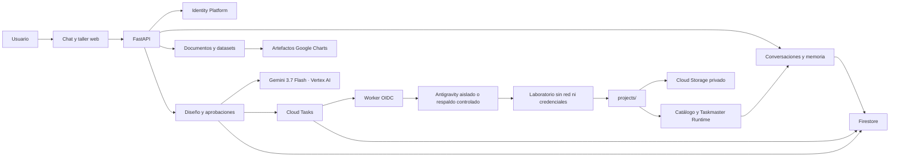
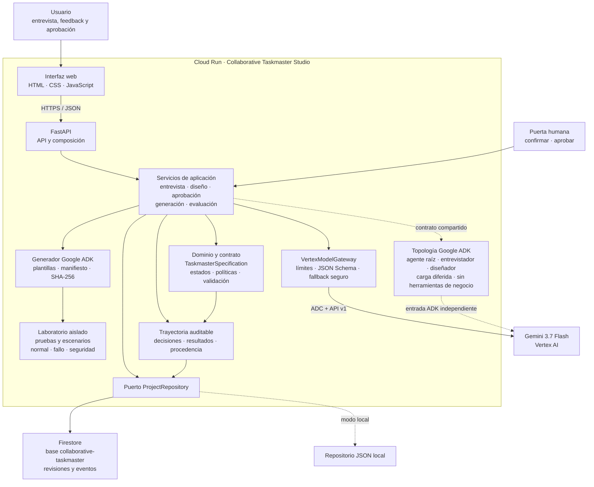
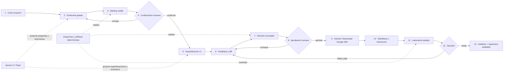
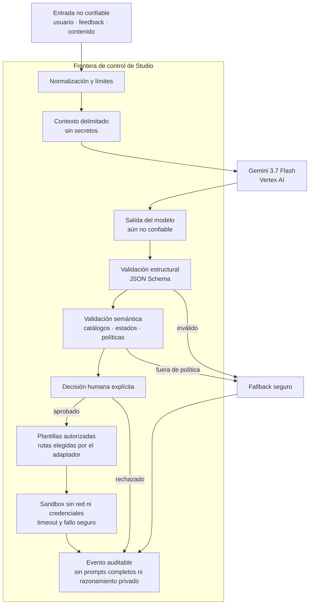
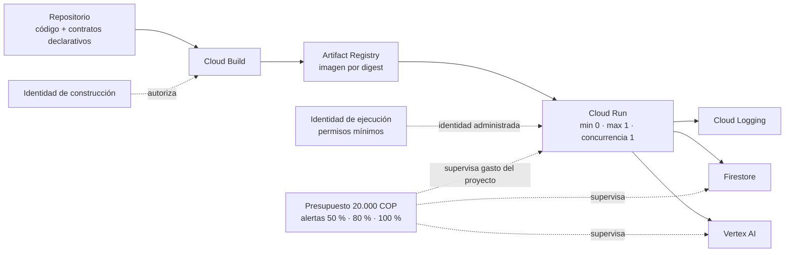

# H11-02 — Diagrama de arquitectura final

## Propósito

Esta es la vista autoritativa de la arquitectura implementada y desplegada de Collaborative
Taskmaster Studio. Separa las responsabilidades del socio colaborativo, el modelo, la persistencia,
la generación de código y la verificación. Los diagramas muestran resultados y eventos auditables;
no representan cadenas privadas de razonamiento.

Actualización consolidada: **2026-08-30**. La evidencia numérica de H10 que aparece más adelante se
conserva como registro de aquel despliegue; no representa la revisión pública más reciente.

## 0. Vista consolidada vigente

Los documentos y cargas parciales utilizan almacenamiento acotado por sesión; los proyectos
terminados sí se replican de forma durable. Los gráficos son contratos de datos producidos por el
servidor y renderizados por el navegador, no código generado y ejecutado por el modelo.

## 1. Sistema desplegado

La aplicación es un monolito modular: presentación, aplicación, dominio y adaptadores se despliegan
en un solo contenedor, pero conservan fronteras explícitas. El dominio no importa FastAPI, Google
ADK, Vertex AI ni Firestore. La API web coordina el flujo mediante servicios de aplicación y usa el
Google Gen AI SDK a través de `VertexModelGateway`. La topología ADK es un punto de entrada separado,
descubrible y de carga diferida; la API no inicia un Runner ni una sesión ADK.

## 2. Recorrido completo del producto

Gemini ayuda a preguntar, sintetizar y proponer. No confirma el briefing, no aprueba revisiones, no
elige rutas de archivos y no ejecuta herramientas. Si su respuesta no cumple el contrato, el flujo
registra el fallback y conserva una alternativa determinista segura.

## 3. Fronteras de confianza y autoridad

### Autoridad por componente

| Componente | Puede | No puede |
| --- | --- | --- |
| Usuario | responder, corregir, aprobar o rechazar | alterar políticas internas mediante texto |
| Gemini / agentes ADK | proponer preguntas y estructuras | aprobar, escribir en Firestore o ejecutar archivos |
| Servicios de aplicación | coordinar casos de uso e idempotencia | omitir reglas del dominio |
| Dominio | validar estados, contrato, riesgo y transiciones | invocar servicios cloud |
| Repositorio | persistir snapshots, revisiones, aprobaciones y eventos | decidir el contenido del diseño |
| Generador | renderizar plantillas aprobadas y calcular hashes | aceptar rutas o comandos libres del modelo |
| Laboratorio | ejecutar pruebas confinadas y producir un informe | usar red o credenciales cloud |
| Humano | confirmar briefing y aprobar una revisión | volver mutable una revisión ya aprobada |

## 4. Construcción, identidad y operación

- La identidad de construcción está separada de la identidad de ejecución.
- La cuenta runtime solo usa Vertex AI y la base Firestore declarada mediante IAM mínimo.
- ADC e identidad administrada reemplazan API keys y archivos JSON de credenciales.
- El MVP no necesita secretos externos; la lista declarada de secretos está vacía.
- Los artefactos de Cloud Run viven en `/tmp/generated`; sus metadatos, hashes y resultados quedan
  persistidos. El sistema no presenta el almacenamiento efímero como persistencia durable.
- Cloud Run escala a cero; el presupuesto alerta, pero no constituye un tope automático de gasto.

## 5. Responsabilidades y evidencia en el repositorio

| Bloque | Implementación principal | Evidencia |
| --- | --- | --- |
| Presentación y API | `app/static/`, `app/api/router.py`, `app/main.py` | recorrido HTTP de 13 pasos |
| Aplicación | `studio/application/` | servicios y pruebas de integración |
| Dominio | `studio/domain/`, `schemas/taskmaster-specification-1.0.0.json` | contrato, estados y validadores |
| Agentes | `agents/` | raíz, entrevistador y diseñador Google ADK |
| Modelo | `infrastructure/vertex/model_gateway.py` | eventos Gemini y fallback identificados |
| Persistencia | `studio/ports/repositories.py`, `infrastructure/local/`, `infrastructure/firestore/` | proyecto y trayectoria recuperables |
| Generación | `adapters/google_adk/` | artefacto, manifiesto y SHA-256 |
| Evaluación | `sandbox/` | tres escenarios y decisión `ready` o `failed_safe` |
| Nube | `infrastructure/cloud_run/` | build, digest, IAM, despliegue, rollback y presupuesto |

## 6. Evidencia histórica de H10

| Evidencia | Valor |
| --- | --- |
| Servicio | `https://collaborative-taskmaster-studio-760216344589.us-central1.run.app` |
| Revisión | `collaborative-taskmaster-studio-00004-fqp` — 100 % del tráfico |
| Modelo | `gemini-3.5-flash` mediante Vertex AI API `v1` |
| Persistencia | Firestore Native, base `collaborative-taskmaster` |
| Imagen | digest `sha256:3cedab2f2a07e62a2ae593d7b6f1cd78368c7528fd91f58723cc5363cf29c1a5` |
| Escalado | mínimo 0, máximo 1, concurrencia 1 |
| Recorrido | 13 pasos HTTP, revisión humana 2, laboratorio `ready` |
| Trazabilidad | 27 eventos, 3 generaciones Gemini y 5 fallbacks seguros |

El estado funcional posterior utiliza Gemini 3.7 Flash e incorpora Cloud Tasks, Antigravity,
identidad multiusuario, archivos, datasets y catálogo conversacional. Consulte
[`23_ESTADO_ACTUAL_PRODUCTO.md`](23_ESTADO_ACTUAL_PRODUCTO.md) para no interpretar esta tabla
histórica como inventario vigente.

La evidencia detallada se conserva en
[`09_HITO_H10_CLOUD_RUN.md`](09_HITO_H10_CLOUD_RUN.md) y
[`10_HITO_H10_RECORRIDO_INTEGRAL.md`](10_HITO_H10_RECORRIDO_INTEGRAL.md).

## 7. Cómo leer los diagramas

- Flecha continua: llamada o flujo de datos directo.
- Flecha discontinua: control, validación, autorización o alternativa de entorno.
- Los bloques dentro de Cloud Run comparten despliegue, no autoridad.
- Firestore y el repositorio local implementan el mismo puerto; producción usa Firestore.
- La trayectoria registra decisiones y resultados observables, nunca cadena de pensamiento.

Este documento cierra H11-02 y reemplaza como vista final los diagramas prospectivos del Documento
03. El Documento 03 conserva las decisiones técnicas detalladas y el historial del diseño.
